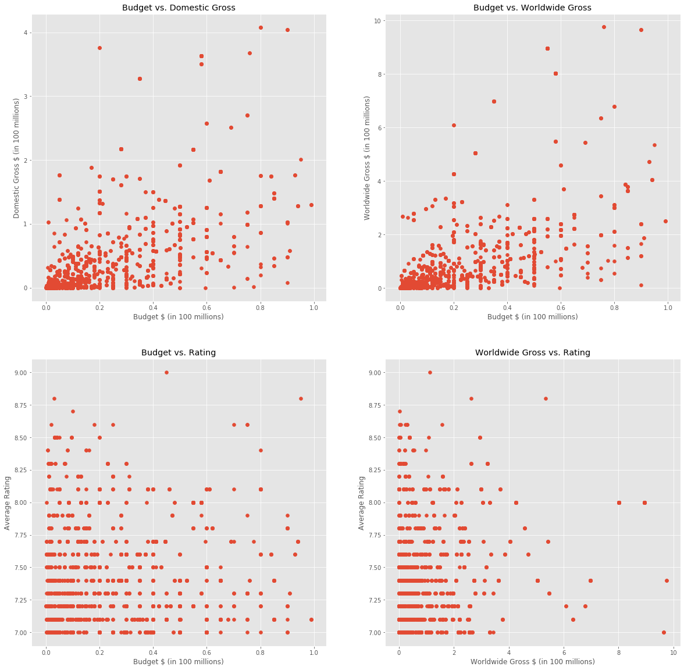
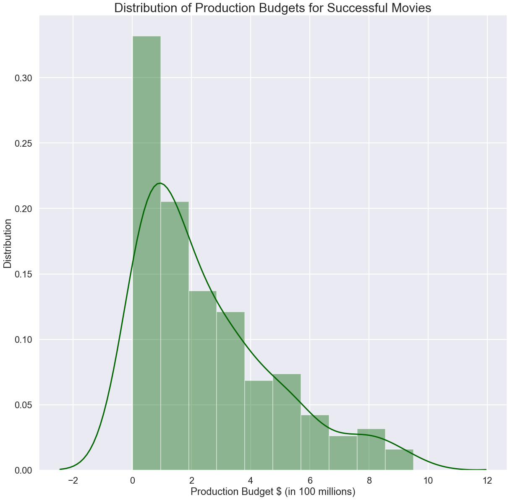
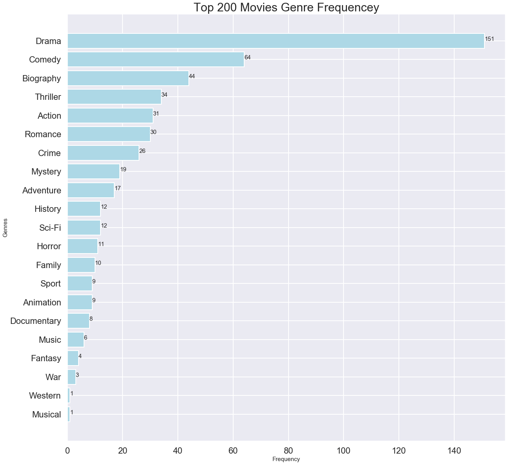
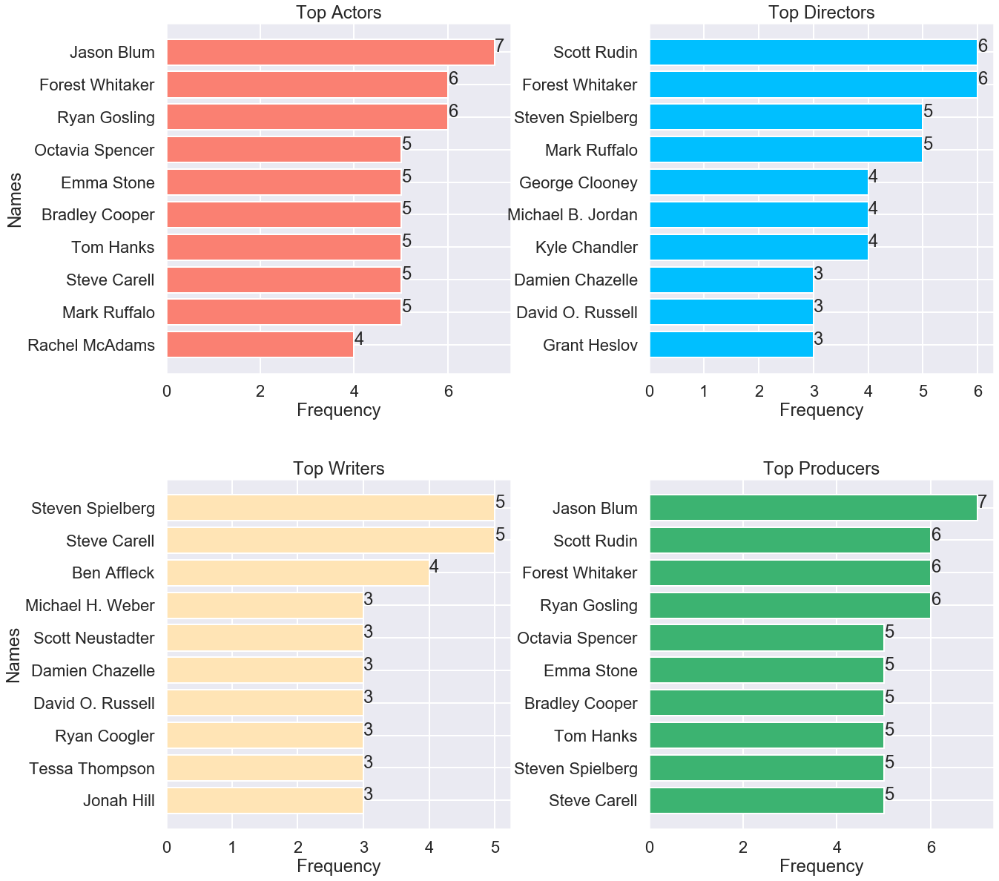
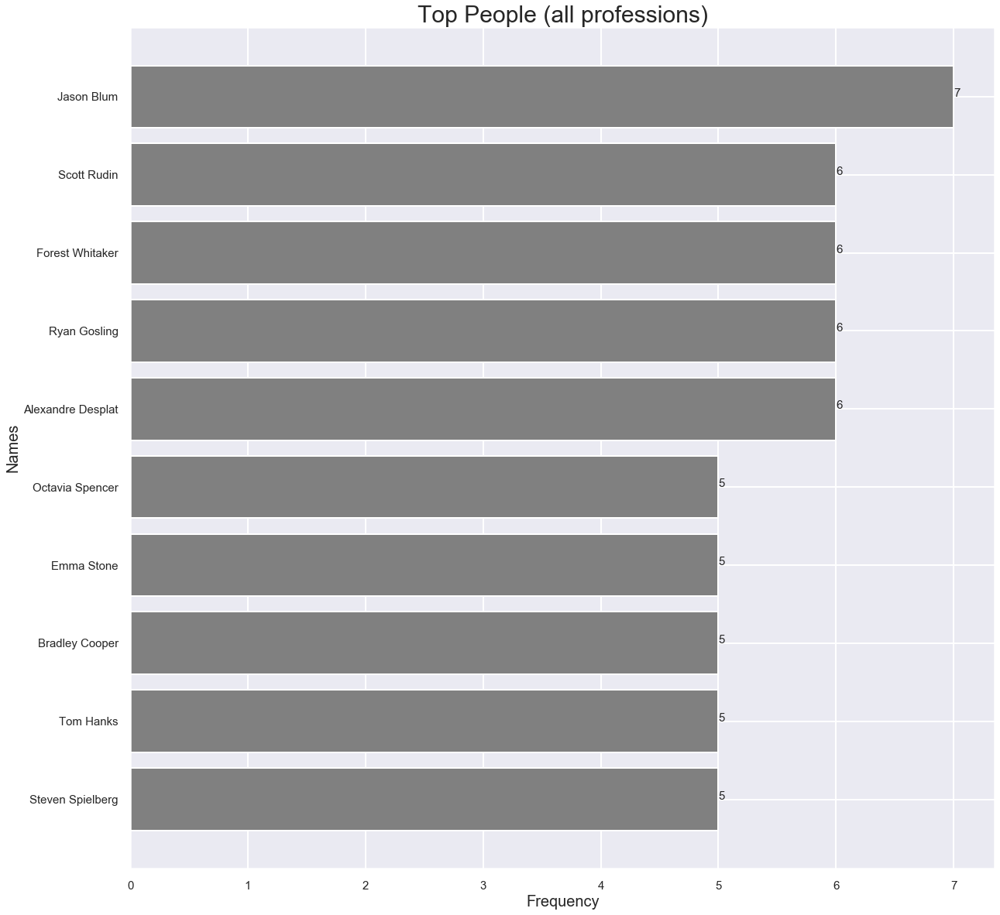

# Flatiron School Module 1 Final Project - Alexi Zalk 

## Introduction

Microsoft sees all the big companies creating original video content, and they want to get in on the fun. They have decided to create a new movie studio, but the problem is they don’t know anything about creating movies. They have hired you to help them better understand the movie industry. Your team is charged with doing data analysis and creating a presentation that explores what type of films are currently doing the best at the box office. You must then translate those findings into actionable insights that the CEO can use when deciding what type of films they should be creating.

## Deliverables
1. A well documented Jupyter Notebook containing any code you've written for this project and comments explaining it. This work will need to be pushed to your GitHub repository in order to submit your project.
2. An organized README.md file in the GitHub repository that describes the contents of the repository. This file should be the source of information for navigating through the repository.
3. A short Keynote/PowerPoint/Google Slides presentation (delivered as a PDF export) giving a high-level overview of your methodology and recommendations for non-technical stakeholders. Make sure to also add and commit this pdf of your non-technical presentation to your repository with a file name of presentation.pdf.
4. A Blog Post
5. A Video Walkthrough of your non-technical presentation. Some common video recording tools used are Zoom, Quicktime, and Nimbus. After you record your presentation, publish it on a service like YouTube or Google Drive, you will need a link to the video to submit your project.

## Dataset

Included in the repository (in the folder zippedData) is some movie-related data from:

- Box Office Mojo
- IMDB
- Rotten Tomatoes
- TheMovieDB.org


```python
import pandas as pd
import numpy as np
import seaborn as sns
import matplotlib.pyplot as plt
%matplotlib inline
```

    /Users/alexizalk/opt/anaconda3/envs/learn-env/lib/python3.6/site-packages/statsmodels/tools/_testing.py:19: FutureWarning: pandas.util.testing is deprecated. Use the functions in the public API at pandas.testing instead.
      import pandas.util.testing as tm


I'm going to start by taking a look at what's in the `zippedData` folder on my computer. I unzipped the files and took a look at them all in `Excel`. The folder is renamed `Data`.


```python
ls Data
```

    bom.movie_gross.csv        imdb.title.ratings.csv
    imdb.name.basics.csv       rt.movie_info.tsv
    imdb.title.akas.csv        rt.reviews.csv
    imdb.title.basics.csv      rt.reviews.tsv
    imdb.title.crew.csv        tmdb.movies.csv
    imdb.title.principals.csv  tn.movie_budgets.csv


Load all these `csv` files into dataframes and preview them


```python
# Check out the fist file
box_gross_df = pd.read_csv('Data/bom.movie_gross.csv')
print(list(box_gross_df.columns))
box_gross_df.head(2)
```

    ['title', 'studio', 'domestic_gross', 'foreign_gross', 'year']


<div>
<style scoped>
    .dataframe tbody tr th:only-of-type {
        vertical-align: middle;
    }

    .dataframe tbody tr th {
        vertical-align: top;
    }

    .dataframe thead th {
        text-align: right;
    }
</style>
<table border="1" class="dataframe">
  <thead>
    <tr style="text-align: right;">
      <th></th>
      <th>title</th>
      <th>studio</th>
      <th>domestic_gross</th>
      <th>foreign_gross</th>
      <th>year</th>
    </tr>
  </thead>
  <tbody>
    <tr>
      <th>0</th>
      <td>Toy Story 3</td>
      <td>BV</td>
      <td>415000000.0</td>
      <td>652000000</td>
      <td>2010</td>
    </tr>
    <tr>
      <th>1</th>
      <td>Alice in Wonderland (2010)</td>
      <td>BV</td>
      <td>334200000.0</td>
      <td>691300000</td>
      <td>2010</td>
    </tr>
  </tbody>
</table>
</div>


```python
# Load the IMDB files
imdb_names_df = pd.read_csv('Data/imdb.name.basics.csv')
imdb_akas_df = pd.read_csv('Data/imdb.title.akas.csv')
imdb_basics_df = pd.read_csv('Data/imdb.title.basics.csv')
imdb_crew_df = pd.read_csv('Data/imdb.title.crew.csv')
imdb_principals_df = pd.read_csv('Data/imdb.title.principals.csv')
imdb_ratings_df = pd.read_csv('Data/imdb.title.ratings.csv')
```


```python
print(list(imdb_names_df.columns))
print(list(imdb_akas_df.columns))
print(list(imdb_basics_df.columns))
print(list(imdb_crew_df.columns))
print(list(imdb_principals_df.columns))
print(list(imdb_ratings_df.columns))
```

    ['nconst', 'primary_name', 'birth_year', 'death_year', 'primary_profession', 'known_for_titles']
    ['title_id', 'ordering', 'title', 'region', 'language', 'types', 'attributes', 'is_original_title']
    ['tconst', 'primary_title', 'original_title', 'start_year', 'runtime_minutes', 'genres']
    ['tconst', 'directors', 'writers']
    ['tconst', 'ordering', 'nconst', 'category', 'job', 'characters']
    ['tconst', 'averagerating', 'numvotes']


```python
imdb_akas_df.head(2)
```


<div>
<style scoped>
    .dataframe tbody tr th:only-of-type {
        vertical-align: middle;
    }

    .dataframe tbody tr th {
        vertical-align: top;
    }

    .dataframe thead th {
        text-align: right;
    }
</style>
<table border="1" class="dataframe">
  <thead>
    <tr style="text-align: right;">
      <th></th>
      <th>title_id</th>
      <th>ordering</th>
      <th>title</th>
      <th>region</th>
      <th>language</th>
      <th>types</th>
      <th>attributes</th>
      <th>is_original_title</th>
    </tr>
  </thead>
  <tbody>
    <tr>
      <th>0</th>
      <td>tt0369610</td>
      <td>10</td>
      <td>Джурасик свят</td>
      <td>BG</td>
      <td>bg</td>
      <td>NaN</td>
      <td>NaN</td>
      <td>0.0</td>
    </tr>
    <tr>
      <th>1</th>
      <td>tt0369610</td>
      <td>11</td>
      <td>Jurashikku warudo</td>
      <td>JP</td>
      <td>NaN</td>
      <td>imdbDisplay</td>
      <td>NaN</td>
      <td>0.0</td>
    </tr>
  </tbody>
</table>
</div>


```python
# Checking to see if 'title_id' matches 'tconst'
imdb_basics_df.head(2)
```


<div>
<style scoped>
    .dataframe tbody tr th:only-of-type {
        vertical-align: middle;
    }

    .dataframe tbody tr th {
        vertical-align: top;
    }

    .dataframe thead th {
        text-align: right;
    }
</style>
<table border="1" class="dataframe">
  <thead>
    <tr style="text-align: right;">
      <th></th>
      <th>tconst</th>
      <th>primary_title</th>
      <th>original_title</th>
      <th>start_year</th>
      <th>runtime_minutes</th>
      <th>genres</th>
    </tr>
  </thead>
  <tbody>
    <tr>
      <th>0</th>
      <td>tt0063540</td>
      <td>Sunghursh</td>
      <td>Sunghursh</td>
      <td>2013</td>
      <td>175.0</td>
      <td>Action,Crime,Drama</td>
    </tr>
    <tr>
      <th>1</th>
      <td>tt0066787</td>
      <td>One Day Before the Rainy Season</td>
      <td>Ashad Ka Ek Din</td>
      <td>2019</td>
      <td>114.0</td>
      <td>Biography,Drama</td>
    </tr>
  </tbody>
</table>
</div>


The `read_csv` function had trouble reading the `rt.reviews.tsv` files, so I resaved it as a `csv`


```python
rt_reviews_df = pd.read_csv('Data/rt.reviews.csv')
print(list(rt_reviews_df.columns))
rt_reviews_df.head(2)
```

    ['id', 'review', 'rating', 'fresh', 'critic', 'top_critic', 'publisher', 'date']


<div>
<style scoped>
    .dataframe tbody tr th:only-of-type {
        vertical-align: middle;
    }

    .dataframe tbody tr th {
        vertical-align: top;
    }

    .dataframe thead th {
        text-align: right;
    }
</style>
<table border="1" class="dataframe">
  <thead>
    <tr style="text-align: right;">
      <th></th>
      <th>id</th>
      <th>review</th>
      <th>rating</th>
      <th>fresh</th>
      <th>critic</th>
      <th>top_critic</th>
      <th>publisher</th>
      <th>date</th>
    </tr>
  </thead>
  <tbody>
    <tr>
      <th>0</th>
      <td>3</td>
      <td>A distinctly gallows take on contemporary fina...</td>
      <td>5-Mar</td>
      <td>fresh</td>
      <td>PJ Nabarro</td>
      <td>0</td>
      <td>Patrick Nabarro</td>
      <td>10-Nov-18</td>
    </tr>
    <tr>
      <th>1</th>
      <td>3</td>
      <td>It's an allegory in search of a meaning that n...</td>
      <td>NaN</td>
      <td>rotten</td>
      <td>Annalee Newitz</td>
      <td>0</td>
      <td>io9.com</td>
      <td>23-May-18</td>
    </tr>
  </tbody>
</table>
</div>


```python
# Load the rest of the files
rt_info_df = pd.read_csv('Data/rt.movie_info.tsv', sep='\t')
moviedb_df = pd.read_csv('Data/tmdb.movies.csv')
tn_budgets_df = pd.read_csv('Data/tn.movie_budgets.csv')
```


```python
print(list(rt_info_df.columns))
print(list(moviedb_df.columns))
print(list(tn_budgets_df.columns))
```

    ['id', 'synopsis', 'rating', 'genre', 'director', 'writer', 'theater_date', 'dvd_date', 'currency', 'box_office', 'runtime', 'studio']
    ['Unnamed: 0', 'genre_ids', 'id', 'original_language', 'original_title', 'popularity', 'release_date', 'title', 'vote_average', 'vote_count']
    ['id', 'release_date', 'movie', 'production_budget', 'domestic_gross', 'worldwide_gross']


```python
#Do either Rotten Tomatoes DataFrames have a title anywhere? Nope
rt_info_df.head(2)
```


<div>
<style scoped>
    .dataframe tbody tr th:only-of-type {
        vertical-align: middle;
    }

    .dataframe tbody tr th {
        vertical-align: top;
    }

    .dataframe thead th {
        text-align: right;
    }
</style>
<table border="1" class="dataframe">
  <thead>
    <tr style="text-align: right;">
      <th></th>
      <th>id</th>
      <th>synopsis</th>
      <th>rating</th>
      <th>genre</th>
      <th>director</th>
      <th>writer</th>
      <th>theater_date</th>
      <th>dvd_date</th>
      <th>currency</th>
      <th>box_office</th>
      <th>runtime</th>
      <th>studio</th>
    </tr>
  </thead>
  <tbody>
    <tr>
      <th>0</th>
      <td>1</td>
      <td>This gritty, fast-paced, and innovative police...</td>
      <td>R</td>
      <td>Action and Adventure|Classics|Drama</td>
      <td>William Friedkin</td>
      <td>Ernest Tidyman</td>
      <td>Oct 9, 1971</td>
      <td>Sep 25, 2001</td>
      <td>NaN</td>
      <td>NaN</td>
      <td>104 minutes</td>
      <td>NaN</td>
    </tr>
    <tr>
      <th>1</th>
      <td>3</td>
      <td>New York City, not-too-distant-future: Eric Pa...</td>
      <td>R</td>
      <td>Drama|Science Fiction and Fantasy</td>
      <td>David Cronenberg</td>
      <td>David Cronenberg|Don DeLillo</td>
      <td>Aug 17, 2012</td>
      <td>Jan 1, 2013</td>
      <td>$</td>
      <td>600,000</td>
      <td>108 minutes</td>
      <td>Entertainment One</td>
    </tr>
  </tbody>
</table>
</div>


```python
moviedb_df.head(2)
```


<div>
<style scoped>
    .dataframe tbody tr th:only-of-type {
        vertical-align: middle;
    }

    .dataframe tbody tr th {
        vertical-align: top;
    }

    .dataframe thead th {
        text-align: right;
    }
</style>
<table border="1" class="dataframe">
  <thead>
    <tr style="text-align: right;">
      <th></th>
      <th>Unnamed: 0</th>
      <th>genre_ids</th>
      <th>id</th>
      <th>original_language</th>
      <th>original_title</th>
      <th>popularity</th>
      <th>release_date</th>
      <th>title</th>
      <th>vote_average</th>
      <th>vote_count</th>
    </tr>
  </thead>
  <tbody>
    <tr>
      <th>0</th>
      <td>0</td>
      <td>[12, 14, 10751]</td>
      <td>12444</td>
      <td>en</td>
      <td>Harry Potter and the Deathly Hallows: Part 1</td>
      <td>33.533</td>
      <td>2010-11-19</td>
      <td>Harry Potter and the Deathly Hallows: Part 1</td>
      <td>7.7</td>
      <td>10788</td>
    </tr>
    <tr>
      <th>1</th>
      <td>1</td>
      <td>[14, 12, 16, 10751]</td>
      <td>10191</td>
      <td>en</td>
      <td>How to Train Your Dragon</td>
      <td>28.734</td>
      <td>2010-03-26</td>
      <td>How to Train Your Dragon</td>
      <td>7.7</td>
      <td>7610</td>
    </tr>
  </tbody>
</table>
</div>


```python
tn_budgets_df.head()
```


<div>
<style scoped>
    .dataframe tbody tr th:only-of-type {
        vertical-align: middle;
    }

    .dataframe tbody tr th {
        vertical-align: top;
    }

    .dataframe thead th {
        text-align: right;
    }
</style>
<table border="1" class="dataframe">
  <thead>
    <tr style="text-align: right;">
      <th></th>
      <th>id</th>
      <th>release_date</th>
      <th>movie</th>
      <th>production_budget</th>
      <th>domestic_gross</th>
      <th>worldwide_gross</th>
    </tr>
  </thead>
  <tbody>
    <tr>
      <th>0</th>
      <td>1</td>
      <td>Dec 18, 2009</td>
      <td>Avatar</td>
      <td>$425,000,000</td>
      <td>$760,507,625</td>
      <td>$2,776,345,279</td>
    </tr>
    <tr>
      <th>1</th>
      <td>2</td>
      <td>May 20, 2011</td>
      <td>Pirates of the Caribbean: On Stranger Tides</td>
      <td>$410,600,000</td>
      <td>$241,063,875</td>
      <td>$1,045,663,875</td>
    </tr>
    <tr>
      <th>2</th>
      <td>3</td>
      <td>Jun 7, 2019</td>
      <td>Dark Phoenix</td>
      <td>$350,000,000</td>
      <td>$42,762,350</td>
      <td>$149,762,350</td>
    </tr>
    <tr>
      <th>3</th>
      <td>4</td>
      <td>May 1, 2015</td>
      <td>Avengers: Age of Ultron</td>
      <td>$330,600,000</td>
      <td>$459,005,868</td>
      <td>$1,403,013,963</td>
    </tr>
    <tr>
      <th>4</th>
      <td>5</td>
      <td>Dec 15, 2017</td>
      <td>Star Wars Ep. VIII: The Last Jedi</td>
      <td>$317,000,000</td>
      <td>$620,181,382</td>
      <td>$1,316,721,747</td>
    </tr>
  </tbody>
</table>
</div>


```python
print('imdb_names_df', imdb_names_df.shape)
print('imdb_akas_df', imdb_akas_df.shape)
print('imdb_basics_df', imdb_basics_df.shape)
print('imdb_crew_df', imdb_crew_df.shape)
print('imdb_principals_df', imdb_principals_df.shape)
print('imdb_ratings_df', imdb_ratings_df.shape)
print('box_gross_df', box_gross_df.shape)
print('tn_budgets_df', tn_budgets_df.shape)
print('moviedb_df', moviedb_df.shape)
print('rt_reviews_df', rt_reviews_df.shape)
print('rt_info_df', rt_info_df.shape)
```

    imdb_names_df (606648, 6)
    imdb_akas_df (331703, 8)
    imdb_basics_df (146144, 6)
    imdb_crew_df (146144, 3)
    imdb_principals_df (1028186, 6)
    imdb_ratings_df (73856, 3)
    box_gross_df (3387, 5)
    tn_budgets_df (5782, 6)
    moviedb_df (26517, 10)
    rt_reviews_df (54432, 8)
    rt_info_df (1560, 12)


The `id` column on `tn_budgets_df` and `moviedb_df` **DO NOT** match the Rotten Tomatoes ids

### How the DataBases are Connected


### Thoughts after taking a look at the connections

After looking at all the connections, I don't know how the Rotten Tomatoes data will fit in with the rest since it doesn't have and titles or ways to connect it to the rest of the data. The ratings also exist in the IMDB data, and that'll be a lot easier to tie in.

* I will start with the `IMDB` data. It is well connected and includes general info and ratings.
* The `box_gross_df` and/or `tn_budgets` will be helpful to gauge success in a dollar amount. I'm curious to see how well joining using `title` or `movie` will work between the `IMDB` data these dataframes.
* Lastly, `moviesdb` will provide additional information on the popularity of the movies via ratings. We'll see how joining via `original_title` or `title` to the `IMDB` data works here as well.
* There should be enough data here to end up with some decent insights.

* The size of the dataframes vary as you can see above. I'm going to take that into account

## What type of film should Microsoft be creating?

Let's start by taking a look at the most successful films by using `imbd_basics` and `imdb_ratings`


```python
# Default merge is inner merge, so we'll lose about half the data from imdb_basics
# Data without ratings isn't really useful to us though
imdb_basics_ratings = imdb_ratings_df.merge(imdb_basics_df, on='tconst').copy()
print(imdb_basics_ratings.shape)
imdb_basics_ratings.head()
```

    (73856, 8)


<div>
<style scoped>
    .dataframe tbody tr th:only-of-type {
        vertical-align: middle;
    }

    .dataframe tbody tr th {
        vertical-align: top;
    }

    .dataframe thead th {
        text-align: right;
    }
</style>
<table border="1" class="dataframe">
  <thead>
    <tr style="text-align: right;">
      <th></th>
      <th>tconst</th>
      <th>averagerating</th>
      <th>numvotes</th>
      <th>primary_title</th>
      <th>original_title</th>
      <th>start_year</th>
      <th>runtime_minutes</th>
      <th>genres</th>
    </tr>
  </thead>
  <tbody>
    <tr>
      <th>0</th>
      <td>tt10356526</td>
      <td>8.3</td>
      <td>31</td>
      <td>Laiye Je Yaarian</td>
      <td>Laiye Je Yaarian</td>
      <td>2019</td>
      <td>117.0</td>
      <td>Romance</td>
    </tr>
    <tr>
      <th>1</th>
      <td>tt10384606</td>
      <td>8.9</td>
      <td>559</td>
      <td>Borderless</td>
      <td>Borderless</td>
      <td>2019</td>
      <td>87.0</td>
      <td>Documentary</td>
    </tr>
    <tr>
      <th>2</th>
      <td>tt1042974</td>
      <td>6.4</td>
      <td>20</td>
      <td>Just Inès</td>
      <td>Just Inès</td>
      <td>2010</td>
      <td>90.0</td>
      <td>Drama</td>
    </tr>
    <tr>
      <th>3</th>
      <td>tt1043726</td>
      <td>4.2</td>
      <td>50352</td>
      <td>The Legend of Hercules</td>
      <td>The Legend of Hercules</td>
      <td>2014</td>
      <td>99.0</td>
      <td>Action,Adventure,Fantasy</td>
    </tr>
    <tr>
      <th>4</th>
      <td>tt1060240</td>
      <td>6.5</td>
      <td>21</td>
      <td>Até Onde?</td>
      <td>Até Onde?</td>
      <td>2011</td>
      <td>73.0</td>
      <td>Mystery,Thriller</td>
    </tr>
  </tbody>
</table>
</div>


What are the genres? And which genres have the highest ratings?


```python
list(imdb_basics_ratings['genres'].unique())
```


    ['Romance',
     'Documentary',
     'Drama',
     'Action,Adventure,Fantasy',
     'Mystery,Thriller',
     'Comedy,Romance',
     'Biography,Drama,Sport',
     'Drama,Thriller',
     'Drama,War',
     'Action,Adventure,Sci-Fi',
     'Comedy',
     'Comedy,Drama,Romance',
     'Adventure,Animation,Drama',
     'Thriller',
     'Drama,Fantasy,Romance',
     'Adventure,Animation,Comedy',
     'Action,Adventure,Thriller',
     'Action,Comedy,Crime',
     'Biography,Drama',
     'Documentary,History,Sport',
     'Documentary,War',
     'Drama,Fantasy',
     'Sci-Fi,Thriller',
     'Fantasy,Horror,Thriller',
     'Comedy,Crime,Drama',
     'Comedy,Thriller',
     'Horror',
     'Comedy,Crime,History',
     'Comedy,Documentary',
     'Biography,Documentary',
     'Drama,Romance',
     'Drama,Music,Romance',
     'Action,Horror,Thriller',
     'Comedy,Horror',
     'Comedy,Drama',
     'Adventure,Family,Fantasy',
     'Horror,Thriller',
     'Comedy,Drama,Thriller',
     'Documentary,Music',
     'Animation',
     'Action,Adventure',
     'Action,Drama',
     'Drama,Family,Fantasy',
     'Action,Comedy,Horror',
     'Crime,Drama,Horror',
     'Documentary,Sport',
     'Comedy,Crime',
     'Drama,Mystery,Thriller',
     'Family',
     'Action,Drama,History',
     'Adventure,Comedy,Drama',
     'Drama,Horror,Mystery',
     'Biography,Comedy,Documentary',
     'Documentary,Drama',
     'Action,Animation',
     'Adventure',
     'Biography,Drama,Thriller',
     'Drama,Mystery',
     'Drama,Romance,Sci-Fi',
     'Action,Drama,Thriller',
     'Comedy,Horror,Musical',
     'Horror,Sci-Fi,Thriller',
     'Action,Biography,Documentary',
     'Drama,Horror,Thriller',
     'Action,Comedy',
     'Biography,Documentary,History',
     'Comedy,Crime,Romance',
     'Sci-Fi',
     'Action,Drama,Mystery',
     'Action,Crime',
     'Documentary,News',
     'Comedy,Music',
     'Crime,Thriller',
     'Drama,Musical,Romance',
     'Drama,Musical',
     'Adventure,Animation,Family',
     'Adventure,Documentary,Drama',
     'Crime,Drama,Mystery',
     'Action,Horror,Mystery',
     'Crime,Drama',
     'Action,Crime,Thriller',
     'Action,Adventure,Biography',
     'Biography,Documentary,News',
     'Comedy,Family,Romance',
     'Action,Adventure,Comedy',
     'Action,Romance,Thriller',
     'Documentary,Family',
     'Comedy,Fantasy,Romance',
     'Drama,Fantasy,Mystery',
     'Horror,Mystery,Thriller',
     'Action',
     'Action,Comedy,Drama',
     'Action,Horror,Sci-Fi',
     'Crime,Documentary,Drama',
     'Animation,Horror,Sci-Fi',
     'Adventure,Documentary',
     'Comedy,Musical,Romance',
     'Documentary,History',
     'Crime,Mystery,Thriller',
     'Comedy,Horror,Romance',
     'Documentary,Horror',
     'Crime,Drama,Thriller',
     'Drama,Family',
     'Biography,Documentary,Drama',
     'Crime,Mystery',
     'Documentary,History,Music',
     'Fantasy',
     'Documentary,History,Mystery',
     'Comedy,Family',
     'Family,Fantasy',
     'Action,Thriller',
     'Crime,Documentary,Mystery',
     'Biography',
     'Documentary,History,War',
     'Horror,Sci-Fi',
     'Action,Mystery,Romance',
     'History',
     'Crime',
     'Adventure,Fantasy,War',
     'Comedy,Mystery,Romance',
     'Animation,Drama,Fantasy',
     'Animation,Comedy',
     'Adventure,Comedy,Family',
     'Drama,Horror',
     'Adventure,Sci-Fi',
     nan,
     'Mystery,Romance,Thriller',
     'Action,History,War',
     'Crime,Drama,Family',
     'Mystery,Sci-Fi,Thriller',
     'Adventure,Comedy',
     'Comedy,Drama,Horror',
     'Animation,Biography,Comedy',
     'Animation,Family',
     'Sport',
     'Drama,Mystery,Romance',
     'Drama,Fantasy,Thriller',
     'Mystery,Sci-Fi',
     'Drama,History',
     'Mystery',
     'Comedy,Family,Fantasy',
     'Comedy,Sci-Fi',
     'Comedy,Drama,Sport',
     'Musical',
     'Adventure,Comedy,Crime',
     'Animation,Documentary,Drama',
     'Animation,Comedy,Family',
     'Documentary,Drama,Mystery',
     'Animation,Documentary',
     'Family,Sci-Fi',
     'Action,Sci-Fi',
     'Action,War',
     'Music,Romance',
     'Drama,Horror,Romance',
     'Adventure,Animation',
     'Adventure,Drama,Fantasy',
     'Action,Adventure,Drama',
     'Biography,Documentary,Music',
     'Comedy,Family,Musical',
     'Action,Crime,Drama',
     'Comedy,Drama,Fantasy',
     'Comedy,Drama,Family',
     'Biography,Drama,Music',
     'Comedy,Sport',
     'Adventure,Horror',
     'Documentary,Drama,History',
     'Comedy,Drama,Musical',
     'Fantasy,Horror,Musical',
     'Drama,Music',
     'Drama,History,War',
     'Western',
     'Biography,Drama,History',
     'Action,Mystery,Thriller',
     'Documentary,Family,History',
     'Action,Fantasy,Horror',
     'Biography,Documentary,Sport',
     'Animation,Family,Fantasy',
     'Crime,Horror,Thriller',
     'Action,Animation,Drama',
     'Adventure,Comedy,Documentary',
     'Action,Adventure,Crime',
     'Action,Horror',
     'Action,Drama,Horror',
     'Biography,Documentary,Family',
     'Drama,Mystery,Sci-Fi',
     'Documentary,History,News',
     'Drama,Family,Romance',
     'Adventure,Horror,Sci-Fi',
     'Drama,Sci-Fi',
     'Romance,Thriller',
     'Adventure,Biography,Documentary',
     'Action,Drama,Romance',
     'Comedy,Drama,War',
     'Animation,Biography,Documentary',
     'War',
     'Comedy,Fantasy,Horror',
     'Drama,History,Mystery',
     'Comedy,Music,Romance',
     'Comedy,Drama,Mystery',
     'Drama,Horror,Sci-Fi',
     'Action,Adventure,Animation',
     'Action,Comedy,Romance',
     'Animation,Comedy,Sci-Fi',
     'Biography,Crime,Drama',
     'Action,Drama,Family',
     'Documentary,Family,News',
     'Drama,Mystery,War',
     'Crime,Horror,Mystery',
     'Action,Biography,Crime',
     'Drama,Sport',
     'Comedy,Western',
     'Animation,Drama',
     'Comedy,Drama,Music',
     'Action,Comedy,Documentary',
     'Action,Sci-Fi,Western',
     'Crime,Drama,Romance',
     'Animation,Drama,Romance',
     'Action,Adventure,Family',
     'Action,Biography,Drama',
     'Drama,Fantasy,Music',
     'Animation,Fantasy,Horror',
     'Documentary,Sci-Fi',
     'Documentary,Drama,Music',
     'Drama,Music,War',
     'Drama,Music,Thriller',
     'Animation,Romance,Sci-Fi',
     'Drama,Sci-Fi,Thriller',
     'Music',
     'Documentary,Drama,Family',
     'Biography,Comedy,Drama',
     'Adventure,Animation,Sci-Fi',
     'Action,History',
     'Biography,Drama,Fantasy',
     'Action,Crime,Mystery',
     'Drama,Music,Musical',
     'Action,Sci-Fi,Thriller',
     'Fantasy,Horror',
     'Adventure,Fantasy',
     'Adventure,Fantasy,Horror',
     'Documentary,Drama,News',
     'Drama,History,Romance',
     'Action,Comedy,Fantasy',
     'Drama,Family,Horror',
     'Biography,Romance,War',
     'Comedy,Fantasy',
     'Adventure,Drama',
     'Comedy,History',
     'Adventure,Drama,Thriller',
     'Comedy,Drama,History',
     'Adventure,Drama,History',
     'Comedy,Documentary,Drama',
     'Adventure,Family',
     'Documentary,Family,Sport',
     'Adventure,Biography,History',
     'Biography,Crime,Documentary',
     'Family,Musical',
     'Adventure,Comedy,History',
     'Biography,History',
     'Drama,Fantasy,Horror',
     'Action,Mystery,Sci-Fi',
     'Comedy,Documentary,Romance',
     'Biography,History,Mystery',
     'Drama,History,Thriller',
     'Biography,Sport',
     'Documentary,Music,Musical',
     'Crime,Drama,Music',
     'Animation,War',
     'Comedy,Mystery',
     'Action,Animation,Comedy',
     'Thriller,War',
     'Comedy,Fantasy,Sport',
     'Family,Musical,Romance',
     'Animation,Documentary,Music',
     'Drama,Romance,Thriller',
     'Adventure,Comedy,Mystery',
     'Action,Animation,Fantasy',
     'Crime,History,Thriller',
     'Adventure,Drama,Romance',
     'Action,Family,Fantasy',
     'Drama,Thriller,War',
     'Action,Fantasy',
     'Drama,Romance,War',
     'Action,Drama,Fantasy',
     'Animation,Comedy,Crime',
     'Drama,Romance,Sport',
     'Adventure,Comedy,Romance',
     'Crime,Romance,Thriller',
     'Adventure,Crime,Family',
     'Music,Mystery',
     'Comedy,Drama,Western',
     'Musical,Romance',
     'Action,History,Thriller',
     'Fantasy,Horror,Mystery',
     'Documentary,Drama,Sport',
     'Biography,Drama,Romance',
     'Adventure,Family,Romance',
     'Drama,Family,Sport',
     'Biography,Crime,History',
     'Comedy,Mystery,Sci-Fi',
     'Adventure,Documentary,Sport',
     'Fantasy,Romance',
     'Documentary,Music,News',
     'Action,Adventure,Horror',
     'Adventure,Comedy,Fantasy',
     'Adventure,Family,Mystery',
     'Adventure,Horror,Thriller',
     'Documentary,Musical',
     'Action,Mystery',
     'Horror,Thriller,War',
     'Drama,Family,Thriller',
     'Comedy,Crime,Mystery',
     'Drama,Family,Musical',
     'Drama,Western',
     'Crime,Western',
     'Crime,Mystery,Sci-Fi',
     'Action,Comedy,History',
     'Documentary,Music,Sport',
     'Drama,History,Music',
     'Horror,Mystery',
     'Biography,Comedy,Crime',
     'Comedy,Crime,Thriller',
     'Crime,Family',
     'Comedy,Musical',
     'Action,Animation,Documentary',
     'Animation,Documentary,History',
     'Animation,Drama,Mystery',
     'Adventure,Mystery,Thriller',
     'Comedy,Family,Music',
     'Adventure,Comedy,Horror',
     'Fantasy,Sci-Fi,Thriller',
     'Action,Drama,Sport',
     'Action,Drama,Sci-Fi',
     'Action,Comedy,Family',
     'Adventure,Romance',
     'Adventure,Crime,Thriller',
     'Adventure,Documentary,Family',
     'Comedy,Horror,Sci-Fi',
     'Documentary,Western',
     'Drama,Family,Sci-Fi',
     'Action,Documentary,History',
     'Action,Documentary',
     'Action,Crime,Romance',
     'Fantasy,Horror,Sci-Fi',
     'Adventure,Documentary,History',
     'Fantasy,Music',
     'Adventure,Crime,Drama',
     'Adventure,Drama,Horror',
     'Biography,Comedy,Family',
     'Comedy,Documentary,Music',
     'Comedy,Romance,Sci-Fi',
     'Adventure,Mystery',
     'Family,Mystery',
     'Drama,Family,History',
     'Action,Documentary,Sport',
     'Comedy,Horror,Thriller',
     'Comedy,Family,Sport',
     'Family,Sport',
     'Biography,History,War',
     'Animation,Fantasy,Romance',
     'Animation,Fantasy',
     'Adventure,Drama,Family',
     'Documentary,Family,Romance',
     'Comedy,Documentary,History',
     'Action,Drama,War',
     'Animation,Drama,Horror',
     'Documentary,Drama,Sci-Fi',
     'Adventure,Comedy,Sci-Fi',
     'Adventure,Biography,Comedy',
     'Action,Adventure,Mystery',
     'Action,Comedy,Sci-Fi',
     'Crime,Drama,History',
     'Action,Fantasy,Thriller',
     'Action,Biography,Comedy',
     'Animation,Comedy,Fantasy',
     'Biography,Drama,Family',
     'Animation,Horror',
     'Horror,Musical',
     'Adventure,Biography',
     'Animation,Biography',
     'Documentary,Family,Music',
     'Animation,Family,Musical',
     'Drama,Fantasy,Sci-Fi',
     'Drama,Fantasy,Musical',
     'Biography,Comedy,Music',
     'Comedy,Music,Sci-Fi',
     'Action,Romance',
     'Horror,Mystery,Sci-Fi',
     'Animation,Thriller',
     'Mystery,Romance',
     'Crime,Documentary',
     'Biography,Documentary,Sci-Fi',
     'Comedy,Romance,Thriller',
     'Crime,Fantasy,Mystery',
     'Adventure,Comedy,Western',
     'Adventure,Comedy,Musical',
     'Family,War',
     'Family,Romance',
     'Action,Adventure,Documentary',
     'Horror,Mystery,Romance',
     'Action,Romance,Sport',
     'Animation,History',
     'Comedy,Documentary,Family',
     'Comedy,Music,Musical',
     'Action,Crime,Sci-Fi',
     'Fantasy,Horror,Music',
     'Adventure,Sci-Fi,Thriller',
     'Action,Crime,History',
     'Romance,War',
     'Documentary,Romance',
     'Romance,Sci-Fi',
     'Comedy,History,War',
     'Adventure,Fantasy,Sci-Fi',
     'Adventure,Documentary,Music',
     'Romance,Sci-Fi,Thriller',
     'Action,Adventure,History',
     'Action,Fantasy,Sci-Fi',
     'Action,Animation,Crime',
     'Family,Mystery,Thriller',
     'Comedy,Sci-Fi,Thriller',
     'Horror,Thriller,Western',
     'Thriller,Western',
     'Documentary,Drama,Fantasy',
     'Comedy,Documentary,Horror',
     'Crime,Music,Thriller',
     'Adventure,Fantasy,Romance',
     'Action,Crime,Horror',
     'Documentary,History,Sci-Fi',
     'History,Horror',
     'Crime,Drama,News',
     'Adventure,Mystery,Sci-Fi',
     'Comedy,Documentary,News',
     'Animation,Horror,Mystery',
     'Reality-TV',
     'Action,Animation,Sci-Fi',
     'Documentary,Drama,Thriller',
     'Biography,Crime,Thriller',
     'News',
     'Crime,Documentary,Family',
     'Animation,Drama,Sport',
     'Biography,Drama,War',
     'Adventure,Animation,Biography',
     'Adventure,History,Sci-Fi',
     'Crime,Sport,Thriller',
     'Adventure,Mystery,Romance',
     'Adventure,Comedy,Thriller',
     'Action,Documentary,Drama',
     'Adventure,Horror,Mystery',
     'Adventure,Fantasy,Musical',
     'Action,Fantasy,History',
     'Drama,Family,Music',
     'Documentary,Drama,Romance',
     'Documentary,Drama,War',
     'Animation,Comedy,Romance',
     'Adventure,Documentary,News',
     'Animation,Drama,Family',
     'Action,Romance,War',
     'Adventure,Drama,Mystery',
     'Action,Comedy,Thriller',
     'Music,Mystery,Thriller',
     'Comedy,Crime,Horror',
     'Adventure,News',
     'History,Sci-Fi,Thriller',
     'Adventure,Family,Sci-Fi',
     'Documentary,Mystery',
     'Documentary,Thriller',
     'Adventure,Family,Western',
     'Adventure,Biography,Drama',
     'Drama,News',
     'Biography,Musical',
     'Comedy,Horror,Mystery',
     'Fantasy,Mystery,Sci-Fi',
     'Adventure,Drama,Sport',
     'Adventure,Thriller',
     'Horror,Romance',
     'Fantasy,Mystery,Romance',
     'Action,Animation,Horror',
     'Crime,Drama,Fantasy',
     'Animation,Comedy,Drama',
     'Drama,Horror,Music',
     'Animation,Drama,History',
     'Adventure,Documentary,Mystery',
     'Biography,Documentary,Musical',
     'Fantasy,Thriller',
     'Drama,Mystery,News',
     'Fantasy,Mystery,Thriller',
     'Comedy,Musical,Sci-Fi',
     'Comedy,Fantasy,Sci-Fi',
     'Fantasy,Horror,Western',
     'Comedy,Crime,Fantasy',
     'Comedy,Mystery,Thriller',
     'Comedy,Drama,Sci-Fi',
     'Adventure,Drama,Musical',
     'Comedy,Family,Horror',
     'Comedy,History,News',
     'Biography,Documentary,Romance',
     'Action,Biography,Thriller',
     'Adventure,Family,Sport',
     'Biography,Fantasy',
     'Adventure,Fantasy,Mystery',
     'History,Musical',
     'Action,Romance,Sci-Fi',
     'Drama,Thriller,Western',
     'Comedy,Fantasy,Music',
     'Adventure,Crime,Documentary',
     'Animation,Musical',
     'Drama,History,Musical',
     'Animation,Sport',
     'Animation,Biography,Drama',
     'Comedy,Romance,Sport',
     'Crime,Documentary,War',
     'Adventure,Biography,Crime',
     'Crime,Documentary,News',
     'Horror,War',
     'Adventure,Drama,Sci-Fi',
     'Action,Crime,Documentary',
     'Biography,Music',
     'Animation,Western',
     'Action,Sci-Fi,War',
     'Biography,Drama,Mystery',
     'Animation,Sci-Fi',
     'Comedy,Documentary,Mystery',
     'History,Sport',
     'Action,Drama,Music',
     'Biography,Crime',
     'Horror,Western',
     'Documentary,Sport,Thriller',
     'Crime,Documentary,History',
     'Adventure,Documentary,Western',
     'Adventure,History,Mystery',
     'Family,Fantasy,Mystery',
     'Biography,Comedy',
     'Documentary,Mystery,Sci-Fi',
     'Biography,Drama,Musical',
     'History,Romance,War',
     'Horror,Romance,Sci-Fi',
     'Documentary,Drama,Musical',
     'Action,Adventure,Western',
     'Comedy,Crime,Family',
     'Crime,Drama,War',
     'Horror,Romance,Thriller',
     'Documentary,Fantasy',
     'Action,Crime,Musical',
     'Comedy,Fantasy,Musical',
     'Biography,Documentary,Western',
     'Biography,Comedy,Fantasy',
     'Comedy,Documentary,Musical',
     'Biography,Documentary,Thriller',
     'Action,Adventure,Music',
     'Animation,Comedy,Horror',
     'Action,Horror,Western',
     'Drama,Musical,Sci-Fi',
     'Comedy,Documentary,Sport',
     'Action,Adventure,Romance',
     'Family,Music,Romance',
     'Adventure,Animation,Fantasy',
     'Action,Horror,Romance',
     'Adventure,History,Romance',
     'Family,Fantasy,Musical',
     'Documentary,Fantasy,History',
     'Action,Comedy,Music',
     'Comedy,Sport,Western',
     'Comedy,Sci-Fi,Western',
     'Adventure,Drama,Music',
     'Crime,Drama,Sport',
     'Animation,Comedy,Documentary',
     'Action,Fantasy,Romance',
     'Crime,Drama,Musical',
     'Action,Adult,Comedy',
     'History,Mystery,Thriller',
     'Action,Biography,History',
     'Crime,Sci-Fi,Thriller',
     'Adventure,Romance,Sport',
     'Horror,Music,Thriller',
     'Action,Music',
     'Fantasy,Romance,Thriller',
     'Documentary,News,War',
     'Crime,Horror',
     'Animation,Drama,Thriller',
     'Drama,Family,Mystery',
     'Comedy,Fantasy,Thriller',
     'Comedy,Family,Mystery',
     'Animation,Sci-Fi,Thriller',
     'History,War',
     'Comedy,War',
     'Biography,War',
     'Animation,Biography,Fantasy',
     'History,Musical,Romance',
     'Documentary,News,Sport',
     'Comedy,Crime,Documentary',
     'Comedy,Family,Sci-Fi',
     'Adventure,Animation,Horror',
     'History,Thriller',
     'Action,Adventure,Sport',
     'Action,Crime,Fantasy',
     'Action,Family,Sci-Fi',
     'Adventure,Comedy,Music',
     'Adventure,History',
     'Action,Fantasy,Mystery',
     'Documentary,Music,War',
     'History,Horror,Thriller',
     'Family,Fantasy,Sci-Fi',
     'Adventure,Crime,Horror',
     'Comedy,Sport,Thriller',
     'Adventure,Western',
     'Action,Family',
     'Action,Fantasy,War',
     'Comedy,Crime,Music',
     'History,Music',
     'Action,Animation,Family',
     'Documentary,Fantasy,Horror',
     'Fantasy,Romance,Sci-Fi',
     'Adult,Horror',
     'Comedy,Horror,Western',
     'Horror,Sci-Fi,War',
     'Action,Comedy,Western',
     'Biography,Documentary,Mystery',
     'Action,Comedy,Musical',
     'Biography,Comedy,Horror',
     'Comedy,History,Music',
     'Fantasy,Musical',
     'Drama,Family,News',
     'Drama,Music,Sci-Fi',
     'Action,Comedy,Mystery',
     'Adventure,Drama,Western',
     'Biography,Documentary,Fantasy',
     'Animation,Drama,Musical',
     'Drama,Family,War',
     'Action,Musical,Romance',
     'Fantasy,Musical,Sci-Fi',
     'Music,Musical,Romance',
     'Mystery,News,Thriller',
     'Documentary,History,Thriller',
     'Action,Drama,Western',
     'Animation,Fantasy,Music',
     'Drama,Sci-Fi,War',
     'Family,Thriller',
     'Musical,Mystery,Thriller',
     'Adventure,Animation,Crime',
     'Animation,Music',
     'Animation,Family,Music',
     'Fantasy,Mystery',
     'Animation,Biography,History',
     'Music,Musical',
     'Documentary,Mystery,News',
     'Crime,Family,Thriller',
     'Horror,Music',
     'Drama,History,Sci-Fi',
     'Biography,Documentary,War',
     'Action,Thriller,War',
     'Horror,Music,Mystery',
     'Fantasy,Sci-Fi',
     'Drama,Fantasy,History',
     'Documentary,News,Thriller',
     'Crime,Musical',
     'Comedy,News',
     'Biography,Horror',
     'Action,Romance,Western',
     'Crime,Thriller,Western',
     'Drama,History,Sport',
     'Drama,Music,News',
     'Drama,News,Thriller',
     'Biography,History,Thriller',
     'Biography,Drama,Horror',
     'Musical,Thriller',
     'Action,Animation,Sport',
     'Comedy,History,Horror',
     'Adventure,Documentary,Romance',
     'Drama,Music,Mystery',
     'Biography,Music,Romance',
     'Adventure,Sport',
     'Family,Fantasy,Horror',
     'Documentary,History,Horror',
     'Adventure,Documentary,Musical',
     'Action,Sport',
     'History,Sci-Fi',
     'Crime,Drama,Sci-Fi',
     'Crime,Romance',
     'Documentary,Family,Mystery',
     'Documentary,Family,Musical',
     'Adventure,Romance,Thriller',
     'Action,Drama,Musical',
     'Drama,Mystery,Western',
     'Crime,Documentary,Fantasy',
     'Comedy,Drama,Reality-TV',
     'Animation,Crime,Thriller',
     'Comedy,Crime,Sci-Fi',
     'Comedy,Family,Thriller',
     'Documentary,Drama,Reality-TV',
     'Action,Comedy,Sport',
     'Musical,Romance,Western',
     'Animation,Comedy,History',
     'Adventure,Family,Horror',
     'Comedy,Horror,Music',
     'Fantasy,History,Mystery',
     'Comedy,Family,Western',
     'Action,Documentary,Family',
     'Animation,History,Music',
     'Family,Horror,Thriller',
     'Biography,Comedy,Romance',
     'Horror,Music,Sci-Fi',
     'Animation,Documentary,Family',
     'Comedy,Documentary,War',
     'Action,Thriller,Western',
     'Action,Drama,News',
     'Adventure,Comedy,War',
     'Adventure,Fantasy,History',
     'History,Horror,Mystery',
     'Crime,Documentary,Music',
     'Animation,Comedy,Music',
     'Sci-Fi,Western',
     'Documentary,Music,Reality-TV',
     'History,Thriller,War',
     'Adventure,Drama,War',
     'Drama,Fantasy,Western',
     'Musical,Romance,Thriller',
     'Action,Animation,History',
     'Action,Crime,Sport',
     'Crime,Fantasy,Horror',
     'Action,Adventure,War',
     'Drama,War,Western',
     'Adventure,Romance,Sci-Fi',
     'Action,Documentary,News',
     'Documentary,History,Western',
     'Documentary,Family,Sci-Fi',
     'Animation,Crime,Documentary',
     'Crime,Sci-Fi',
     'Drama,News,War',
     'Family,History,War',
     'Drama,Sport,Thriller',
     'Animation,Horror,Romance',
     'Documentary,Horror,Mystery',
     'Biography,Family',
     'Action,Crime,Western',
     'Documentary,Family,Western',
     'Adventure,Horror,Romance',
     'Action,Musical',
     'Biography,Comedy,Sci-Fi',
     'Musical,Sci-Fi',
     'Action,Western',
     'Biography,History,Romance',
     'Drama,History,News',
     'Crime,Drama,Western',
     'Biography,History,Music',
     'Animation,Horror,Music',
     'Animation,Biography,Crime',
     'Fantasy,History,Music',
     'Comedy,Documentary,Sci-Fi',
     'Crime,Documentary,Thriller',
     'Adventure,Music,Romance',
     'Family,Mystery,Sport',
     'Drama,History,Western',
     'Action,Documentary,Horror',
     'Documentary,Family,War',
     'Documentary,Drama,Horror',
     'Animation,Family,Sci-Fi',
     'History,Romance',
     'Drama,Fantasy,War',
     'Action,Biography',
     'Animation,Sci-Fi,War',
     'Drama,Horror,Musical',
     'Comedy,History,Musical',
     'Animation,Crime,Music',
     'Animation,Music,Romance',
     'Action,Horror,Sport',
     'Adventure,Music',
     'Biography,Family,History',
     'Crime,Fantasy,Thriller',
     'Animation,Crime,Drama',
     'Drama,Musical,War',
     'Action,Documentary,War',
     'Animation,Comedy,Musical',
     'Adventure,Animation,Documentary',
     'Mystery,Romance,Sci-Fi',
     'History,Western',
     'Comedy,Crime,Sport',
     'Animation,Family,Mystery',
     'Adventure,Musical',
     'Crime,Mystery,Western',
     'Action,Fantasy,Western',
     'Family,Fantasy,Romance',
     'Action,Family,Romance',
     'Action,Family,Western',
     'Drama,History,Horror',
     'Documentary,Horror,Romance',
     'Comedy,Documentary,Western',
     'Comedy,History,Sport',
     'Biography,Fantasy,Horror',
     'Adventure,Animation,History',
     'Drama,Game-Show,Thriller',
     'Action,Sport,Thriller',
     'Documentary,News,Romance',
     'Biography,Documentary,Reality-TV',
     'Action,Adventure,Musical',
     'Biography,Comedy,History',
     'Animation,Documentary,War',
     'Documentary,Music,Romance',
     'Documentary,History,Romance',
     'Adventure,Documentary,Reality-TV',
     'Documentary,History,Musical',
     'Crime,Horror,Sci-Fi',
     'Biography,Documentary,Horror',
     'Drama,Sci-Fi,Sport',
     'Documentary,Family,Fantasy',
     'Action,Family,Mystery',
     'Family,Musical,Sport',
     'Adventure,Family,Musical',
     'Romance,Sport',
     'Adventure,Crime,Western',
     'Animation,Family,History',
     'Animation,Family,Sport',
     'Documentary,News,Reality-TV',
     'Action,Comedy,War',
     'Sci-Fi,War',
     'Comedy,Music,Thriller',
     'Drama,Short',
     'Animation,Drama,War',
     'Comedy,Horror,Sport',
     'Documentary,Music,Mystery',
     'Animation,Mystery,Sci-Fi',
     'Action,Sport,War',
     'Action,Musical,Sci-Fi',
     'Action,Mystery,Western',
     'Action,Animation,Biography',
     'Drama,Musical,Thriller',
     'Adventure,Documentary,Horror',
     'Animation,Horror,Thriller',
     'Crime,Horror,Romance',
     'Documentary,Sport,War',
     'Biography,Thriller,Western',
     'Drama,Musical,Western',
     'Family,Fantasy,Music',
     'Animation,Fantasy,Sci-Fi',
     'Adventure,Family,Music',
     'Animation,Crime,Mystery',
     'Animation,Fantasy,Mystery',
     'Comedy,Drama,News',
     'Sport,Thriller',
     'Comedy,Sci-Fi,Sport',
     'Fantasy,Horror,Romance',
     'Documentary,Horror,Thriller',
     'Animation,History,Horror',
     'Crime,Music,Mystery',
     'Documentary,Mystery,Thriller',
     'Family,Horror,Romance',
     'Comedy,Music,War',
     'Crime,Musical,Thriller',
     'Animation,Romance',
     'Documentary,Fantasy,Mystery',
     'Horror,Musical,Romance',
     'Animation,Drama,Music',
     'Comedy,Reality-TV',
     'Crime,History',
     'Comedy,Documentary,Thriller',
     'Action,History,Romance',
     'Adventure,Fantasy,Thriller',
     'Animation,Biography,Family',
     'Adventure,Documentary,Fantasy',
     'Comedy,Crime,Musical',
     'Action,Crime,Music',
     'Documentary,History,Reality-TV',
     'Biography,Drama,Western',
     'Animation,Fantasy,History',
     'Comedy,Musical,Sport',
     'Romance,Western',
     'Adventure,Horror,Western',
     'Biography,Thriller',
     'Action,Animation,Music',
     'Animation,Mystery,Thriller',
     'Adventure,Documentary,Sci-Fi',
     'Animation,Documentary,Mystery',
     'Biography,Family,Fantasy',
     'Biography,Family,Sport',
     'Comedy,Family,History',
     'Documentary,Reality-TV',
     'Action,History,Horror',
     'Comedy,Thriller,Western',
     'Fantasy,Music,Romance',
     'Animation,Drama,Sci-Fi',
     'Comedy,History,Mystery',
     'Adventure,Animation,Musical',
     'Game-Show',
     'Crime,Family,Horror',
     'History,Romance,Western',
     'Adventure,Biography,Family',
     'Action,Family,Thriller',
     'Documentary,Drama,Western',
     'Adventure,Music,Sci-Fi',
     'Crime,Documentary,Sport',
     'Crime,Music',
     'Animation,Comedy,Mystery',
     'Fantasy,History,Romance',
     'Drama,Romance,Western',
     'Comedy,Musical,War',
     'Comedy,Romance,Western',
     'Crime,Horror,Musical',
     'Animation,Documentary,News',
     'Drama,Horror,Western',
     'Comedy,Fantasy,Mystery',
     'Documentary,Horror,News',
     'Romance,Thriller,War',
     'Musical,Mystery,Sci-Fi',
     'Family,Fantasy,Western',
     'Adventure,Crime,Romance',
     'Action,Documentary,Thriller',
     'Biography,Romance',
     'Horror,Sport,Thriller',
     'Comedy,Documentary,Fantasy',
     'Family,Music',
     'Family,Western',
     'Adventure,Crime',
     'Crime,Documentary,Romance',
     'Crime,Mystery,Romance',
     'Biography,Drama,News',
     'Family,Sci-Fi,Thriller',
     'Action,Musical,Thriller',
     'Documentary,Musical,Mystery',
     'Mystery,Thriller,Western',
     'Animation,History,Musical',
     'Drama,Family,Western',
     'Comedy,Horror,War',
     'Comedy,Musical,Western',
     'Comedy,History,Romance',
     'Drama,Sci-Fi,Western',
     'Documentary,Fantasy,Sci-Fi']


There are A LOT of genres and the majority of movies have a few genres attached to them. To make the dataset easier, let's pair it down using the following:

* Movies that have an average rating of at least 7.0
* Movies that have at least 100 votes


```python
ratings = imdb_basics_ratings[(imdb_basics_ratings['averagerating'] >= 7.0) & 
                                    (imdb_basics_ratings['numvotes'] >= 100)].copy()
print(ratings.shape)
ratings.head()
```

    (6545, 8)


<div>
<style scoped>
    .dataframe tbody tr th:only-of-type {
        vertical-align: middle;
    }

    .dataframe tbody tr th {
        vertical-align: top;
    }

    .dataframe thead th {
        text-align: right;
    }
</style>
<table border="1" class="dataframe">
  <thead>
    <tr style="text-align: right;">
      <th></th>
      <th>tconst</th>
      <th>averagerating</th>
      <th>numvotes</th>
      <th>primary_title</th>
      <th>original_title</th>
      <th>start_year</th>
      <th>runtime_minutes</th>
      <th>genres</th>
    </tr>
  </thead>
  <tbody>
    <tr>
      <th>1</th>
      <td>tt10384606</td>
      <td>8.9</td>
      <td>559</td>
      <td>Borderless</td>
      <td>Borderless</td>
      <td>2019</td>
      <td>87.0</td>
      <td>Documentary</td>
    </tr>
    <tr>
      <th>6</th>
      <td>tt1094666</td>
      <td>7.0</td>
      <td>1613</td>
      <td>The Hammer</td>
      <td>Hamill</td>
      <td>2010</td>
      <td>108.0</td>
      <td>Biography,Drama,Sport</td>
    </tr>
    <tr>
      <th>8</th>
      <td>tt1156528</td>
      <td>7.2</td>
      <td>265</td>
      <td>Silent Sonata</td>
      <td>Circus Fantasticus</td>
      <td>2011</td>
      <td>77.0</td>
      <td>Drama,War</td>
    </tr>
    <tr>
      <th>12</th>
      <td>tt1181840</td>
      <td>7.0</td>
      <td>5494</td>
      <td>Jack and the Cuckoo-Clock Heart</td>
      <td>Jack et la mécanique du coeur</td>
      <td>2013</td>
      <td>94.0</td>
      <td>Adventure,Animation,Drama</td>
    </tr>
    <tr>
      <th>16</th>
      <td>tt1210166</td>
      <td>7.6</td>
      <td>326657</td>
      <td>Moneyball</td>
      <td>Moneyball</td>
      <td>2011</td>
      <td>133.0</td>
      <td>Biography,Drama,Sport</td>
    </tr>
  </tbody>
</table>
</div>


That paired down the size of our dataset by a lot. Just looking at this list, some of these movies are probably too expensive for a new studio to produce and some may not have made that much money. Unfortunately, our `IMDB` datasets don't include any information on production budgets or profit. Let's see how many of these movie titles match with our `tn_budgets` data.


```python
# Will the primary_title or original_title have more matches? My guess is primary_title
popular_finances1 = tn_budgets_df.merge(ratings, left_on='movie', right_on='primary_title').copy()
print(popular_finances1.shape)
popular_finances1.head(2)
```

    (584, 14)


<div>
<style scoped>
    .dataframe tbody tr th:only-of-type {
        vertical-align: middle;
    }

    .dataframe tbody tr th {
        vertical-align: top;
    }

    .dataframe thead th {
        text-align: right;
    }
</style>
<table border="1" class="dataframe">
  <thead>
    <tr style="text-align: right;">
      <th></th>
      <th>id</th>
      <th>release_date</th>
      <th>movie</th>
      <th>production_budget</th>
      <th>domestic_gross</th>
      <th>worldwide_gross</th>
      <th>tconst</th>
      <th>averagerating</th>
      <th>numvotes</th>
      <th>primary_title</th>
      <th>original_title</th>
      <th>start_year</th>
      <th>runtime_minutes</th>
      <th>genres</th>
    </tr>
  </thead>
  <tbody>
    <tr>
      <th>0</th>
      <td>4</td>
      <td>May 1, 2015</td>
      <td>Avengers: Age of Ultron</td>
      <td>$330,600,000</td>
      <td>$459,005,868</td>
      <td>$1,403,013,963</td>
      <td>tt2395427</td>
      <td>7.3</td>
      <td>665594</td>
      <td>Avengers: Age of Ultron</td>
      <td>Avengers: Age of Ultron</td>
      <td>2015</td>
      <td>141.0</td>
      <td>Action,Adventure,Sci-Fi</td>
    </tr>
    <tr>
      <th>1</th>
      <td>7</td>
      <td>Apr 27, 2018</td>
      <td>Avengers: Infinity War</td>
      <td>$300,000,000</td>
      <td>$678,815,482</td>
      <td>$2,048,134,200</td>
      <td>tt4154756</td>
      <td>8.5</td>
      <td>670926</td>
      <td>Avengers: Infinity War</td>
      <td>Avengers: Infinity War</td>
      <td>2018</td>
      <td>149.0</td>
      <td>Action,Adventure,Sci-Fi</td>
    </tr>
  </tbody>
</table>
</div>


That leaves us with 584 movie titles down from 6,545. Let's check two other ways to match more results.


```python
# Checking original_title
popular_finances2 = tn_budgets_df.merge(ratings, left_on='movie', right_on='original_title').copy()
print(popular_finances2.shape)
popular_finances2.head(2)
```

    (540, 14)


<div>
<style scoped>
    .dataframe tbody tr th:only-of-type {
        vertical-align: middle;
    }

    .dataframe tbody tr th {
        vertical-align: top;
    }

    .dataframe thead th {
        text-align: right;
    }
</style>
<table border="1" class="dataframe">
  <thead>
    <tr style="text-align: right;">
      <th></th>
      <th>id</th>
      <th>release_date</th>
      <th>movie</th>
      <th>production_budget</th>
      <th>domestic_gross</th>
      <th>worldwide_gross</th>
      <th>tconst</th>
      <th>averagerating</th>
      <th>numvotes</th>
      <th>primary_title</th>
      <th>original_title</th>
      <th>start_year</th>
      <th>runtime_minutes</th>
      <th>genres</th>
    </tr>
  </thead>
  <tbody>
    <tr>
      <th>0</th>
      <td>4</td>
      <td>May 1, 2015</td>
      <td>Avengers: Age of Ultron</td>
      <td>$330,600,000</td>
      <td>$459,005,868</td>
      <td>$1,403,013,963</td>
      <td>tt2395427</td>
      <td>7.3</td>
      <td>665594</td>
      <td>Avengers: Age of Ultron</td>
      <td>Avengers: Age of Ultron</td>
      <td>2015</td>
      <td>141.0</td>
      <td>Action,Adventure,Sci-Fi</td>
    </tr>
    <tr>
      <th>1</th>
      <td>7</td>
      <td>Apr 27, 2018</td>
      <td>Avengers: Infinity War</td>
      <td>$300,000,000</td>
      <td>$678,815,482</td>
      <td>$2,048,134,200</td>
      <td>tt4154756</td>
      <td>8.5</td>
      <td>670926</td>
      <td>Avengers: Infinity War</td>
      <td>Avengers: Infinity War</td>
      <td>2018</td>
      <td>149.0</td>
      <td>Action,Adventure,Sci-Fi</td>
    </tr>
  </tbody>
</table>
</div>


```python
# Now merging with imdb_akas before merging with tn_budgets
df = ratings.merge(imdb_akas_df, left_on='tconst', right_on='title_id').copy()
popular_finances3 = tn_budgets_df.merge(df, left_on='movie', right_on='title').copy()
print(popular_finances3.shape)
popular_finances3.head(2)
```

    (2973, 22)


<div>
<style scoped>
    .dataframe tbody tr th:only-of-type {
        vertical-align: middle;
    }

    .dataframe tbody tr th {
        vertical-align: top;
    }

    .dataframe thead th {
        text-align: right;
    }
</style>
<table border="1" class="dataframe">
  <thead>
    <tr style="text-align: right;">
      <th></th>
      <th>id</th>
      <th>release_date</th>
      <th>movie</th>
      <th>production_budget</th>
      <th>domestic_gross</th>
      <th>worldwide_gross</th>
      <th>tconst</th>
      <th>averagerating</th>
      <th>numvotes</th>
      <th>primary_title</th>
      <th>...</th>
      <th>runtime_minutes</th>
      <th>genres</th>
      <th>title_id</th>
      <th>ordering</th>
      <th>title</th>
      <th>region</th>
      <th>language</th>
      <th>types</th>
      <th>attributes</th>
      <th>is_original_title</th>
    </tr>
  </thead>
  <tbody>
    <tr>
      <th>0</th>
      <td>4</td>
      <td>May 1, 2015</td>
      <td>Avengers: Age of Ultron</td>
      <td>$330,600,000</td>
      <td>$459,005,868</td>
      <td>$1,403,013,963</td>
      <td>tt2395427</td>
      <td>7.3</td>
      <td>665594</td>
      <td>Avengers: Age of Ultron</td>
      <td>...</td>
      <td>141.0</td>
      <td>Action,Adventure,Sci-Fi</td>
      <td>tt2395427</td>
      <td>15</td>
      <td>Avengers: Age of Ultron</td>
      <td>US</td>
      <td>NaN</td>
      <td>NaN</td>
      <td>NaN</td>
      <td>0.0</td>
    </tr>
    <tr>
      <th>1</th>
      <td>4</td>
      <td>May 1, 2015</td>
      <td>Avengers: Age of Ultron</td>
      <td>$330,600,000</td>
      <td>$459,005,868</td>
      <td>$1,403,013,963</td>
      <td>tt2395427</td>
      <td>7.3</td>
      <td>665594</td>
      <td>Avengers: Age of Ultron</td>
      <td>...</td>
      <td>141.0</td>
      <td>Action,Adventure,Sci-Fi</td>
      <td>tt2395427</td>
      <td>19</td>
      <td>Avengers: Age of Ultron</td>
      <td>DE</td>
      <td>NaN</td>
      <td>imdbDisplay</td>
      <td>NaN</td>
      <td>0.0</td>
    </tr>
  </tbody>
</table>
<p>2 rows × 22 columns</p>
</div>


The 3rd way matched the most results, so let's use that version.


```python
popular_finances = popular_finances3.copy()
```


```python
popular_finances.info()
```

    <class 'pandas.core.frame.DataFrame'>
    Int64Index: 2973 entries, 0 to 2972
    Data columns (total 22 columns):
     #   Column             Non-Null Count  Dtype  
    ---  ------             --------------  -----  
     0   id                 2973 non-null   int64  
     1   release_date       2973 non-null   object 
     2   movie              2973 non-null   object 
     3   production_budget  2973 non-null   object 
     4   domestic_gross     2973 non-null   object 
     5   worldwide_gross    2973 non-null   object 
     6   tconst             2973 non-null   object 
     7   averagerating      2973 non-null   float64
     8   numvotes           2973 non-null   int64  
     9   primary_title      2973 non-null   object 
     10  original_title     2973 non-null   object 
     11  start_year         2973 non-null   int64  
     12  runtime_minutes    2970 non-null   float64
     13  genres             2973 non-null   object 
     14  title_id           2973 non-null   object 
     15  ordering           2973 non-null   int64  
     16  title              2973 non-null   object 
     17  region             2443 non-null   object 
     18  language           518 non-null    object 
     19  types              2457 non-null   object 
     20  attributes         93 non-null     object 
     21  is_original_title  2973 non-null   float64
    dtypes: float64(3), int64(4), object(15)
    memory usage: 534.2+ KB


```python
# Need to remove '$' and ',' from production_budget, domestic_gross, worldwide_gross
# Need to change the Dtype to float64
popular_finances['production_budget'] = popular_finances.production_budget.apply(lambda x: x.strip('$'))
popular_finances['production_budget'] = popular_finances.production_budget.apply(lambda x: x.replace(',',''))
popular_finances['domestic_gross'] = popular_finances.domestic_gross.apply(lambda x: x.strip('$'))
popular_finances['domestic_gross'] = popular_finances.domestic_gross.apply(lambda x: x.replace(',',''))
popular_finances['worldwide_gross'] = popular_finances.worldwide_gross.apply(lambda x: x.strip('$'))
popular_finances['worldwide_gross'] = popular_finances.worldwide_gross.apply(lambda x: x.replace(',',''))
popular_finances
```


<div>
<style scoped>
    .dataframe tbody tr th:only-of-type {
        vertical-align: middle;
    }

    .dataframe tbody tr th {
        vertical-align: top;
    }

    .dataframe thead th {
        text-align: right;
    }
</style>
<table border="1" class="dataframe">
  <thead>
    <tr style="text-align: right;">
      <th></th>
      <th>id</th>
      <th>release_date</th>
      <th>movie</th>
      <th>production_budget</th>
      <th>domestic_gross</th>
      <th>worldwide_gross</th>
      <th>tconst</th>
      <th>averagerating</th>
      <th>numvotes</th>
      <th>primary_title</th>
      <th>...</th>
      <th>runtime_minutes</th>
      <th>genres</th>
      <th>title_id</th>
      <th>ordering</th>
      <th>title</th>
      <th>region</th>
      <th>language</th>
      <th>types</th>
      <th>attributes</th>
      <th>is_original_title</th>
    </tr>
  </thead>
  <tbody>
    <tr>
      <th>0</th>
      <td>4</td>
      <td>May 1, 2015</td>
      <td>Avengers: Age of Ultron</td>
      <td>330600000</td>
      <td>459005868</td>
      <td>1403013963</td>
      <td>tt2395427</td>
      <td>7.3</td>
      <td>665594</td>
      <td>Avengers: Age of Ultron</td>
      <td>...</td>
      <td>141.0</td>
      <td>Action,Adventure,Sci-Fi</td>
      <td>tt2395427</td>
      <td>15</td>
      <td>Avengers: Age of Ultron</td>
      <td>US</td>
      <td>NaN</td>
      <td>NaN</td>
      <td>NaN</td>
      <td>0.0</td>
    </tr>
    <tr>
      <th>1</th>
      <td>4</td>
      <td>May 1, 2015</td>
      <td>Avengers: Age of Ultron</td>
      <td>330600000</td>
      <td>459005868</td>
      <td>1403013963</td>
      <td>tt2395427</td>
      <td>7.3</td>
      <td>665594</td>
      <td>Avengers: Age of Ultron</td>
      <td>...</td>
      <td>141.0</td>
      <td>Action,Adventure,Sci-Fi</td>
      <td>tt2395427</td>
      <td>19</td>
      <td>Avengers: Age of Ultron</td>
      <td>DE</td>
      <td>NaN</td>
      <td>imdbDisplay</td>
      <td>NaN</td>
      <td>0.0</td>
    </tr>
    <tr>
      <th>2</th>
      <td>4</td>
      <td>May 1, 2015</td>
      <td>Avengers: Age of Ultron</td>
      <td>330600000</td>
      <td>459005868</td>
      <td>1403013963</td>
      <td>tt2395427</td>
      <td>7.3</td>
      <td>665594</td>
      <td>Avengers: Age of Ultron</td>
      <td>...</td>
      <td>141.0</td>
      <td>Action,Adventure,Sci-Fi</td>
      <td>tt2395427</td>
      <td>24</td>
      <td>Avengers: Age of Ultron</td>
      <td>NaN</td>
      <td>NaN</td>
      <td>original</td>
      <td>NaN</td>
      <td>1.0</td>
    </tr>
    <tr>
      <th>3</th>
      <td>4</td>
      <td>May 1, 2015</td>
      <td>Avengers: Age of Ultron</td>
      <td>330600000</td>
      <td>459005868</td>
      <td>1403013963</td>
      <td>tt2395427</td>
      <td>7.3</td>
      <td>665594</td>
      <td>Avengers: Age of Ultron</td>
      <td>...</td>
      <td>141.0</td>
      <td>Action,Adventure,Sci-Fi</td>
      <td>tt2395427</td>
      <td>3</td>
      <td>Avengers: Age of Ultron</td>
      <td>IT</td>
      <td>NaN</td>
      <td>imdbDisplay</td>
      <td>NaN</td>
      <td>0.0</td>
    </tr>
    <tr>
      <th>4</th>
      <td>4</td>
      <td>May 1, 2015</td>
      <td>Avengers: Age of Ultron</td>
      <td>330600000</td>
      <td>459005868</td>
      <td>1403013963</td>
      <td>tt2395427</td>
      <td>7.3</td>
      <td>665594</td>
      <td>Avengers: Age of Ultron</td>
      <td>...</td>
      <td>141.0</td>
      <td>Action,Adventure,Sci-Fi</td>
      <td>tt2395427</td>
      <td>9</td>
      <td>Avengers: Age of Ultron</td>
      <td>CZ</td>
      <td>NaN</td>
      <td>imdbDisplay</td>
      <td>NaN</td>
      <td>0.0</td>
    </tr>
    <tr>
      <th>...</th>
      <td>...</td>
      <td>...</td>
      <td>...</td>
      <td>...</td>
      <td>...</td>
      <td>...</td>
      <td>...</td>
      <td>...</td>
      <td>...</td>
      <td>...</td>
      <td>...</td>
      <td>...</td>
      <td>...</td>
      <td>...</td>
      <td>...</td>
      <td>...</td>
      <td>...</td>
      <td>...</td>
      <td>...</td>
      <td>...</td>
      <td>...</td>
    </tr>
    <tr>
      <th>2968</th>
      <td>95</td>
      <td>Mar 17, 2015</td>
      <td>Closure</td>
      <td>100000</td>
      <td>0</td>
      <td>0</td>
      <td>tt2405862</td>
      <td>8.0</td>
      <td>150</td>
      <td>Closure</td>
      <td>...</td>
      <td>76.0</td>
      <td>Adventure,Biography,Documentary</td>
      <td>tt2405862</td>
      <td>1</td>
      <td>Closure</td>
      <td>US</td>
      <td>NaN</td>
      <td>NaN</td>
      <td>NaN</td>
      <td>0.0</td>
    </tr>
    <tr>
      <th>2969</th>
      <td>26</td>
      <td>Dec 31, 2014</td>
      <td>The Image Revolution</td>
      <td>50000</td>
      <td>0</td>
      <td>0</td>
      <td>tt2294916</td>
      <td>7.2</td>
      <td>156</td>
      <td>The Image Revolution</td>
      <td>...</td>
      <td>81.0</td>
      <td>Biography,Documentary</td>
      <td>tt2294916</td>
      <td>1</td>
      <td>The Image Revolution</td>
      <td>US</td>
      <td>NaN</td>
      <td>NaN</td>
      <td>NaN</td>
      <td>0.0</td>
    </tr>
    <tr>
      <th>2970</th>
      <td>38</td>
      <td>Mar 18, 2016</td>
      <td>Krisha</td>
      <td>30000</td>
      <td>144822</td>
      <td>144822</td>
      <td>tt4266638</td>
      <td>7.2</td>
      <td>5917</td>
      <td>Krisha</td>
      <td>...</td>
      <td>83.0</td>
      <td>Drama</td>
      <td>tt4266638</td>
      <td>1</td>
      <td>Krisha</td>
      <td>US</td>
      <td>NaN</td>
      <td>NaN</td>
      <td>NaN</td>
      <td>0.0</td>
    </tr>
    <tr>
      <th>2971</th>
      <td>38</td>
      <td>Mar 18, 2016</td>
      <td>Krisha</td>
      <td>30000</td>
      <td>144822</td>
      <td>144822</td>
      <td>tt4266638</td>
      <td>7.2</td>
      <td>5917</td>
      <td>Krisha</td>
      <td>...</td>
      <td>83.0</td>
      <td>Drama</td>
      <td>tt4266638</td>
      <td>2</td>
      <td>Krisha</td>
      <td>CZ</td>
      <td>NaN</td>
      <td>festival</td>
      <td>NaN</td>
      <td>0.0</td>
    </tr>
    <tr>
      <th>2972</th>
      <td>38</td>
      <td>Mar 18, 2016</td>
      <td>Krisha</td>
      <td>30000</td>
      <td>144822</td>
      <td>144822</td>
      <td>tt4266638</td>
      <td>7.2</td>
      <td>5917</td>
      <td>Krisha</td>
      <td>...</td>
      <td>83.0</td>
      <td>Drama</td>
      <td>tt4266638</td>
      <td>3</td>
      <td>Krisha</td>
      <td>NaN</td>
      <td>NaN</td>
      <td>original</td>
      <td>NaN</td>
      <td>1.0</td>
    </tr>
  </tbody>
</table>
<p>2973 rows × 22 columns</p>
</div>


```python
# Need to change the Dtype to int64 for production_budget, domestic_gross, worldwide_gross
popular_finances['production_budget'] = pd.to_numeric(popular_finances['production_budget'])
popular_finances['domestic_gross'] = pd.to_numeric(popular_finances['domestic_gross'])
popular_finances['worldwide_gross'] = pd.to_numeric(popular_finances['worldwide_gross'])
```


```python
# Double check the Dtypes
popular_finances.info()
```

    <class 'pandas.core.frame.DataFrame'>
    Int64Index: 2973 entries, 0 to 2972
    Data columns (total 22 columns):
     #   Column             Non-Null Count  Dtype  
    ---  ------             --------------  -----  
     0   id                 2973 non-null   int64  
     1   release_date       2973 non-null   object 
     2   movie              2973 non-null   object 
     3   production_budget  2973 non-null   int64  
     4   domestic_gross     2973 non-null   int64  
     5   worldwide_gross    2973 non-null   int64  
     6   tconst             2973 non-null   object 
     7   averagerating      2973 non-null   float64
     8   numvotes           2973 non-null   int64  
     9   primary_title      2973 non-null   object 
     10  original_title     2973 non-null   object 
     11  start_year         2973 non-null   int64  
     12  runtime_minutes    2970 non-null   float64
     13  genres             2973 non-null   object 
     14  title_id           2973 non-null   object 
     15  ordering           2973 non-null   int64  
     16  title              2973 non-null   object 
     17  region             2443 non-null   object 
     18  language           518 non-null    object 
     19  types              2457 non-null   object 
     20  attributes         93 non-null     object 
     21  is_original_title  2973 non-null   float64
    dtypes: float64(3), int64(7), object(12)
    memory usage: 534.2+ KB


```python
# Get min + max for budget + gross
print('Production Budget Min:', popular_finances['production_budget'].min())
print('Production Budget Max:', popular_finances['production_budget'].max())
print('Production Budget Mean:', popular_finances['production_budget'].mean())
print('')
print('Domestic Gross Min:', popular_finances['domestic_gross'].min())
print('Domestic Gross Max:', popular_finances['domestic_gross'].max())
print('')
print('Worldwide Gross Min:', popular_finances['worldwide_gross'].min())
print('Worldwide Gross Max:', popular_finances['worldwide_gross'].max())
```

    Production Budget Min: 30000
    Production Budget Max: 330600000
    Production Budget Mean: 60974158.291288264
    
    Domestic Gross Min: 0
    Domestic Gross Max: 700059566
    
    Worldwide Gross Min: 0
    Worldwide Gross Max: 2048134200


```python
plt.style.use('ggplot')
fig = plt.figure(figsize = (20,20))

ax1 = plt.subplot(221)
plt.scatter(popular_finances['production_budget'] / 100000000, popular_finances['domestic_gross'] / 100000000)
ax1.set_title('Budget vs. Domestic Gross')
ax1.set_xlabel('Budget $ (in 100 millions)')
ax1.set_ylabel('Domestic Gross $ (in 100 millions)')

ax2 = plt.subplot(222)
plt.scatter(popular_finances['production_budget'] / 100000000, popular_finances['worldwide_gross'] / 100000000)
ax2.set_title('Budget vs. Worldwide Gross')
ax2.set_xlabel('Budget $ (in 100 millions)')
ax2.set_ylabel('Worldwide Gross $ (in 100 millions)')

ax3 = plt.subplot(223)
plt.scatter(popular_finances['production_budget'] / 100000000, popular_finances['averagerating'])
ax3.set_title('Budget vs. Rating')
ax3.set_xlabel('Budget $ (in 100 millions)')
ax3.set_ylabel('Average Rating')

ax4 = plt.subplot(224)
plt.scatter(popular_finances['worldwide_gross'] / 100000000, popular_finances['averagerating'])
ax4.set_title('Worldwide Gross vs. Rating')
ax4.set_xlabel('Worldwide Gross $ (in 100 millions)')
ax4.set_ylabel('Average Rating');
```


There are a lot of high budget movies here that are skewing the results. Generally, based on the first two graphs, the more money spent, the higher grossing the film. There appears to be the highest range of success and data points for movies with a budget under 100M. Let's also assume that if we want to make a few movies to increase our chances of success, they each have to be under 100M budget. The maean movie also has a budget of about 60M, so 100M seems like a good number to include a range of results.


```python
popular_cheap = popular_finances[popular_finances['production_budget'] < 100000000].copy()
popular_cheap.shape
```


    (2246, 22)


```python
plt.style.use('ggplot')
fig = plt.figure(figsize = (20,20))

ax1 = plt.subplot(221)
plt.scatter(popular_cheap['production_budget'] / 100000000, popular_cheap['domestic_gross'] / 100000000)
ax1.set_title('Budget vs. Domestic Gross')
ax1.set_xlabel('Budget $ (in 100 millions)')
ax1.set_ylabel('Domestic Gross $ (in 100 millions)')

ax2 = plt.subplot(222)
plt.scatter(popular_cheap['production_budget'] / 100000000, popular_cheap['worldwide_gross'] / 100000000)
ax2.set_title('Budget vs. Worldwide Gross')
ax2.set_xlabel('Budget $ (in 100 millions)')
ax2.set_ylabel('Worldwide Gross $ (in 100 millions)')

ax3 = plt.subplot(223)
plt.scatter(popular_cheap['production_budget'] / 100000000, popular_cheap['averagerating'])
ax3.set_title('Budget vs. Rating')
ax3.set_xlabel('Budget $ (in 100 millions)')
ax3.set_ylabel('Average Rating')

ax4 = plt.subplot(224)
plt.scatter(popular_cheap['worldwide_gross'] / 100000000, popular_cheap['averagerating'])
ax4.set_title('Worldwide Gross vs. Rating')
ax4.set_xlabel('Worldwide Gross $ (in 100 millions)')
ax4.set_ylabel('Average Rating');
```





Let's break down the successful movies on our list a little more. First, let's only include movies where the **Domestic Gross was 50% higher than the Production Budget**. Since the production budget doesn't include things like marketing, there needs to be a fair amount of money left over. With a new studio, focusing on the domestic market first is smart.


```python
profitable = popular_cheap[popular_cheap['domestic_gross'] >= (popular_cheap['production_budget']*1.5)].copy()
print(profitable.shape)
profitable.head(2)
```

    (1041, 22)


<div>
<style scoped>
    .dataframe tbody tr th:only-of-type {
        vertical-align: middle;
    }

    .dataframe tbody tr th {
        vertical-align: top;
    }

    .dataframe thead th {
        text-align: right;
    }
</style>
<table border="1" class="dataframe">
  <thead>
    <tr style="text-align: right;">
      <th></th>
      <th>id</th>
      <th>release_date</th>
      <th>movie</th>
      <th>production_budget</th>
      <th>domestic_gross</th>
      <th>worldwide_gross</th>
      <th>tconst</th>
      <th>averagerating</th>
      <th>numvotes</th>
      <th>primary_title</th>
      <th>...</th>
      <th>runtime_minutes</th>
      <th>genres</th>
      <th>title_id</th>
      <th>ordering</th>
      <th>title</th>
      <th>region</th>
      <th>language</th>
      <th>types</th>
      <th>attributes</th>
      <th>is_original_title</th>
    </tr>
  </thead>
  <tbody>
    <tr>
      <th>194</th>
      <td>100</td>
      <td>Mar 29, 1974</td>
      <td>The Great Gatsby</td>
      <td>7000000</td>
      <td>26533200</td>
      <td>26533200</td>
      <td>tt1343092</td>
      <td>7.3</td>
      <td>433165</td>
      <td>The Great Gatsby</td>
      <td>...</td>
      <td>143.0</td>
      <td>Drama,Romance</td>
      <td>tt1343092</td>
      <td>13</td>
      <td>The Great Gatsby</td>
      <td>US</td>
      <td>NaN</td>
      <td>imdbDisplay</td>
      <td>NaN</td>
      <td>0.0</td>
    </tr>
    <tr>
      <th>195</th>
      <td>100</td>
      <td>Mar 29, 1974</td>
      <td>The Great Gatsby</td>
      <td>7000000</td>
      <td>26533200</td>
      <td>26533200</td>
      <td>tt1343092</td>
      <td>7.3</td>
      <td>433165</td>
      <td>The Great Gatsby</td>
      <td>...</td>
      <td>143.0</td>
      <td>Drama,Romance</td>
      <td>tt1343092</td>
      <td>18</td>
      <td>The Great Gatsby</td>
      <td>NaN</td>
      <td>NaN</td>
      <td>original</td>
      <td>NaN</td>
      <td>1.0</td>
    </tr>
  </tbody>
</table>
<p>2 rows × 22 columns</p>
</div>


I see there are some duplicates. Let's get rid of those. I probably should have done that earlier.


```python
profitable.drop_duplicates(subset='tconst', inplace=True)
profitable.reset_index(drop=True, inplace=True)
print(profitable.shape)
```

    (222, 22)


Wow! There were a lot of duplicates. Now we have a workable list of successful movies.


```python
profitable.head(10)
```


<div>
<style scoped>
    .dataframe tbody tr th:only-of-type {
        vertical-align: middle;
    }

    .dataframe tbody tr th {
        vertical-align: top;
    }

    .dataframe thead th {
        text-align: right;
    }
</style>
<table border="1" class="dataframe">
  <thead>
    <tr style="text-align: right;">
      <th></th>
      <th>id</th>
      <th>release_date</th>
      <th>movie</th>
      <th>production_budget</th>
      <th>domestic_gross</th>
      <th>worldwide_gross</th>
      <th>tconst</th>
      <th>averagerating</th>
      <th>numvotes</th>
      <th>primary_title</th>
      <th>...</th>
      <th>runtime_minutes</th>
      <th>genres</th>
      <th>title_id</th>
      <th>ordering</th>
      <th>title</th>
      <th>region</th>
      <th>language</th>
      <th>types</th>
      <th>attributes</th>
      <th>is_original_title</th>
    </tr>
  </thead>
  <tbody>
    <tr>
      <th>0</th>
      <td>100</td>
      <td>Mar 29, 1974</td>
      <td>The Great Gatsby</td>
      <td>7000000</td>
      <td>26533200</td>
      <td>26533200</td>
      <td>tt1343092</td>
      <td>7.3</td>
      <td>433165</td>
      <td>The Great Gatsby</td>
      <td>...</td>
      <td>143.0</td>
      <td>Drama,Romance</td>
      <td>tt1343092</td>
      <td>13</td>
      <td>The Great Gatsby</td>
      <td>US</td>
      <td>NaN</td>
      <td>imdbDisplay</td>
      <td>NaN</td>
      <td>0.0</td>
    </tr>
    <tr>
      <th>1</th>
      <td>33</td>
      <td>Nov 11, 1992</td>
      <td>Aladdin</td>
      <td>28000000</td>
      <td>217350219</td>
      <td>504050219</td>
      <td>tt6139732</td>
      <td>7.4</td>
      <td>57549</td>
      <td>Aladdin</td>
      <td>...</td>
      <td>128.0</td>
      <td>Adventure,Comedy,Family</td>
      <td>tt6139732</td>
      <td>11</td>
      <td>Aladdin</td>
      <td>DE</td>
      <td>NaN</td>
      <td>imdbDisplay</td>
      <td>NaN</td>
      <td>0.0</td>
    </tr>
    <tr>
      <th>2</th>
      <td>96</td>
      <td>Dec 25, 1994</td>
      <td>The Jungle Book</td>
      <td>27000000</td>
      <td>44342956</td>
      <td>44342956</td>
      <td>tt3040964</td>
      <td>7.4</td>
      <td>240821</td>
      <td>The Jungle Book</td>
      <td>...</td>
      <td>106.0</td>
      <td>Adventure,Drama,Family</td>
      <td>tt3040964</td>
      <td>1</td>
      <td>The Jungle Book</td>
      <td>US</td>
      <td>NaN</td>
      <td>imdbDisplay</td>
      <td>NaN</td>
      <td>0.0</td>
    </tr>
    <tr>
      <th>3</th>
      <td>86</td>
      <td>Nov 13, 1991</td>
      <td>Beauty and the Beast</td>
      <td>20000000</td>
      <td>376057266</td>
      <td>608431132</td>
      <td>tt2771200</td>
      <td>7.2</td>
      <td>238325</td>
      <td>Beauty and the Beast</td>
      <td>...</td>
      <td>129.0</td>
      <td>Family,Fantasy,Musical</td>
      <td>tt2771200</td>
      <td>37</td>
      <td>Beauty and the Beast</td>
      <td>NaN</td>
      <td>NaN</td>
      <td>original</td>
      <td>NaN</td>
      <td>1.0</td>
    </tr>
    <tr>
      <th>4</th>
      <td>13</td>
      <td>Mar 13, 2015</td>
      <td>Cinderella</td>
      <td>95000000</td>
      <td>201151353</td>
      <td>534551353</td>
      <td>tt7060344</td>
      <td>8.8</td>
      <td>10518</td>
      <td>Ratsasan</td>
      <td>...</td>
      <td>170.0</td>
      <td>Action,Crime,Thriller</td>
      <td>tt7060344</td>
      <td>6</td>
      <td>Cinderella</td>
      <td>NaN</td>
      <td>NaN</td>
      <td>NaN</td>
      <td>NaN</td>
      <td>0.0</td>
    </tr>
    <tr>
      <th>5</th>
      <td>31</td>
      <td>Aug 5, 2011</td>
      <td>Rise of the Planet of the Apes</td>
      <td>93000000</td>
      <td>176760185</td>
      <td>470986200</td>
      <td>tt1318514</td>
      <td>7.6</td>
      <td>473020</td>
      <td>Rise of the Planet of the Apes</td>
      <td>...</td>
      <td>105.0</td>
      <td>Action,Drama,Sci-Fi</td>
      <td>tt1318514</td>
      <td>19</td>
      <td>Rise of the Planet of the Apes</td>
      <td>US</td>
      <td>NaN</td>
      <td>NaN</td>
      <td>NaN</td>
      <td>0.0</td>
    </tr>
    <tr>
      <th>6</th>
      <td>38</td>
      <td>Dec 20, 2017</td>
      <td>Jumanji: Welcome to the Jungle</td>
      <td>90000000</td>
      <td>404508916</td>
      <td>964496193</td>
      <td>tt2283362</td>
      <td>7.0</td>
      <td>242735</td>
      <td>Jumanji: Welcome to the Jungle</td>
      <td>...</td>
      <td>119.0</td>
      <td>Action,Adventure,Comedy</td>
      <td>tt2283362</td>
      <td>13</td>
      <td>Jumanji: Welcome to the Jungle</td>
      <td>NaN</td>
      <td>NaN</td>
      <td>original</td>
      <td>NaN</td>
      <td>1.0</td>
    </tr>
    <tr>
      <th>7</th>
      <td>96</td>
      <td>Sep 28, 2012</td>
      <td>Hotel Transylvania</td>
      <td>85000000</td>
      <td>148313048</td>
      <td>378505812</td>
      <td>tt0837562</td>
      <td>7.1</td>
      <td>204571</td>
      <td>Hotel Transylvania</td>
      <td>...</td>
      <td>91.0</td>
      <td>Animation,Comedy,Family</td>
      <td>tt0837562</td>
      <td>14</td>
      <td>Hotel Transylvania</td>
      <td>AR</td>
      <td>NaN</td>
      <td>imdbDisplay</td>
      <td>NaN</td>
      <td>0.0</td>
    </tr>
    <tr>
      <th>8</th>
      <td>97</td>
      <td>Apr 5, 2019</td>
      <td>Shazam!</td>
      <td>85000000</td>
      <td>139606856</td>
      <td>362899733</td>
      <td>tt0448115</td>
      <td>7.4</td>
      <td>109051</td>
      <td>Shazam!</td>
      <td>...</td>
      <td>132.0</td>
      <td>Action,Adventure,Comedy</td>
      <td>tt0448115</td>
      <td>11</td>
      <td>Shazam!</td>
      <td>FR</td>
      <td>NaN</td>
      <td>imdbDisplay</td>
      <td>NaN</td>
      <td>0.0</td>
    </tr>
    <tr>
      <th>9</th>
      <td>25</td>
      <td>Dec 20, 2017</td>
      <td>The Greatest Showman</td>
      <td>84000000</td>
      <td>174340174</td>
      <td>386665550</td>
      <td>tt1485796</td>
      <td>7.6</td>
      <td>199663</td>
      <td>The Greatest Showman</td>
      <td>...</td>
      <td>105.0</td>
      <td>Biography,Drama,Musical</td>
      <td>tt1485796</td>
      <td>12</td>
      <td>The Greatest Showman</td>
      <td>GR</td>
      <td>NaN</td>
      <td>imdbDisplay</td>
      <td>NaN</td>
      <td>0.0</td>
    </tr>
  </tbody>
</table>
<p>10 rows × 22 columns</p>
</div>


Let's also only look at movies released after 2000. What makes a successful older movie might not hold up anymore.


```python
profitable.info()
```

    <class 'pandas.core.frame.DataFrame'>
    RangeIndex: 222 entries, 0 to 221
    Data columns (total 22 columns):
     #   Column             Non-Null Count  Dtype  
    ---  ------             --------------  -----  
     0   id                 222 non-null    int64  
     1   release_date       222 non-null    object 
     2   movie              222 non-null    object 
     3   production_budget  222 non-null    int64  
     4   domestic_gross     222 non-null    int64  
     5   worldwide_gross    222 non-null    int64  
     6   tconst             222 non-null    object 
     7   averagerating      222 non-null    float64
     8   numvotes           222 non-null    int64  
     9   primary_title      222 non-null    object 
     10  original_title     222 non-null    object 
     11  start_year         222 non-null    int64  
     12  runtime_minutes    222 non-null    float64
     13  genres             222 non-null    object 
     14  title_id           222 non-null    object 
     15  ordering           222 non-null    int64  
     16  title              222 non-null    object 
     17  region             159 non-null    object 
     18  language           37 non-null     object 
     19  types              180 non-null    object 
     20  attributes         7 non-null      object 
     21  is_original_title  222 non-null    float64
    dtypes: float64(3), int64(7), object(12)
    memory usage: 38.3+ KB


Need to grab the year from the `release_date` and make a new column.


```python
profitable['release_year'] = profitable['release_date'].str[-4:]
profitable.head()
```


<div>
<style scoped>
    .dataframe tbody tr th:only-of-type {
        vertical-align: middle;
    }

    .dataframe tbody tr th {
        vertical-align: top;
    }

    .dataframe thead th {
        text-align: right;
    }
</style>
<table border="1" class="dataframe">
  <thead>
    <tr style="text-align: right;">
      <th></th>
      <th>id</th>
      <th>release_date</th>
      <th>movie</th>
      <th>production_budget</th>
      <th>domestic_gross</th>
      <th>worldwide_gross</th>
      <th>tconst</th>
      <th>averagerating</th>
      <th>numvotes</th>
      <th>primary_title</th>
      <th>...</th>
      <th>genres</th>
      <th>title_id</th>
      <th>ordering</th>
      <th>title</th>
      <th>region</th>
      <th>language</th>
      <th>types</th>
      <th>attributes</th>
      <th>is_original_title</th>
      <th>release_year</th>
    </tr>
  </thead>
  <tbody>
    <tr>
      <th>0</th>
      <td>100</td>
      <td>Mar 29, 1974</td>
      <td>The Great Gatsby</td>
      <td>7000000</td>
      <td>26533200</td>
      <td>26533200</td>
      <td>tt1343092</td>
      <td>7.3</td>
      <td>433165</td>
      <td>The Great Gatsby</td>
      <td>...</td>
      <td>Drama,Romance</td>
      <td>tt1343092</td>
      <td>13</td>
      <td>The Great Gatsby</td>
      <td>US</td>
      <td>NaN</td>
      <td>imdbDisplay</td>
      <td>NaN</td>
      <td>0.0</td>
      <td>1974</td>
    </tr>
    <tr>
      <th>1</th>
      <td>33</td>
      <td>Nov 11, 1992</td>
      <td>Aladdin</td>
      <td>28000000</td>
      <td>217350219</td>
      <td>504050219</td>
      <td>tt6139732</td>
      <td>7.4</td>
      <td>57549</td>
      <td>Aladdin</td>
      <td>...</td>
      <td>Adventure,Comedy,Family</td>
      <td>tt6139732</td>
      <td>11</td>
      <td>Aladdin</td>
      <td>DE</td>
      <td>NaN</td>
      <td>imdbDisplay</td>
      <td>NaN</td>
      <td>0.0</td>
      <td>1992</td>
    </tr>
    <tr>
      <th>2</th>
      <td>96</td>
      <td>Dec 25, 1994</td>
      <td>The Jungle Book</td>
      <td>27000000</td>
      <td>44342956</td>
      <td>44342956</td>
      <td>tt3040964</td>
      <td>7.4</td>
      <td>240821</td>
      <td>The Jungle Book</td>
      <td>...</td>
      <td>Adventure,Drama,Family</td>
      <td>tt3040964</td>
      <td>1</td>
      <td>The Jungle Book</td>
      <td>US</td>
      <td>NaN</td>
      <td>imdbDisplay</td>
      <td>NaN</td>
      <td>0.0</td>
      <td>1994</td>
    </tr>
    <tr>
      <th>3</th>
      <td>86</td>
      <td>Nov 13, 1991</td>
      <td>Beauty and the Beast</td>
      <td>20000000</td>
      <td>376057266</td>
      <td>608431132</td>
      <td>tt2771200</td>
      <td>7.2</td>
      <td>238325</td>
      <td>Beauty and the Beast</td>
      <td>...</td>
      <td>Family,Fantasy,Musical</td>
      <td>tt2771200</td>
      <td>37</td>
      <td>Beauty and the Beast</td>
      <td>NaN</td>
      <td>NaN</td>
      <td>original</td>
      <td>NaN</td>
      <td>1.0</td>
      <td>1991</td>
    </tr>
    <tr>
      <th>4</th>
      <td>13</td>
      <td>Mar 13, 2015</td>
      <td>Cinderella</td>
      <td>95000000</td>
      <td>201151353</td>
      <td>534551353</td>
      <td>tt7060344</td>
      <td>8.8</td>
      <td>10518</td>
      <td>Ratsasan</td>
      <td>...</td>
      <td>Action,Crime,Thriller</td>
      <td>tt7060344</td>
      <td>6</td>
      <td>Cinderella</td>
      <td>NaN</td>
      <td>NaN</td>
      <td>NaN</td>
      <td>NaN</td>
      <td>0.0</td>
      <td>2015</td>
    </tr>
  </tbody>
</table>
<p>5 rows × 23 columns</p>
</div>


```python
list(profitable['release_year'])
```


    ['1974',
     '1992',
     '1994',
     '1991',
     '2015',
     '2011',
     '2017',
     '2012',
     '2019',
     '2017',
     '2012',
     '2017',
     '2010',
     '2013',
     '2016',
     '2013',
     '2013',
     '2010',
     '2012',
     '2014',
     '2014',
     '2014',
     '2016',
     '2010',
     '2016',
     '2014',
     '2018',
     '2013',
     '2014',
     '2012',
     '2014',
     '2011',
     '2018',
     '2018',
     '2014',
     '2011',
     '2017',
     '2011',
     '2011',
     '2000',
     '2016',
     '2011',
     '2012',
     '2012',
     '2013',
     '2013',
     '2016',
     '2010',
     '2016',
     '2015',
     '2004',
     '2015',
     '2016',
     '2013',
     '2015',
     '2010',
     '2018',
     '2017',
     '2010',
     '2013',
     '2010',
     '2017',
     '2011',
     '2013',
     '2012',
     '2012',
     '2014',
     '2018',
     '2013',
     '2004',
     '2012',
     '2011',
     '2017',
     '2015',
     '2015',
     '2018',
     '2015',
     '2015',
     '2004',
     '2010',
     '2011',
     '2011',
     '2016',
     '2000',
     '2013',
     '2016',
     '2018',
     '2011',
     '2014',
     '1995',
     '2012',
     '2019',
     '2016',
     '2013',
     '2017',
     '2010',
     '2011',
     '2013',
     '2016',
     '2015',
     '2015',
     '2017',
     '2017',
     '2011',
     '2014',
     '2013',
     '2003',
     '2018',
     '2012',
     '2015',
     '2006',
     '1982',
     '2012',
     '2011',
     '2014',
     '2013',
     '2018',
     '2012',
     '2014',
     '2014',
     '2014',
     '2011',
     '1966',
     '1966',
     '2018',
     '1992',
     '1991',
     '1999',
     '2010',
     '2016',
     '2014',
     '2015',
     '2014',
     '1985',
     '2012',
     '2017',
     '2016',
     '2013',
     '2016',
     '2010',
     '2015',
     '2015',
     '2017',
     '2017',
     '2012',
     '2018',
     '2018',
     '2013',
     '2017',
     '2015',
     '2015',
     '2008',
     '2016',
     '2016',
     '2016',
     '2014',
     '2019',
     '2010',
     '2011',
     '2008',
     '1993',
     '1993',
     '2013',
     '2014',
     '1989',
     '2018',
     '2019',
     '2017',
     '2001',
     '2015',
     '1985',
     '1980',
     '2012',
     '2017',
     '2017',
     '2016',
     '2017',
     '2013',
     '2000',
     '2013',
     '1997',
     '2016',
     '2015',
     '2016',
     '2014',
     '2010',
     '2000',
     '1972',
     '2011',
     '2014',
     '2018',
     '2011',
     '2013',
     '1978',
     '2018',
     '2013',
     '2013',
     '2016',
     '2011',
     '2018',
     '2010',
     '2017',
     '2010',
     '2012',
     '2014',
     '2016',
     '2013',
     '2012',
     '2010',
     '2017',
     '2012',
     '2013',
     '1942',
     '2011',
     '2011',
     '2012',
     '1974',
     '2011',
     '2012',
     '2011',
     '2011',
     '2016']


```python
profitable.info()
```

    <class 'pandas.core.frame.DataFrame'>
    RangeIndex: 222 entries, 0 to 221
    Data columns (total 23 columns):
     #   Column             Non-Null Count  Dtype  
    ---  ------             --------------  -----  
     0   id                 222 non-null    int64  
     1   release_date       222 non-null    object 
     2   movie              222 non-null    object 
     3   production_budget  222 non-null    int64  
     4   domestic_gross     222 non-null    int64  
     5   worldwide_gross    222 non-null    int64  
     6   tconst             222 non-null    object 
     7   averagerating      222 non-null    float64
     8   numvotes           222 non-null    int64  
     9   primary_title      222 non-null    object 
     10  original_title     222 non-null    object 
     11  start_year         222 non-null    int64  
     12  runtime_minutes    222 non-null    float64
     13  genres             222 non-null    object 
     14  title_id           222 non-null    object 
     15  ordering           222 non-null    int64  
     16  title              222 non-null    object 
     17  region             159 non-null    object 
     18  language           37 non-null     object 
     19  types              180 non-null    object 
     20  attributes         7 non-null      object 
     21  is_original_title  222 non-null    float64
     22  release_year       222 non-null    object 
    dtypes: float64(3), int64(7), object(13)
    memory usage: 40.0+ KB


```python
profitable_year = profitable.copy()
profitable_year['release_year'] = pd.to_numeric(profitable_year['release_year'])
profitable_year.info()
```

    <class 'pandas.core.frame.DataFrame'>
    RangeIndex: 222 entries, 0 to 221
    Data columns (total 23 columns):
     #   Column             Non-Null Count  Dtype  
    ---  ------             --------------  -----  
     0   id                 222 non-null    int64  
     1   release_date       222 non-null    object 
     2   movie              222 non-null    object 
     3   production_budget  222 non-null    int64  
     4   domestic_gross     222 non-null    int64  
     5   worldwide_gross    222 non-null    int64  
     6   tconst             222 non-null    object 
     7   averagerating      222 non-null    float64
     8   numvotes           222 non-null    int64  
     9   primary_title      222 non-null    object 
     10  original_title     222 non-null    object 
     11  start_year         222 non-null    int64  
     12  runtime_minutes    222 non-null    float64
     13  genres             222 non-null    object 
     14  title_id           222 non-null    object 
     15  ordering           222 non-null    int64  
     16  title              222 non-null    object 
     17  region             159 non-null    object 
     18  language           37 non-null     object 
     19  types              180 non-null    object 
     20  attributes         7 non-null      object 
     21  is_original_title  222 non-null    float64
     22  release_year       222 non-null    int64  
    dtypes: float64(3), int64(8), object(12)
    memory usage: 40.0+ KB


#### Faster way grab the year from the `release_date` when it's an object type:
`pd.to_datetime(profitable['release_date']).dt.year`

Converting to a pandas datetime object gives you a lot of flexibility - here I'm grabbing day of the week:
`pd.to_datetime(profitable['release_date']).dt.day_name()`


```python
successful_movies = profitable_year[profitable_year['release_year'] >= 2000].copy()
successful_movies.drop_duplicates(subset='tconst', inplace=True)
successful_movies.reset_index(drop=True, inplace=True)
print(successful_movies.shape)
successful_movies.head()
```

    (200, 23)


<div>
<style scoped>
    .dataframe tbody tr th:only-of-type {
        vertical-align: middle;
    }

    .dataframe tbody tr th {
        vertical-align: top;
    }

    .dataframe thead th {
        text-align: right;
    }
</style>
<table border="1" class="dataframe">
  <thead>
    <tr style="text-align: right;">
      <th></th>
      <th>id</th>
      <th>release_date</th>
      <th>movie</th>
      <th>production_budget</th>
      <th>domestic_gross</th>
      <th>worldwide_gross</th>
      <th>tconst</th>
      <th>averagerating</th>
      <th>numvotes</th>
      <th>primary_title</th>
      <th>...</th>
      <th>genres</th>
      <th>title_id</th>
      <th>ordering</th>
      <th>title</th>
      <th>region</th>
      <th>language</th>
      <th>types</th>
      <th>attributes</th>
      <th>is_original_title</th>
      <th>release_year</th>
    </tr>
  </thead>
  <tbody>
    <tr>
      <th>0</th>
      <td>13</td>
      <td>Mar 13, 2015</td>
      <td>Cinderella</td>
      <td>95000000</td>
      <td>201151353</td>
      <td>534551353</td>
      <td>tt7060344</td>
      <td>8.8</td>
      <td>10518</td>
      <td>Ratsasan</td>
      <td>...</td>
      <td>Action,Crime,Thriller</td>
      <td>tt7060344</td>
      <td>6</td>
      <td>Cinderella</td>
      <td>NaN</td>
      <td>NaN</td>
      <td>NaN</td>
      <td>NaN</td>
      <td>0.0</td>
      <td>2015</td>
    </tr>
    <tr>
      <th>1</th>
      <td>31</td>
      <td>Aug 5, 2011</td>
      <td>Rise of the Planet of the Apes</td>
      <td>93000000</td>
      <td>176760185</td>
      <td>470986200</td>
      <td>tt1318514</td>
      <td>7.6</td>
      <td>473020</td>
      <td>Rise of the Planet of the Apes</td>
      <td>...</td>
      <td>Action,Drama,Sci-Fi</td>
      <td>tt1318514</td>
      <td>19</td>
      <td>Rise of the Planet of the Apes</td>
      <td>US</td>
      <td>NaN</td>
      <td>NaN</td>
      <td>NaN</td>
      <td>0.0</td>
      <td>2011</td>
    </tr>
    <tr>
      <th>2</th>
      <td>38</td>
      <td>Dec 20, 2017</td>
      <td>Jumanji: Welcome to the Jungle</td>
      <td>90000000</td>
      <td>404508916</td>
      <td>964496193</td>
      <td>tt2283362</td>
      <td>7.0</td>
      <td>242735</td>
      <td>Jumanji: Welcome to the Jungle</td>
      <td>...</td>
      <td>Action,Adventure,Comedy</td>
      <td>tt2283362</td>
      <td>13</td>
      <td>Jumanji: Welcome to the Jungle</td>
      <td>NaN</td>
      <td>NaN</td>
      <td>original</td>
      <td>NaN</td>
      <td>1.0</td>
      <td>2017</td>
    </tr>
    <tr>
      <th>3</th>
      <td>96</td>
      <td>Sep 28, 2012</td>
      <td>Hotel Transylvania</td>
      <td>85000000</td>
      <td>148313048</td>
      <td>378505812</td>
      <td>tt0837562</td>
      <td>7.1</td>
      <td>204571</td>
      <td>Hotel Transylvania</td>
      <td>...</td>
      <td>Animation,Comedy,Family</td>
      <td>tt0837562</td>
      <td>14</td>
      <td>Hotel Transylvania</td>
      <td>AR</td>
      <td>NaN</td>
      <td>imdbDisplay</td>
      <td>NaN</td>
      <td>0.0</td>
      <td>2012</td>
    </tr>
    <tr>
      <th>4</th>
      <td>97</td>
      <td>Apr 5, 2019</td>
      <td>Shazam!</td>
      <td>85000000</td>
      <td>139606856</td>
      <td>362899733</td>
      <td>tt0448115</td>
      <td>7.4</td>
      <td>109051</td>
      <td>Shazam!</td>
      <td>...</td>
      <td>Action,Adventure,Comedy</td>
      <td>tt0448115</td>
      <td>11</td>
      <td>Shazam!</td>
      <td>FR</td>
      <td>NaN</td>
      <td>imdbDisplay</td>
      <td>NaN</td>
      <td>0.0</td>
      <td>2019</td>
    </tr>
  </tbody>
</table>
<p>5 rows × 23 columns</p>
</div>


## What is our criteria for a successful movie so far?

* Movies that have an average rating of at least 7.0
* Movies that have at least 100 votes
* `Production_Budget` less than 100M
* `Domestic_Gross` 50% higher than the `Production_Budget`
* Released after 2000

We now have a list of 200 movies that meet all the criteria. Let's analyze them.


```python
list(successful_movies['movie'])
```


    ['Cinderella',
     'Rise of the Planet of the Apes',
     'Jumanji: Welcome to the Jungle',
     'Hotel Transylvania',
     'Shazam!',
     'The Greatest Showman',
     'The Hunger Games',
     'The Lego Batman Movie',
     'Shutter Island',
     'Despicable Me 2',
     'Sing',
     'Now You See Me',
     'Now You See Me',
     'Despicable Me',
     'Lincoln',
     'Unbroken',
     'Gone Girl',
     'The Lego Movie',
     'Sully',
     'Red',
     'Deadpool',
     'American Sniper',
     'Bohemian Rhapsody',
     'Captain Phillips',
     'The Equalizer',
     'Zero Dark Thirty',
     '22 Jump Street',
     'Super 8',
     'Creed II',
     'The Mule',
     'Non-Stop',
     'Crazy, Stupid, Love',
     'The Post',
     'We Bought a Zoo',
     'Moneyball',
     'Traffic',
     'Arrival',
     'The Muppets',
     'Argo',
     '21 Jump Street',
     'American Hustle',
     'Lone Survivor',
     'The Conjuring 2: The Enfield Poltergeist',
     'The Social Network',
     'The Accountant',
     'The Intern',
     'Ray',
     'Bridge of Spies',
     'Hacksaw Ridge',
     "We're the Millers",
     'Creed',
     'The Town',
     'Game Night',
     'It',
     'True Grit',
     'Saving Mr. Banks',
     'Secretariat',
     'Baby Driver',
     'Source Code',
     '42',
     'Flight',
     'Flight',
     'The Grand Budapest Hotel',
     'Crazy Rich Asians',
     "Lee Daniels' The Butler",
     'The Notebook',
     'Looper',
     'Midnight in Paris',
     'Darkest Hour',
     'Southpaw',
     'Sicario',
     'Night School',
     'Straight Outta Compton',
     'The Big Short',
     'Miracle',
     'Kick-Ass',
     'Limitless',
     'The Help',
     'Hidden Figures',
     'Chocolat',
     'August: Osage County',
     'Fences',
     'Green Book',
     'The Ides of March',
     'The Hundred-Foot Journey',
     'Silver Linings Playbook',
     'Us',
     'La La Land',
     'The Conjuring',
     'Wonder',
     'Jackass 3D',
     'The Descendants',
     '12 Years a Slave',
     'Me Before You',
     'Selma',
     'Spotlight',
     'The Star',
     'The Shape of Water',
     'Soul Surfer',
     'Birdman or (The Unexpected Virtue of Ignorance)',
     'Blue Jasmine',
     'Honey',
     'A Quiet Place',
     'Pitch Perfect',
     'McFarland, USA',
     'The Illusionist',
     'Moonrise Kingdom',
     'The Artist',
     'The Imitation Game',
     'Mama',
     'BlacKkKlansman',
     'End of Watch',
     'Wild',
     'Wild',
     'The Theory of Everything',
     'Drive',
     'The Favourite',
     'Black Swan',
     'Miracles from Heaven',
     'St. Vincent',
     'Ex Machina',
     'The Fault in Our Stars',
     'Chronicle',
     'Three Billboards Outside Ebbing, Missouri',
     'Lion',
     'Philomena',
     'Hell or High Water',
     'The Fighter',
     'Brooklyn',
     'Woman in Gold',
     'I, Tonya',
     'Lady Bird',
     'The Best Exotic Marigold Hotel',
     'Hereditary',
     'Love, Simon',
     'Mud',
     'The Disaster Artist',
     'The Gift',
     'The Gift',
     'The Strangers',
     'The Edge of Seventeen',
     'Jackie',
     'Manchester by the Sea',
     'Nightcrawler',
     'Dragon Ball Super: Broly',
     'Easy A',
     '50/50',
     'Shutter',
     'Enough Said',
     'Begin Again',
     'I Can Only Imagine',
     'Five Feet Apart',
     'Gifted',
     'Kingdom Come',
     'Dope',
     'The Words',
     'Get Out',
     'Split',
     '10 Cloverfield Lane',
     'The Big Sick',
     'Dallas Buyers Club',
     'Billy Elliot',
     'The Way Way Back',
     'Race',
     'Still Alice',
     'The Lobster',
     'Boyhood',
     'The Kids Are All Right',
     'Saving Grace',
     'Margin Call',
     'Whiplash',
     'Sorry to Bother You',
     'Beginners',
     'The Purge',
     'Upgrade',
     'Before Midnight',
     'The Spectacular Now',
     'Hunt for the Wilderpeople',
     'Courageous',
     'Eighth Grade',
     "Winter's Bone",
     'The Florida Project',
     'Inside Job',
     'Beasts of the Southern Wild',
     'The Lunchbox',
     'Moonlight',
     'The Gatekeepers',
     'Serbuan maut',
     'Blue Valentine',
     'I Am Not Your Negro',
     'The Sessions',
     'Fruitvale Station',
     'Jodaeiye Nader az Simin',
     'Kevin Hart: Laugh at My Pain',
     'Safety Not Guaranteed',
     'Like Crazy',
     'Burn',
     'Weekend',
     'Another Earth',
     'Krisha']


### The distribution of Production Budgets


```python
sns.set_style('darkgrid')
sns.color_palette('colorblind')
sns.set_context('poster')
fig = plt.figure(figsize = (20,20))

ax1 = plt.subplot(111)
sns.distplot(successful_movies['production_budget'] / 10000000, norm_hist=True, bins=10, color='darkgreen', axlabel=False)
ax1.set_title('Distribution of Production Budgets for Successful Movies', fontsize=30)
ax1.set_xlabel('Production Budget $ (in 100 millions)')
ax1.set_ylabel('Distribution');

fig.savefig("images/budgets_hist.png", bbox_inches='tight', dpi=600)
```





The majority of our list of sucessful movies have a production budget under $40M. The distribution is skewed left, which is good because it means we can spend less money on movies.

Looks like a production budget under $20M is the sweet spot.

### The distribution of genres


```python
genre_strings = list(successful_movies['genres'])
```


```python
range(0,len(genre_strings))
```


    range(0, 200)


```python
successful_movies['genres'][0]
```


    'Action,Crime,Thriller'


```python
successful_movies['genres'][0].split(',')
```


    ['Action', 'Crime', 'Thriller']


```python
genres_tuples = []
for i in range(0,len(genre_strings)):
    genres_tuples.append(successful_movies['genres'][i].split(','))
genres_tuples
```


    [['Action', 'Crime', 'Thriller'],
     ['Action', 'Drama', 'Sci-Fi'],
     ['Action', 'Adventure', 'Comedy'],
     ['Animation', 'Comedy', 'Family'],
     ['Action', 'Adventure', 'Comedy'],
     ['Biography', 'Drama', 'Musical'],
     ['Action', 'Adventure', 'Sci-Fi'],
     ['Action', 'Animation', 'Comedy'],
     ['Mystery', 'Thriller'],
     ['Adventure', 'Animation', 'Comedy'],
     ['Animation', 'Comedy', 'Family'],
     ['Drama', 'Horror', 'Thriller'],
     ['Crime', 'Mystery', 'Thriller'],
     ['Animation', 'Comedy', 'Family'],
     ['Biography', 'Drama', 'History'],
     ['Biography', 'Drama', 'Sport'],
     ['Drama', 'Mystery', 'Thriller'],
     ['Action', 'Adventure', 'Animation'],
     ['Biography', 'Drama'],
     ['Action', 'Comedy', 'Crime'],
     ['Action', 'Adventure', 'Comedy'],
     ['Action', 'Biography', 'Drama'],
     ['Biography', 'Drama', 'Music'],
     ['Biography', 'Drama', 'Thriller'],
     ['Action', 'Crime', 'Thriller'],
     ['Drama', 'Thriller'],
     ['Action', 'Comedy', 'Crime'],
     ['Mystery', 'Sci-Fi', 'Thriller'],
     ['Drama', 'Sport'],
     ['Crime', 'Drama', 'Thriller'],
     ['Action', 'Mystery', 'Thriller'],
     ['Comedy', 'Drama', 'Romance'],
     ['Biography', 'Drama', 'History'],
     ['Comedy', 'Drama', 'Family'],
     ['Biography', 'Drama', 'Sport'],
     ['Action', 'Adventure', 'Mystery'],
     ['Drama', 'Mystery', 'Sci-Fi'],
     ['Adventure', 'Comedy', 'Family'],
     ['Biography', 'Drama', 'Thriller'],
     ['Action', 'Comedy', 'Crime'],
     ['Crime', 'Drama'],
     ['Action', 'Biography', 'Drama'],
     ['Drama', 'Horror', 'Mystery'],
     ['Biography', 'Drama'],
     ['Action', 'Crime', 'Drama'],
     ['Comedy', 'Drama'],
     ['Drama', 'War'],
     ['Drama', 'History', 'Thriller'],
     ['Biography', 'Drama', 'History'],
     ['Comedy', 'Crime'],
     ['Drama', 'Sport'],
     ['Crime', 'Drama', 'Thriller'],
     ['Action', 'Comedy', 'Crime'],
     ['Horror', 'Thriller'],
     ['Adventure', 'Drama', 'Western'],
     ['Biography', 'Comedy', 'Drama'],
     ['Biography', 'Drama', 'Family'],
     ['Action', 'Crime', 'Drama'],
     ['Action', 'Drama', 'Sci-Fi'],
     ['Biography', 'Drama', 'Sport'],
     ['Drama'],
     ['Drama', 'Thriller'],
     ['Adventure', 'Comedy', 'Crime'],
     ['Comedy', 'Romance'],
     ['Biography', 'Drama'],
     ['Drama', 'War'],
     ['Action', 'Crime', 'Drama'],
     ['Comedy', 'Fantasy', 'Romance'],
     ['Biography', 'Drama', 'History'],
     ['Drama', 'Sport'],
     ['Action', 'Crime', 'Drama'],
     ['Documentary'],
     ['Biography', 'Drama', 'History'],
     ['Biography', 'Comedy', 'Drama'],
     ['Comedy', 'Drama'],
     ['Action', 'Comedy'],
     ['Mystery', 'Sci-Fi', 'Thriller'],
     ['Drama'],
     ['Biography', 'Drama', 'History'],
     ['Biography', 'Drama'],
     ['Comedy', 'Drama'],
     ['Drama'],
     ['Biography', 'Comedy', 'Drama'],
     ['Drama', 'Thriller'],
     ['Comedy', 'Drama'],
     ['Comedy', 'Drama', 'Romance'],
     ['Horror', 'Mystery', 'Thriller'],
     ['Comedy', 'Drama', 'Music'],
     ['Horror', 'Mystery', 'Thriller'],
     ['Drama', 'Family'],
     ['Action', 'Comedy', 'Documentary'],
     ['Comedy', 'Drama'],
     ['Biography', 'Drama', 'History'],
     ['Drama', 'Romance'],
     ['Biography', 'Drama', 'History'],
     ['Crime', 'Drama'],
     ['Comedy', 'Drama'],
     ['Adventure', 'Drama', 'Fantasy'],
     ['Biography', 'Drama', 'Family'],
     ['Comedy', 'Drama'],
     ['Drama'],
     ['Drama'],
     ['Drama', 'Horror', 'Sci-Fi'],
     ['Comedy', 'Music', 'Romance'],
     ['Biography', 'Drama', 'Sport'],
     ['Animation', 'Drama'],
     ['Adventure', 'Comedy', 'Drama'],
     ['Comedy', 'Drama', 'Romance'],
     ['Biography', 'Drama', 'Thriller'],
     ['Drama'],
     ['Biography', 'Crime', 'Drama'],
     ['Action', 'Crime', 'Drama'],
     ['Adventure', 'Biography', 'Drama'],
     ['Drama', 'Romance'],
     ['Biography', 'Drama', 'Romance'],
     ['Crime', 'Drama'],
     ['Biography', 'Drama', 'History'],
     ['Drama', 'Thriller'],
     ['Biography', 'Drama', 'Family'],
     ['Comedy', 'Drama'],
     ['Drama', 'Mystery', 'Sci-Fi'],
     ['Drama', 'Romance'],
     ['Drama', 'Sci-Fi', 'Thriller'],
     ['Crime', 'Drama'],
     ['Biography', 'Drama'],
     ['Biography', 'Comedy', 'Drama'],
     ['Action', 'Crime', 'Drama'],
     ['Biography', 'Drama', 'Sport'],
     ['Drama', 'Romance'],
     ['Biography', 'Drama', 'History'],
     ['Biography', 'Comedy', 'Drama'],
     ['Comedy', 'Drama'],
     ['Comedy', 'Drama', 'Romance'],
     ['Drama', 'Horror', 'Mystery'],
     ['Comedy', 'Drama', 'Romance'],
     ['Drama'],
     ['Biography', 'Comedy', 'Drama'],
     ['Drama', 'Mystery', 'Thriller'],
     ['Action', 'Drama', 'Thriller'],
     ['Horror', 'Mystery', 'Thriller'],
     ['Comedy', 'Drama'],
     ['Action'],
     ['Drama'],
     ['Crime', 'Drama', 'Thriller'],
     ['Action', 'Adventure', 'Animation'],
     ['Comedy', 'Drama', 'Romance'],
     ['Comedy', 'Drama', 'Romance'],
     ['Thriller'],
     ['Comedy', 'Drama', 'Romance'],
     ['Comedy', 'Drama', 'Music'],
     ['Biography', 'Drama', 'Family'],
     ['Drama', 'Romance'],
     ['Drama'],
     ['Documentary', 'Drama'],
     ['Comedy', 'Crime', 'Drama'],
     ['Drama', 'Mystery', 'Romance'],
     ['Horror', 'Mystery', 'Thriller'],
     ['Horror', 'Thriller'],
     ['Drama', 'Horror', 'Mystery'],
     ['Comedy', 'Drama', 'Romance'],
     ['Biography', 'Drama'],
     ['Comedy', 'Drama', 'Music'],
     ['Comedy', 'Drama'],
     ['Biography', 'Drama', 'Sport'],
     ['Drama'],
     ['Comedy', 'Drama', 'Romance'],
     ['Drama'],
     ['Comedy', 'Drama', 'Romance'],
     ['Adventure', 'Animation', 'Comedy'],
     ['Drama', 'Thriller'],
     ['Drama', 'Music'],
     ['Comedy', 'Fantasy', 'Sci-Fi'],
     ['Comedy', 'Drama', 'Romance'],
     ['Crime', 'Drama'],
     ['Action', 'Sci-Fi', 'Thriller'],
     ['Drama', 'Romance'],
     ['Comedy', 'Drama', 'Romance'],
     ['Adventure', 'Comedy', 'Drama'],
     ['Drama'],
     ['Comedy', 'Drama'],
     ['Drama', 'Mystery'],
     ['Drama'],
     ['Crime', 'Documentary'],
     ['Adventure', 'Drama', 'Fantasy'],
     ['Drama', 'Romance'],
     ['Drama'],
     ['Documentary', 'History', 'War'],
     ['Action', 'Thriller'],
     ['Drama', 'Romance'],
     ['Documentary'],
     ['Biography', 'Comedy', 'Drama'],
     ['Biography', 'Drama', 'Romance'],
     ['Drama', 'Thriller'],
     ['Comedy', 'Documentary'],
     ['Comedy', 'Drama', 'Romance'],
     ['Comedy', 'Drama'],
     ['Documentary'],
     ['Drama', 'Romance'],
     ['Drama', 'Romance', 'Sci-Fi'],
     ['Drama']]


```python
import itertools
genres_list = list(itertools.chain(*genres_tuples))
print(len(genres_list))
genres_list
```

    502


    ['Action',
     'Crime',
     'Thriller',
     'Action',
     'Drama',
     'Sci-Fi',
     'Action',
     'Adventure',
     'Comedy',
     'Animation',
     'Comedy',
     'Family',
     'Action',
     'Adventure',
     'Comedy',
     'Biography',
     'Drama',
     'Musical',
     'Action',
     'Adventure',
     'Sci-Fi',
     'Action',
     'Animation',
     'Comedy',
     'Mystery',
     'Thriller',
     'Adventure',
     'Animation',
     'Comedy',
     'Animation',
     'Comedy',
     'Family',
     'Drama',
     'Horror',
     'Thriller',
     'Crime',
     'Mystery',
     'Thriller',
     'Animation',
     'Comedy',
     'Family',
     'Biography',
     'Drama',
     'History',
     'Biography',
     'Drama',
     'Sport',
     'Drama',
     'Mystery',
     'Thriller',
     'Action',
     'Adventure',
     'Animation',
     'Biography',
     'Drama',
     'Action',
     'Comedy',
     'Crime',
     'Action',
     'Adventure',
     'Comedy',
     'Action',
     'Biography',
     'Drama',
     'Biography',
     'Drama',
     'Music',
     'Biography',
     'Drama',
     'Thriller',
     'Action',
     'Crime',
     'Thriller',
     'Drama',
     'Thriller',
     'Action',
     'Comedy',
     'Crime',
     'Mystery',
     'Sci-Fi',
     'Thriller',
     'Drama',
     'Sport',
     'Crime',
     'Drama',
     'Thriller',
     'Action',
     'Mystery',
     'Thriller',
     'Comedy',
     'Drama',
     'Romance',
     'Biography',
     'Drama',
     'History',
     'Comedy',
     'Drama',
     'Family',
     'Biography',
     'Drama',
     'Sport',
     'Action',
     'Adventure',
     'Mystery',
     'Drama',
     'Mystery',
     'Sci-Fi',
     'Adventure',
     'Comedy',
     'Family',
     'Biography',
     'Drama',
     'Thriller',
     'Action',
     'Comedy',
     'Crime',
     'Crime',
     'Drama',
     'Action',
     'Biography',
     'Drama',
     'Drama',
     'Horror',
     'Mystery',
     'Biography',
     'Drama',
     'Action',
     'Crime',
     'Drama',
     'Comedy',
     'Drama',
     'Drama',
     'War',
     'Drama',
     'History',
     'Thriller',
     'Biography',
     'Drama',
     'History',
     'Comedy',
     'Crime',
     'Drama',
     'Sport',
     'Crime',
     'Drama',
     'Thriller',
     'Action',
     'Comedy',
     'Crime',
     'Horror',
     'Thriller',
     'Adventure',
     'Drama',
     'Western',
     'Biography',
     'Comedy',
     'Drama',
     'Biography',
     'Drama',
     'Family',
     'Action',
     'Crime',
     'Drama',
     'Action',
     'Drama',
     'Sci-Fi',
     'Biography',
     'Drama',
     'Sport',
     'Drama',
     'Drama',
     'Thriller',
     'Adventure',
     'Comedy',
     'Crime',
     'Comedy',
     'Romance',
     'Biography',
     'Drama',
     'Drama',
     'War',
     'Action',
     'Crime',
     'Drama',
     'Comedy',
     'Fantasy',
     'Romance',
     'Biography',
     'Drama',
     'History',
     'Drama',
     'Sport',
     'Action',
     'Crime',
     'Drama',
     'Documentary',
     'Biography',
     'Drama',
     'History',
     'Biography',
     'Comedy',
     'Drama',
     'Comedy',
     'Drama',
     'Action',
     'Comedy',
     'Mystery',
     'Sci-Fi',
     'Thriller',
     'Drama',
     'Biography',
     'Drama',
     'History',
     'Biography',
     'Drama',
     'Comedy',
     'Drama',
     'Drama',
     'Biography',
     'Comedy',
     'Drama',
     'Drama',
     'Thriller',
     'Comedy',
     'Drama',
     'Comedy',
     'Drama',
     'Romance',
     'Horror',
     'Mystery',
     'Thriller',
     'Comedy',
     'Drama',
     'Music',
     'Horror',
     'Mystery',
     'Thriller',
     'Drama',
     'Family',
     'Action',
     'Comedy',
     'Documentary',
     'Comedy',
     'Drama',
     'Biography',
     'Drama',
     'History',
     'Drama',
     'Romance',
     'Biography',
     'Drama',
     'History',
     'Crime',
     'Drama',
     'Comedy',
     'Drama',
     'Adventure',
     'Drama',
     'Fantasy',
     'Biography',
     'Drama',
     'Family',
     'Comedy',
     'Drama',
     'Drama',
     'Drama',
     'Drama',
     'Horror',
     'Sci-Fi',
     'Comedy',
     'Music',
     'Romance',
     'Biography',
     'Drama',
     'Sport',
     'Animation',
     'Drama',
     'Adventure',
     'Comedy',
     'Drama',
     'Comedy',
     'Drama',
     'Romance',
     'Biography',
     'Drama',
     'Thriller',
     'Drama',
     'Biography',
     'Crime',
     'Drama',
     'Action',
     'Crime',
     'Drama',
     'Adventure',
     'Biography',
     'Drama',
     'Drama',
     'Romance',
     'Biography',
     'Drama',
     'Romance',
     'Crime',
     'Drama',
     'Biography',
     'Drama',
     'History',
     'Drama',
     'Thriller',
     'Biography',
     'Drama',
     'Family',
     'Comedy',
     'Drama',
     'Drama',
     'Mystery',
     'Sci-Fi',
     'Drama',
     'Romance',
     'Drama',
     'Sci-Fi',
     'Thriller',
     'Crime',
     'Drama',
     'Biography',
     'Drama',
     'Biography',
     'Comedy',
     'Drama',
     'Action',
     'Crime',
     'Drama',
     'Biography',
     'Drama',
     'Sport',
     'Drama',
     'Romance',
     'Biography',
     'Drama',
     'History',
     'Biography',
     'Comedy',
     'Drama',
     'Comedy',
     'Drama',
     'Comedy',
     'Drama',
     'Romance',
     'Drama',
     'Horror',
     'Mystery',
     'Comedy',
     'Drama',
     'Romance',
     'Drama',
     'Biography',
     'Comedy',
     'Drama',
     'Drama',
     'Mystery',
     'Thriller',
     'Action',
     'Drama',
     'Thriller',
     'Horror',
     'Mystery',
     'Thriller',
     'Comedy',
     'Drama',
     'Action',
     'Drama',
     'Crime',
     'Drama',
     'Thriller',
     'Action',
     'Adventure',
     'Animation',
     'Comedy',
     'Drama',
     'Romance',
     'Comedy',
     'Drama',
     'Romance',
     'Thriller',
     'Comedy',
     'Drama',
     'Romance',
     'Comedy',
     'Drama',
     'Music',
     'Biography',
     'Drama',
     'Family',
     'Drama',
     'Romance',
     'Drama',
     'Documentary',
     'Drama',
     'Comedy',
     'Crime',
     'Drama',
     'Drama',
     'Mystery',
     'Romance',
     'Horror',
     'Mystery',
     'Thriller',
     'Horror',
     'Thriller',
     'Drama',
     'Horror',
     'Mystery',
     'Comedy',
     'Drama',
     'Romance',
     'Biography',
     'Drama',
     'Comedy',
     'Drama',
     'Music',
     'Comedy',
     'Drama',
     'Biography',
     'Drama',
     'Sport',
     'Drama',
     'Comedy',
     'Drama',
     'Romance',
     'Drama',
     'Comedy',
     'Drama',
     'Romance',
     'Adventure',
     'Animation',
     'Comedy',
     'Drama',
     'Thriller',
     'Drama',
     'Music',
     'Comedy',
     'Fantasy',
     'Sci-Fi',
     'Comedy',
     'Drama',
     'Romance',
     'Crime',
     'Drama',
     'Action',
     'Sci-Fi',
     'Thriller',
     'Drama',
     'Romance',
     'Comedy',
     'Drama',
     'Romance',
     'Adventure',
     'Comedy',
     'Drama',
     'Drama',
     'Comedy',
     'Drama',
     'Drama',
     'Mystery',
     'Drama',
     'Crime',
     'Documentary',
     'Adventure',
     'Drama',
     'Fantasy',
     'Drama',
     'Romance',
     'Drama',
     'Documentary',
     'History',
     'War',
     'Action',
     'Thriller',
     'Drama',
     'Romance',
     'Documentary',
     'Biography',
     'Comedy',
     'Drama',
     'Biography',
     'Drama',
     'Romance',
     'Drama',
     'Thriller',
     'Comedy',
     'Documentary',
     'Comedy',
     'Drama',
     'Romance',
     'Comedy',
     'Drama',
     'Documentary',
     'Drama',
     'Romance',
     'Drama',
     'Romance',
     'Sci-Fi',
     'Drama']


```python
genres = list(set(genres_list))
print(len(genres))
genres
```

    21


    ['Sport',
     'Musical',
     'Action',
     'Crime',
     'Adventure',
     'Family',
     'Biography',
     'Western',
     'Animation',
     'Music',
     'Thriller',
     'Comedy',
     'Drama',
     'Mystery',
     'War',
     'Romance',
     'Sci-Fi',
     'History',
     'Documentary',
     'Fantasy',
     'Horror']


We have 21 genres. Let's see how many times each one appears in our successful movies.


```python
genres_dict = {}
for genre in genres_list:
    if genre not in genres_dict:
        genres_dict[genre] = 0
    genres_dict[genre] += 1
genres_dict
```


    {'Action': 31,
     'Crime': 26,
     'Thriller': 34,
     'Drama': 151,
     'Sci-Fi': 12,
     'Adventure': 17,
     'Comedy': 64,
     'Animation': 9,
     'Family': 10,
     'Biography': 44,
     'Musical': 1,
     'Mystery': 19,
     'Horror': 11,
     'History': 12,
     'Sport': 9,
     'Music': 6,
     'Romance': 30,
     'War': 3,
     'Western': 1,
     'Fantasy': 4,
     'Documentary': 8}


```python
# Sort the dictionary
genres_sorted = sorted(genres_dict.items(), key=lambda kv: kv[1])
genres_sorted
```


    [('Musical', 1),
     ('Western', 1),
     ('War', 3),
     ('Fantasy', 4),
     ('Music', 6),
     ('Documentary', 8),
     ('Animation', 9),
     ('Sport', 9),
     ('Family', 10),
     ('Horror', 11),
     ('Sci-Fi', 12),
     ('History', 12),
     ('Adventure', 17),
     ('Mystery', 19),
     ('Crime', 26),
     ('Romance', 30),
     ('Action', 31),
     ('Thriller', 34),
     ('Biography', 44),
     ('Comedy', 64),
     ('Drama', 151)]


#### An easier way to pull out the genres

Convert genres to list:
`successful_movies['genres'] = successful_movies['genres'].str.split(',')`

Use .explode on genres:
`successful_movies['genres'].explode().value_counts()`

Let's turn this into a visual


```python
genres_plot = [x[0] for x in genres_sorted]
genres_count_plot = [x[1] for x in genres_sorted]
```


```python
# Found this to add labels to bars on the internet, but couldn't figure it out
def autolabel(rects):
    for rect in rects:
        height = rect.get_height()
        ax.text(rect.get_x() + rect.get_width()/2, 1.05*height,
               '%d' %int(height), ha='center', va='bottom')
```


```python
fig = plt.figure(figsize = (20,20))
sns.set_context('poster')

ax1 = plt.subplot(111)
ax1.barh(y = genres_plot, width = genres_count_plot, color='lightblue')
for index, value in enumerate(genres_count_plot):
    ax1.text(value, index, str(value), fontsize=15)
ax1.set_title('Top 200 Movies Genre Frequencey', fontsize=30)
ax1.set_xlabel('Frequency', fontsize=15)
ax1.set_ylabel('Genres', fontsize=15);

fig.savefig("images/genre_freq.png", bbox_inches='tight', dpi=600)
```





So out of our 200 movies on our shortlist, 151 of them are categorized as Dramas. Sounds like we should make a Drama. The majority of the movies on our list have 2-3 genres, so we should consider including the genres of Comedy, Biography, Thriller, Action, Romance, and Crime.

## Who should we hire to help make our movies?

Let's stick with our database of 200 movies and see the list of people responsible for these films.


```python
successful_movies
```


<div>
<style scoped>
    .dataframe tbody tr th:only-of-type {
        vertical-align: middle;
    }

    .dataframe tbody tr th {
        vertical-align: top;
    }

    .dataframe thead th {
        text-align: right;
    }
</style>
<table border="1" class="dataframe">
  <thead>
    <tr style="text-align: right;">
      <th></th>
      <th>id</th>
      <th>release_date</th>
      <th>movie</th>
      <th>production_budget</th>
      <th>domestic_gross</th>
      <th>worldwide_gross</th>
      <th>tconst</th>
      <th>averagerating</th>
      <th>numvotes</th>
      <th>primary_title</th>
      <th>...</th>
      <th>genres</th>
      <th>title_id</th>
      <th>ordering</th>
      <th>title</th>
      <th>region</th>
      <th>language</th>
      <th>types</th>
      <th>attributes</th>
      <th>is_original_title</th>
      <th>release_year</th>
    </tr>
  </thead>
  <tbody>
    <tr>
      <th>0</th>
      <td>13</td>
      <td>Mar 13, 2015</td>
      <td>Cinderella</td>
      <td>95000000</td>
      <td>201151353</td>
      <td>534551353</td>
      <td>tt7060344</td>
      <td>8.8</td>
      <td>10518</td>
      <td>Ratsasan</td>
      <td>...</td>
      <td>Action,Crime,Thriller</td>
      <td>tt7060344</td>
      <td>6</td>
      <td>Cinderella</td>
      <td>NaN</td>
      <td>NaN</td>
      <td>NaN</td>
      <td>NaN</td>
      <td>0.0</td>
      <td>2015</td>
    </tr>
    <tr>
      <th>1</th>
      <td>31</td>
      <td>Aug 5, 2011</td>
      <td>Rise of the Planet of the Apes</td>
      <td>93000000</td>
      <td>176760185</td>
      <td>470986200</td>
      <td>tt1318514</td>
      <td>7.6</td>
      <td>473020</td>
      <td>Rise of the Planet of the Apes</td>
      <td>...</td>
      <td>Action,Drama,Sci-Fi</td>
      <td>tt1318514</td>
      <td>19</td>
      <td>Rise of the Planet of the Apes</td>
      <td>US</td>
      <td>NaN</td>
      <td>NaN</td>
      <td>NaN</td>
      <td>0.0</td>
      <td>2011</td>
    </tr>
    <tr>
      <th>2</th>
      <td>38</td>
      <td>Dec 20, 2017</td>
      <td>Jumanji: Welcome to the Jungle</td>
      <td>90000000</td>
      <td>404508916</td>
      <td>964496193</td>
      <td>tt2283362</td>
      <td>7.0</td>
      <td>242735</td>
      <td>Jumanji: Welcome to the Jungle</td>
      <td>...</td>
      <td>Action,Adventure,Comedy</td>
      <td>tt2283362</td>
      <td>13</td>
      <td>Jumanji: Welcome to the Jungle</td>
      <td>NaN</td>
      <td>NaN</td>
      <td>original</td>
      <td>NaN</td>
      <td>1.0</td>
      <td>2017</td>
    </tr>
    <tr>
      <th>3</th>
      <td>96</td>
      <td>Sep 28, 2012</td>
      <td>Hotel Transylvania</td>
      <td>85000000</td>
      <td>148313048</td>
      <td>378505812</td>
      <td>tt0837562</td>
      <td>7.1</td>
      <td>204571</td>
      <td>Hotel Transylvania</td>
      <td>...</td>
      <td>Animation,Comedy,Family</td>
      <td>tt0837562</td>
      <td>14</td>
      <td>Hotel Transylvania</td>
      <td>AR</td>
      <td>NaN</td>
      <td>imdbDisplay</td>
      <td>NaN</td>
      <td>0.0</td>
      <td>2012</td>
    </tr>
    <tr>
      <th>4</th>
      <td>97</td>
      <td>Apr 5, 2019</td>
      <td>Shazam!</td>
      <td>85000000</td>
      <td>139606856</td>
      <td>362899733</td>
      <td>tt0448115</td>
      <td>7.4</td>
      <td>109051</td>
      <td>Shazam!</td>
      <td>...</td>
      <td>Action,Adventure,Comedy</td>
      <td>tt0448115</td>
      <td>11</td>
      <td>Shazam!</td>
      <td>FR</td>
      <td>NaN</td>
      <td>imdbDisplay</td>
      <td>NaN</td>
      <td>0.0</td>
      <td>2019</td>
    </tr>
    <tr>
      <th>...</th>
      <td>...</td>
      <td>...</td>
      <td>...</td>
      <td>...</td>
      <td>...</td>
      <td>...</td>
      <td>...</td>
      <td>...</td>
      <td>...</td>
      <td>...</td>
      <td>...</td>
      <td>...</td>
      <td>...</td>
      <td>...</td>
      <td>...</td>
      <td>...</td>
      <td>...</td>
      <td>...</td>
      <td>...</td>
      <td>...</td>
      <td>...</td>
    </tr>
    <tr>
      <th>195</th>
      <td>74</td>
      <td>Oct 28, 2011</td>
      <td>Like Crazy</td>
      <td>250000</td>
      <td>3395391</td>
      <td>3728400</td>
      <td>tt4621872</td>
      <td>7.2</td>
      <td>7156</td>
      <td>Like Crazy</td>
      <td>...</td>
      <td>Comedy,Drama</td>
      <td>tt4621872</td>
      <td>21</td>
      <td>Like Crazy</td>
      <td>DE</td>
      <td>NaN</td>
      <td>working</td>
      <td>NaN</td>
      <td>0.0</td>
      <td>2011</td>
    </tr>
    <tr>
      <th>196</th>
      <td>10</td>
      <td>Jul 20, 2012</td>
      <td>Burn</td>
      <td>225000</td>
      <td>1109276</td>
      <td>1109276</td>
      <td>tt1781784</td>
      <td>7.5</td>
      <td>663</td>
      <td>Burn</td>
      <td>...</td>
      <td>Documentary</td>
      <td>tt1781784</td>
      <td>2</td>
      <td>Burn</td>
      <td>US</td>
      <td>NaN</td>
      <td>NaN</td>
      <td>NaN</td>
      <td>0.0</td>
      <td>2012</td>
    </tr>
    <tr>
      <th>197</th>
      <td>43</td>
      <td>Sep 23, 2011</td>
      <td>Weekend</td>
      <td>190000</td>
      <td>484592</td>
      <td>1577585</td>
      <td>tt1714210</td>
      <td>7.6</td>
      <td>25424</td>
      <td>Weekend</td>
      <td>...</td>
      <td>Drama,Romance</td>
      <td>tt1714210</td>
      <td>13</td>
      <td>Weekend</td>
      <td>ES</td>
      <td>NaN</td>
      <td>imdbDisplay</td>
      <td>NaN</td>
      <td>0.0</td>
      <td>2011</td>
    </tr>
    <tr>
      <th>198</th>
      <td>48</td>
      <td>Jul 22, 2011</td>
      <td>Another Earth</td>
      <td>175000</td>
      <td>1321194</td>
      <td>2102779</td>
      <td>tt1549572</td>
      <td>7.0</td>
      <td>85839</td>
      <td>Another Earth</td>
      <td>...</td>
      <td>Drama,Romance,Sci-Fi</td>
      <td>tt1549572</td>
      <td>15</td>
      <td>Another Earth</td>
      <td>US</td>
      <td>NaN</td>
      <td>NaN</td>
      <td>NaN</td>
      <td>0.0</td>
      <td>2011</td>
    </tr>
    <tr>
      <th>199</th>
      <td>38</td>
      <td>Mar 18, 2016</td>
      <td>Krisha</td>
      <td>30000</td>
      <td>144822</td>
      <td>144822</td>
      <td>tt4266638</td>
      <td>7.2</td>
      <td>5917</td>
      <td>Krisha</td>
      <td>...</td>
      <td>Drama</td>
      <td>tt4266638</td>
      <td>1</td>
      <td>Krisha</td>
      <td>US</td>
      <td>NaN</td>
      <td>NaN</td>
      <td>NaN</td>
      <td>0.0</td>
      <td>2016</td>
    </tr>
  </tbody>
</table>
<p>200 rows × 23 columns</p>
</div>


```python
# Merge our dataset with 'imdb_crew' so we can get the names of who is involved
# This will take multiple steps since the names are coded
df1 = successful_movies.merge(imdb_crew_df, on='tconst').copy()
print(df1.shape)
df1.head()
```

    (200, 25)


<div>
<style scoped>
    .dataframe tbody tr th:only-of-type {
        vertical-align: middle;
    }

    .dataframe tbody tr th {
        vertical-align: top;
    }

    .dataframe thead th {
        text-align: right;
    }
</style>
<table border="1" class="dataframe">
  <thead>
    <tr style="text-align: right;">
      <th></th>
      <th>id</th>
      <th>release_date</th>
      <th>movie</th>
      <th>production_budget</th>
      <th>domestic_gross</th>
      <th>worldwide_gross</th>
      <th>tconst</th>
      <th>averagerating</th>
      <th>numvotes</th>
      <th>primary_title</th>
      <th>...</th>
      <th>ordering</th>
      <th>title</th>
      <th>region</th>
      <th>language</th>
      <th>types</th>
      <th>attributes</th>
      <th>is_original_title</th>
      <th>release_year</th>
      <th>directors</th>
      <th>writers</th>
    </tr>
  </thead>
  <tbody>
    <tr>
      <th>0</th>
      <td>13</td>
      <td>Mar 13, 2015</td>
      <td>Cinderella</td>
      <td>95000000</td>
      <td>201151353</td>
      <td>534551353</td>
      <td>tt7060344</td>
      <td>8.8</td>
      <td>10518</td>
      <td>Ratsasan</td>
      <td>...</td>
      <td>6</td>
      <td>Cinderella</td>
      <td>NaN</td>
      <td>NaN</td>
      <td>NaN</td>
      <td>NaN</td>
      <td>0.0</td>
      <td>2015</td>
      <td>nm6442107</td>
      <td>nm6442107</td>
    </tr>
    <tr>
      <th>1</th>
      <td>31</td>
      <td>Aug 5, 2011</td>
      <td>Rise of the Planet of the Apes</td>
      <td>93000000</td>
      <td>176760185</td>
      <td>470986200</td>
      <td>tt1318514</td>
      <td>7.6</td>
      <td>473020</td>
      <td>Rise of the Planet of the Apes</td>
      <td>...</td>
      <td>19</td>
      <td>Rise of the Planet of the Apes</td>
      <td>US</td>
      <td>NaN</td>
      <td>NaN</td>
      <td>NaN</td>
      <td>0.0</td>
      <td>2011</td>
      <td>nm1012501</td>
      <td>nm0415425,nm0798646,nm0099541</td>
    </tr>
    <tr>
      <th>2</th>
      <td>38</td>
      <td>Dec 20, 2017</td>
      <td>Jumanji: Welcome to the Jungle</td>
      <td>90000000</td>
      <td>404508916</td>
      <td>964496193</td>
      <td>tt2283362</td>
      <td>7.0</td>
      <td>242735</td>
      <td>Jumanji: Welcome to the Jungle</td>
      <td>...</td>
      <td>13</td>
      <td>Jumanji: Welcome to the Jungle</td>
      <td>NaN</td>
      <td>NaN</td>
      <td>original</td>
      <td>NaN</td>
      <td>1.0</td>
      <td>2017</td>
      <td>nm0440458</td>
      <td>nm0571344,nm1273099,nm0003298,nm0684374,nm0885...</td>
    </tr>
    <tr>
      <th>3</th>
      <td>96</td>
      <td>Sep 28, 2012</td>
      <td>Hotel Transylvania</td>
      <td>85000000</td>
      <td>148313048</td>
      <td>378505812</td>
      <td>tt0837562</td>
      <td>7.1</td>
      <td>204571</td>
      <td>Hotel Transylvania</td>
      <td>...</td>
      <td>14</td>
      <td>Hotel Transylvania</td>
      <td>AR</td>
      <td>NaN</td>
      <td>imdbDisplay</td>
      <td>NaN</td>
      <td>0.0</td>
      <td>2012</td>
      <td>nm0850733</td>
      <td>nm0063165,nm0806912,nm0244110,nm1087952,nm1156984</td>
    </tr>
    <tr>
      <th>4</th>
      <td>97</td>
      <td>Apr 5, 2019</td>
      <td>Shazam!</td>
      <td>85000000</td>
      <td>139606856</td>
      <td>362899733</td>
      <td>tt0448115</td>
      <td>7.4</td>
      <td>109051</td>
      <td>Shazam!</td>
      <td>...</td>
      <td>11</td>
      <td>Shazam!</td>
      <td>FR</td>
      <td>NaN</td>
      <td>imdbDisplay</td>
      <td>NaN</td>
      <td>0.0</td>
      <td>2019</td>
      <td>nm2497546</td>
      <td>nm2849655,nm0501359,nm1791910,nm1304148</td>
    </tr>
  </tbody>
</table>
<p>5 rows × 25 columns</p>
</div>


```python
# Merge our dataset with 'imdb_principals'
df2 = df1.merge(imdb_principals_df, on='tconst').copy()
print(df2.shape)
df2.head()
```

    (1988, 30)


<div>
<style scoped>
    .dataframe tbody tr th:only-of-type {
        vertical-align: middle;
    }

    .dataframe tbody tr th {
        vertical-align: top;
    }

    .dataframe thead th {
        text-align: right;
    }
</style>
<table border="1" class="dataframe">
  <thead>
    <tr style="text-align: right;">
      <th></th>
      <th>id</th>
      <th>release_date</th>
      <th>movie</th>
      <th>production_budget</th>
      <th>domestic_gross</th>
      <th>worldwide_gross</th>
      <th>tconst</th>
      <th>averagerating</th>
      <th>numvotes</th>
      <th>primary_title</th>
      <th>...</th>
      <th>attributes</th>
      <th>is_original_title</th>
      <th>release_year</th>
      <th>directors</th>
      <th>writers</th>
      <th>ordering_y</th>
      <th>nconst</th>
      <th>category</th>
      <th>job</th>
      <th>characters</th>
    </tr>
  </thead>
  <tbody>
    <tr>
      <th>0</th>
      <td>13</td>
      <td>Mar 13, 2015</td>
      <td>Cinderella</td>
      <td>95000000</td>
      <td>201151353</td>
      <td>534551353</td>
      <td>tt7060344</td>
      <td>8.8</td>
      <td>10518</td>
      <td>Ratsasan</td>
      <td>...</td>
      <td>NaN</td>
      <td>0.0</td>
      <td>2015</td>
      <td>nm6442107</td>
      <td>nm6442107</td>
      <td>10</td>
      <td>nm6552934</td>
      <td>cinematographer</td>
      <td>NaN</td>
      <td>NaN</td>
    </tr>
    <tr>
      <th>1</th>
      <td>13</td>
      <td>Mar 13, 2015</td>
      <td>Cinderella</td>
      <td>95000000</td>
      <td>201151353</td>
      <td>534551353</td>
      <td>tt7060344</td>
      <td>8.8</td>
      <td>10518</td>
      <td>Ratsasan</td>
      <td>...</td>
      <td>NaN</td>
      <td>0.0</td>
      <td>2015</td>
      <td>nm6442107</td>
      <td>nm6442107</td>
      <td>1</td>
      <td>nm1099597</td>
      <td>actor</td>
      <td>NaN</td>
      <td>["Inspector Rajamanickam"]</td>
    </tr>
    <tr>
      <th>2</th>
      <td>13</td>
      <td>Mar 13, 2015</td>
      <td>Cinderella</td>
      <td>95000000</td>
      <td>201151353</td>
      <td>534551353</td>
      <td>tt7060344</td>
      <td>8.8</td>
      <td>10518</td>
      <td>Ratsasan</td>
      <td>...</td>
      <td>NaN</td>
      <td>0.0</td>
      <td>2015</td>
      <td>nm6442107</td>
      <td>nm6442107</td>
      <td>2</td>
      <td>nm3905156</td>
      <td>actor</td>
      <td>NaN</td>
      <td>["Arun's Houseowner"]</td>
    </tr>
    <tr>
      <th>3</th>
      <td>13</td>
      <td>Mar 13, 2015</td>
      <td>Cinderella</td>
      <td>95000000</td>
      <td>201151353</td>
      <td>534551353</td>
      <td>tt7060344</td>
      <td>8.8</td>
      <td>10518</td>
      <td>Ratsasan</td>
      <td>...</td>
      <td>NaN</td>
      <td>0.0</td>
      <td>2015</td>
      <td>nm6442107</td>
      <td>nm6442107</td>
      <td>3</td>
      <td>nm0712437</td>
      <td>actor</td>
      <td>NaN</td>
      <td>["Doctor Nandhan"]</td>
    </tr>
    <tr>
      <th>4</th>
      <td>13</td>
      <td>Mar 13, 2015</td>
      <td>Cinderella</td>
      <td>95000000</td>
      <td>201151353</td>
      <td>534551353</td>
      <td>tt7060344</td>
      <td>8.8</td>
      <td>10518</td>
      <td>Ratsasan</td>
      <td>...</td>
      <td>NaN</td>
      <td>0.0</td>
      <td>2015</td>
      <td>nm6442107</td>
      <td>nm6442107</td>
      <td>4</td>
      <td>nm10236476</td>
      <td>actor</td>
      <td>NaN</td>
      <td>["Christopher","Mary Fernandes"]</td>
    </tr>
  </tbody>
</table>
<p>5 rows × 30 columns</p>
</div>


We have a lot more data now beause each movie has several people involved


```python
# What are the occupations of the people in our database now
list(set(df2['category']))
```


    ['self',
     'cinematographer',
     'actress',
     'producer',
     'production_designer',
     'composer',
     'director',
     'editor',
     'actor',
     'writer',
     'archive_footage']


That's a very manageable list of occupations. Excellent.


```python
# Merge our dataset with 'imdb_names'
successful_people = df2.merge(imdb_names_df, on='nconst').copy()
print(successful_people.shape)
successful_people.head()
```

    (1988, 35)


<div>
<style scoped>
    .dataframe tbody tr th:only-of-type {
        vertical-align: middle;
    }

    .dataframe tbody tr th {
        vertical-align: top;
    }

    .dataframe thead th {
        text-align: right;
    }
</style>
<table border="1" class="dataframe">
  <thead>
    <tr style="text-align: right;">
      <th></th>
      <th>id</th>
      <th>release_date</th>
      <th>movie</th>
      <th>production_budget</th>
      <th>domestic_gross</th>
      <th>worldwide_gross</th>
      <th>tconst</th>
      <th>averagerating</th>
      <th>numvotes</th>
      <th>primary_title</th>
      <th>...</th>
      <th>ordering_y</th>
      <th>nconst</th>
      <th>category</th>
      <th>job</th>
      <th>characters</th>
      <th>primary_name</th>
      <th>birth_year</th>
      <th>death_year</th>
      <th>primary_profession</th>
      <th>known_for_titles</th>
    </tr>
  </thead>
  <tbody>
    <tr>
      <th>0</th>
      <td>13</td>
      <td>Mar 13, 2015</td>
      <td>Cinderella</td>
      <td>95000000</td>
      <td>201151353</td>
      <td>534551353</td>
      <td>tt7060344</td>
      <td>8.8</td>
      <td>10518</td>
      <td>Ratsasan</td>
      <td>...</td>
      <td>10</td>
      <td>nm6552934</td>
      <td>cinematographer</td>
      <td>NaN</td>
      <td>NaN</td>
      <td>P.V. Shankar</td>
      <td>NaN</td>
      <td>NaN</td>
      <td>cinematographer,make_up_department</td>
      <td>tt7010156,tt6656734,tt3681442,tt7060344</td>
    </tr>
    <tr>
      <th>1</th>
      <td>13</td>
      <td>Mar 13, 2015</td>
      <td>Cinderella</td>
      <td>95000000</td>
      <td>201151353</td>
      <td>534551353</td>
      <td>tt7060344</td>
      <td>8.8</td>
      <td>10518</td>
      <td>Ratsasan</td>
      <td>...</td>
      <td>1</td>
      <td>nm1099597</td>
      <td>actor</td>
      <td>NaN</td>
      <td>["Inspector Rajamanickam"]</td>
      <td>Radha Ravi</td>
      <td>NaN</td>
      <td>NaN</td>
      <td>actor,music_department,soundtrack</td>
      <td>tt5459644,tt7715202,tt7060344,tt0213969</td>
    </tr>
    <tr>
      <th>2</th>
      <td>13</td>
      <td>Mar 13, 2015</td>
      <td>Cinderella</td>
      <td>95000000</td>
      <td>201151353</td>
      <td>534551353</td>
      <td>tt7060344</td>
      <td>8.8</td>
      <td>10518</td>
      <td>Ratsasan</td>
      <td>...</td>
      <td>2</td>
      <td>nm3905156</td>
      <td>actor</td>
      <td>NaN</td>
      <td>["Arun's Houseowner"]</td>
      <td>Sangili Murugan</td>
      <td>NaN</td>
      <td>NaN</td>
      <td>actor,producer</td>
      <td>tt0316078,tt1650433,tt5071886,tt7060344</td>
    </tr>
    <tr>
      <th>3</th>
      <td>13</td>
      <td>Mar 13, 2015</td>
      <td>Cinderella</td>
      <td>95000000</td>
      <td>201151353</td>
      <td>534551353</td>
      <td>tt7060344</td>
      <td>8.8</td>
      <td>10518</td>
      <td>Ratsasan</td>
      <td>...</td>
      <td>3</td>
      <td>nm0712437</td>
      <td>actor</td>
      <td>NaN</td>
      <td>["Doctor Nandhan"]</td>
      <td>Nizhalgal Ravi</td>
      <td>NaN</td>
      <td>NaN</td>
      <td>actor</td>
      <td>tt0285665,tt1039952,tt7060344,tt0417241</td>
    </tr>
    <tr>
      <th>4</th>
      <td>13</td>
      <td>Mar 13, 2015</td>
      <td>Cinderella</td>
      <td>95000000</td>
      <td>201151353</td>
      <td>534551353</td>
      <td>tt7060344</td>
      <td>8.8</td>
      <td>10518</td>
      <td>Ratsasan</td>
      <td>...</td>
      <td>4</td>
      <td>nm10236476</td>
      <td>actor</td>
      <td>NaN</td>
      <td>["Christopher","Mary Fernandes"]</td>
      <td>Saravanan</td>
      <td>NaN</td>
      <td>NaN</td>
      <td>actor</td>
      <td>tt7060344</td>
    </tr>
  </tbody>
</table>
<p>5 rows × 35 columns</p>
</div>


That appeared to work. Our dataset didn't change length. How many people are involved in these 200 films?


```python
print(len(list(set(successful_people['primary_name']))))
list(set(successful_people['primary_name']))
```

    1626


    ['Jon Bernthal',
     'Amara Miller',
     'Allen Leech',
     'Cheo Hodari Coker',
     'Scott Neustadter',
     'Karen Gillan',
     'Deepu Kumar',
     'Jennifer Fox',
     'Jonathan Sehring',
     'Nicole Kidman',
     'Henry Gayden',
     'Jordan Peele',
     'Scott Beck',
     'Sajitha Madathil',
     'Stephen McKinley Henderson',
     'Bobby Cohen',
     'John Ottman',
     'Sonoya Mizuno',
     'Ben Kingsley',
     'John R. Taylor',
     'Tristan Goligher',
     'Anthony Harrison',
     'Kathleen Kennedy',
     'Blye Pagon Faust',
     'Ramunas Rastauskas',
     'Lily James',
     'Miles Teller',
     'Judi Levine',
     'Melanie Vallejo',
     'Garth Davis',
     'Zachary Quinto',
     'Cesar De León',
     'Mark Williams',
     'Jake Johnson',
     'Wil Haygood',
     'Stephan Talty',
     'Gillian Flynn',
     'Fred Roos',
     'Celine Rattray',
     'Olivia Wilde',
     'Ludovic Bource',
     'Jim Taylor',
     'Jon M. Chu',
     'Daniel Brühl',
     'Jason Orans',
     'Christos V. Konstantakopoulos',
     'Joseph Trapanese',
     'Sergey Shustitskiy',
     'Anthony McCarten',
     'Ed Solomon',
     'Rahman',
     'Bob Last',
     'David Ayer',
     'Tony Gilroy',
     'Rachel Weisz',
     'Jeff Pope',
     'Estelle Fialon',
     'Chris Pontius',
     'Susan Littenberg',
     'Thomas Langmann',
     'Barry Jenkins',
     'Benedict Cumberbatch',
     'Emile Sherman',
     'Agota Kristof',
     'Cathleen Sutherland',
     'Andrew Garfield',
     'Ario Sagantoro',
     'Kevin Stitt',
     'Thomas Newman',
     'Peter Safran',
     'Bobby',
     'Patrick Wilson',
     'Richard Suckle',
     'Jacob Lofland',
     'Karen Rosenfelt',
     'Aria Prayogi',
     'Nick Schenk',
     'Lasse Hallström',
     'John Palermo',
     'Bill Paxton',
     'Guillermo del Toro',
     'Mark Ruffalo',
     'Zachary Shields',
     'Michael Showalter',
     'Winston Duke',
     'Bora Altas',
     'Kevin King Templeton',
     'Nancy Grant',
     'Eric Fellner',
     'Michael Brook',
     'Laura Linney',
     'Steve Bannatyne',
     'Octavia Spencer',
     'Graham Moore',
     'Kaui Hart Hemmings',
     'Luke Davies',
     'Norihito Sumitomo',
     'Marco Beltrami',
     'John Hawkes',
     'Dane DeHaan',
     'John Cohen',
     'Pierre Nisse',
     'Drew Daniels',
     'Nicolás Giacobone',
     'David Harbour',
     'Chris Doubek',
     'Nora Grossman',
     'Antoine Olivier Pilon',
     'Andy Muschietti',
     'Andrew Rona',
     'Andrew Lazar',
     'Nicole Rocklin',
     'Jim Henson',
     'Andrea Riseborough',
     'Bob Scott',
     'Anna Drubich',
     'Danny Strong',
     'Max Handelman',
     'Thomas Tull',
     'Jennifer Lawrence',
     'Mary Elizabeth Winstead',
     'Kim Krizan',
     'Zoe Kazan',
     'Elizabeth Berger',
     'Stan Chervin',
     'David Rabinowitz',
     'Alan Riche',
     'Brad Pitt',
     'Aleksandr Simonov',
     'Sharon Horgan',
     'Ron Chartier',
     'Brie Larson',
     'Sam Worthington',
     'Andrius Bialobzeskis',
     'Judd Apatow',
     'Scott Rosenberg',
     'Stanley Tucci',
     'Jay Van Hoy',
     'Michelle Yeoh',
     'Hong-jin Na',
     'Greig Fraser',
     'Nick Urata',
     'Geoff Barrow',
     'Bruce Cohen',
     'John Green',
     'Eduard Grau',
     'Olivier Gorce',
     'Tim Bevan',
     'James Sallis',
     'Mike Mills',
     'V. Harikrishna',
     'Martin Scorsese',
     'Suzanne Clément',
     'Joy Mathew',
     'Elizabeth Banks',
     'Rachel Winter',
     'Mark Duplass',
     'Thad Luckinbill',
     'Bryce Dallas Howard',
     'Andy Serkis',
     'Matthew Goode',
     'Meryl Streep',
     'Jared Stern',
     'Zanne Devine',
     'Will Ferrell',
     'Steve McQueen',
     'Jaume Collet-Serra',
     'Rinku Rajguru',
     'Rebel Wilson',
     'DJ Flava',
     'Rob Simonsen',
     'Helen Estabrook',
     'Jun Kunimura',
     'Mark Eaton',
     'Omar Sy',
     'Paul Tamasy',
     'Viggo Mortensen',
     'Carey Mulligan',
     'Semih Kaplanoglu',
     'BC Smith',
     'Ehren McGhehey',
     'Lex Lutzus',
     'Omari Hardwick',
     'Stephen Frears',
     'Stefan Zweig',
     'Spike Lee',
     'Irrfan Khan',
     'Bill Murray',
     'Dave England',
     'Sophie Kennedy Clark',
     'Kyle Chandler',
     'Ruben Dishdishyan',
     'Oron Adar',
     'Paul Bettany',
     'Joshua Donen',
     'James Wan',
     'Wes Anderson',
     'Tom Prior',
     'Saritha Ann Thomas',
     'G. Dilli Babu',
     'Julian Dennison',
     'Craig Dougherty',
     'Ken Daurio',
     'John W. Richardson',
     'Jason Hall',
     'Ben Mendelsohn',
     'Ronnie Screwvala',
     'Kristen Stewart',
     'Melissa Lewis',
     'Ed Skrein',
     'Daniel Olbrychski',
     'Vincent Cassel',
     'Dan Byrd',
     'Cynthia Gower',
     'Linda Cardellini',
     'Scott Silver',
     'Kelly Fremon Craig',
     'Chris Pratt',
     'P.V. Sankar',
     'West Dylan Thordson',
     'Marc Turtletaub',
     'Samuel L. Jackson',
     'Kay Cannon',
     'Cinco Paul',
     'Michael Barnathan',
     'Chuck Hogan',
     'Bruna Papandrea',
     'Alexi Kaye Campbell',
     'Trace Adkins',
     'Tom Hanks',
     'Nathan Johnson',
     'Jack Thorne',
     'Peter Farrelly',
     'Ram Bergman',
     'Nicole Holofcener',
     'John Whittington',
     'Rebecca Hall',
     'Javier Aguirresarobe',
     'Neal Dodson',
     'Selma Blair',
     'Scott McEwen',
     'Shameik Moore',
     'Melissa McCarthy',
     'Milly Shapiro',
     'Ethan Hawke',
     'Benjamin Bratt',
     'Charles Roven',
     'Hugo Guinness',
     'Ryô Horikawa',
     'Andrew Knight',
     'Miyavi',
     'Michael Sloan',
     'Bart Millard',
     'Vince Jolivette',
     'Penn Badgley',
     'Dalpalan',
     'T.J. Miller',
     'Steven Caple Jr.',
     'Seth Rogen',
     'Tracy Letts',
     'Jane Fonda',
     'John J. McLaughlin',
     'Guneet Monga',
     'Edward L. McDonnell',
     'Pierre Boulle',
     'Saunder Jurriaans',
     'Moon Bloodgood',
     'Thimios Bakatakis',
     'Julianne Nicholson',
     'Corey Moosa',
     'Chad Beck',
     'Leigh Whannell',
     'Cami Delavigne',
     'Luc Dayan',
     'Carter Burwell',
     'Sally Chomet',
     'Cameron Crowe',
     'Bob Fisher',
     'Sophie Perry',
     'Alex R. Hibbert',
     "Will 'Spank' Horton",
     'Peter Morgan',
     'Sylvain Chomet',
     'Brian McOmber',
     'Jon Thor Birgisson',
     'William Goldenberg',
     'Darian Corley',
     'Bradley J. Fischer',
     'Jonathan Finn',
     'Josh Trank',
     'August Wilson',
     'Colombe Raby',
     'Brooklynn Prince',
     'Stephen Daldry',
     'Stephen Kendrick',
     'Sam Dolnick',
     'Sylvester Stallone',
     'Sam Rockwell',
     'Melisa Wallack',
     'Josh Penn',
     'Colin Trevorrow',
     'Anurag Kashyap',
     'Adam Schroeder',
     'Graham Reynolds',
     'Hari Nair',
     'Oprah Winfrey',
     'Evan Goldberg',
     'Thea Sharrock',
     'Ceci Dempsey',
     'Henry Adebonojo',
     'Blake Jenner',
     'Keith Dorrington',
     'Christopher Roach',
     'Cian de Buitléar',
     'Jeff Tremaine',
     'Elle Fanning',
     'Charlotte Le Bon',
     'Gary Oldman',
     'Eilidh Rankin',
     'Greg Berlanti',
     'John Sloss',
     'Alex Kendrick',
     'John Williams',
     'Ho Sung Kim',
     'Danny Bensi',
     'Jared Gilman',
     'Hayedeh Safiyari',
     'Michael Bay',
     'Ben Davis',
     'Ben Lewin',
     'Chase Joliet',
     'Naomie Harris',
     'John Lindley',
     'Barkhad Abdirahman',
     'Jim Broadbent',
     'Cheryl Strayed',
     'Donald Austin',
     'Julie Andrews',
     'John Requa',
     'Matt Charman',
     'Takeshi Kusao',
     'Jason Sudeikis',
     'John Carney',
     'Aline Brosh McKenna',
     'Nick Krause',
     'Ryan Kavanaugh',
     'Lee Magiday',
     'Stephen J. Cannell',
     'Ian Collie',
     'Ewan McGregor',
     'John Francis Daley',
     'Ronit Roy',
     'Peter Czernin',
     'Liev Schreiber',
     'Erik Sommers',
     'Robert Schwentke',
     'Annette Bening',
     'Michelle Dockery',
     'Rajesh Pillai',
     'Mark Heyman',
     'Phylicia Rashad',
     'Alix Madigan',
     'Valarie Benning Barney',
     'Anne Hathaway',
     'Zach Galifianakis',
     'Brittany Snow',
     'James L. Brooks',
     'Garrett Hedlund',
     'Chad Hayes',
     'Michelle Monaghan',
     'Constance Wu',
     'Steve Coogan',
     'Suzanne McNeill Farwell',
     'Jordan Horowitz',
     'Casey Affleck',
     'Renee Jewell',
     'Chris Kyle',
     'Janusz Kaminski',
     'Keyvan Moghaddam',
     'Rob Hardy',
     'Antoine Fuqua',
     'Steve Yedlin',
     'Nelsan Ellis',
     'Jon Erwin',
     'Michael Peña',
     'Kyung-pyo Hong',
     'Michael Shannon',
     'Jeff Nichols',
     'Tatsuya Nagamine',
     'Scott Kroopf',
     'Margot Robbie',
     'AJ Michalka',
     'Christy Beam',
     'Do-won Kwak',
     'Nicholas Stoller',
     'Adam Rubenstein',
     'Matthew Stuecken',
     'Emily Blunt',
     'Robert Smigel',
     'Bill Nighy',
     'Darius Khondji',
     'Nicolas Karakatsanis',
     'Lowell Landes',
     'Tim Heidecker',
     'Paul Greengrass',
     'Kurt Fuller',
     'Michael Benaroya',
     'Will Gluck',
     'Stephen King',
     'Jukka Helle',
     'T.D. Jakes',
     'Carthew Neal',
     'Gabrielle Tana',
     'Andrey Konchalovskiy',
     'Sangili Murugan',
     'James Franco',
     'Kara Hayward',
     'Oren Uziel',
     'F. Gary Gray',
     'C.C. Beck',
     'Annie Rose Buckley',
     'Jonathan Duffy',
     'Tarquin Pack',
     'Jacob Tremblay',
     'Michael Kelly',
     'Bria Vinaite',
     'Rian Johnson',
     'Morten Tyldum',
     'Niki Caro',
     'Kevin James',
     'James Garavente',
     'Mike Rich',
     'Peter Chernin',
     'Rick Famuyiwa',
     'John Cusack',
     'Raoul Peck',
     'Lillete Dubey',
     'Pamela Ryan',
     'Vera Farmiga',
     'Paul Reiser',
     'John Krasinski',
     'Iko Uwais',
     'Steven Knight',
     'Rebecca Yeldham',
     'Boots Riley',
     'Trevante Rhodes',
     'Larry Fong',
     'Debra Granik',
     'Anthony Katagas',
     'Dan Fogelman',
     'Andrey Smolyakov',
     'Jean Doumanian',
     'Charlotte Bradley',
     'Jason Segel',
     'Gaby Hoffmann',
     'Diane Lane',
     'Ray Sahetapy',
     'Charles Dance',
     'Remi Adefarasin',
     'Kathryn Bigelow',
     'Caleb Landry Jones',
     'Edgar Wright',
     'Steve Conrad',
     'Ayse Altay',
     'Janelle Monáe',
     'Nigel Sinclair',
     'Alison Owen',
     'Bill Pohlad',
     "Mark O'Brien",
     'James Newton Howard',
     'William Chartoff',
     'Sophia Lillis',
     'Mckenna Grace',
     'Dickon Hinchliffe',
     'Lee Daniels',
     'Peter Saraf',
     'Graham Broadbent',
     'Ajay Gogavale',
     'Michelle Krumm',
     'Owen Wilson',
     'Jon Gregory',
     'Kunchacko Boban',
     'Bill Skarsgård',
     'Benjamin Mee',
     'Neal H. Moritz',
     'Terry Benedict',
     'Jennifer Jason Leigh',
     'Selena Gomez',
     'Douglas M. Griffin',
     'Sigridur Benediktsdottir',
     'Ryan Miller',
     'Liam Neeson',
     'Patrick Huard',
     'Scott Franklin',
     'András Szekér',
     'Richard Sakai',
     'Paul Giamatti',
     'Jack Dylan Grazer',
     'Ananda George',
     'Mark Wahlberg',
     'Donny Alamsyah',
     'Lee Hall',
     'Valentina Carnelutti',
     'Frank Marshall',
     'Steven Spielberg',
     'Dwayne Johnson',
     'Laura Dern',
     'Ami Ayalon',
     'Lili Taylor',
     'Woody Allen',
     'Bob Odenkirk',
     'Tyler Perry',
     'Oona Laurence',
     'Jeremy Kleiner',
     'Phil Lord',
     'Rajat Barmecha',
     'Finn Wolfhard',
     'Chris New',
     'Rooney Mara',
     'Bhavana',
     'Markus Selin',
     'Common',
     'Jessica Meier',
     'Chris Cooper',
     'Benh Zeitlin',
     'Jeremy Dawson',
     'Chase Palmer',
     'Ariane Labed',
     'Ritesh Batra',
     'Eiza González',
     'Sam Levy',
     'William Nack',
     'Lindsay Duncan',
     'Mark Perez',
     'Nicole Beharie',
     'Alisa Lepselter',
     'Paul Dano',
     'Martin Sixsmith',
     'Satyanshu Singh',
     'Lisa Genova',
     'Colm Tóibín',
     'Jordan Wynn',
     'Basil Iwanyk',
     'Stephanie Langhoff',
     'Chris Van Allsburg',
     'Michael Abels',
     'William Nicholson',
     'Robert Leighton',
     'Ari Graynor',
     'Alan Glynn',
     'Matthew Jensen',
     'Nancy Meyers',
     'Kiersey Clemons',
     'Mark Willard',
     'Sanjay Gandhi',
     'Luke Ciarrocchi',
     'Alex Russell',
     'Michelle Beamish',
     'Vinay Forrt',
     'Bennett Miller',
     'Bruce Willis',
     'David Strathairn',
     'Margot Lee Shetterly',
     'Jovan Adepo',
     'Justin Hurwitz',
     'Michael Gottwald',
     'Peter Sarsgaard',
     'James Gandolfini',
     'Grant Heslov',
     'Tessa Thompson',
     'James Bobin',
     'Will Reiser',
     'Yorgos Lanthimos',
     'Ben Karlin',
     'Rashida Jones',
     'Todd Black',
     'Rupert Wyatt',
     'Zac Efron',
     'Ethan Coen',
     'Tinatin Dalakishvili',
     'Steven Price',
     'Ryan Coogler',
     'Steve Golin',
     'Ryan Engle',
     'Emma Stone',
     'Tim Roth',
     'Jeremy Renner',
     'Allison Williams',
     'Peter Nashel',
     'Robert De Niro',
     'Eric Warren Singer',
     'Rawson Marshall Thurber',
     'Gylfi Zoega',
     'Carlo Virzì',
     'Gregg Alexander',
     'Scarlett Johansson',
     'Brendan Doogie Milewski',
     'Bam Margera',
     'Dwight Henry',
     'Levy Easterly',
     'James Marsh',
     'Charlotte Bruus Christensen',
     'David Sardy',
     'Christopher Storer',
     'Karin Konoval',
     'Doug Jones',
     'Patricia Riggen',
     'Duncan MacNeil',
     'James Cromwell',
     'Arnon Milchan',
     'Michael Gracey',
     'Colin Stetson',
     'Dede Gardner',
     'Jung-min Hwang',
     'Jared Leto',
     'Jim Rash',
     'Gordon Gray',
     'Alex Heffes',
     'Julie Delpy',
     'Martin McDonagh',
     'Simon Kinberg',
     'Shawn Levy',
     'Vanessa Taylor',
     'Michael Giacchino',
     'Kylie Du Fresne',
     'Catherine Keener',
     'Elisabeth Moss',
     'Eli Goree',
     'Isaac Aptaker',
     'Peter Franzén',
     'Yaakov Peri',
     'Jessica Chastain',
     'John Lyons Murphy',
     'Clint Eastwood',
     'Joe Roth',
     'Kimberly Steward',
     'Kurt Sutter',
     'Brad Segal',
     'Sareh Bayat',
     'Bradley Whitford',
     'Laura Freeman',
     'Rodney Rothman',
     'Aya Hisakawa',
     'Peter Baynham',
     'Martin Henderson',
     'Megan Ellison',
     'Daniel Kaluuya',
     'Kate Bosworth',
     'Tony DeRosa-Grund',
     'Radha Ravi',
     'Taraji P. Henson',
     'Michael H. Weber',
     'Dan Trachtenberg',
     'Kevin Scott Frakes',
     'Sam Neill',
     'DeVon Franklin',
     'Satya Hegde',
     'Ed Helms',
     'Robert Chartoff',
     'Scoot McNairy',
     'Jay Border',
     'Robert Ogden Barnum',
     'James Brown',
     'Young-gyu Jang',
     'Morgan Freeman',
     'Maria Bello',
     'Geoffrey Simpson',
     'Kimberly Hebert Gregory',
     'Patricia Arquette',
     'Robert Zemeckis',
     'Corey Hawkins',
     'Doug Emmett',
     'David F. Sandberg',
     'Peter Craig',
     'Stefanie Azpiazu',
     'Sara Woodhatch',
     'Matt Jackson',
     'Brunson Green',
     'Saoirse Ronan',
     'Simon Curtis',
     'Aaron Stockard',
     'Helen Hunt',
     'Graham King',
     'Paul Currie',
     'Chris Evans',
     "Evelyn O'Neill",
     'Eoin McNamee',
     'Nick Robinson',
     'Angie Fielder',
     'Rosario Dawson',
     'Charles B. Wessler',
     'Kyra Sedgwick',
     'Andrew Duncan',
     'Saroo Brierley',
     'Greta Gerwig',
     'Arun Rangachari',
     'Nicholas Britell',
     'Rosemarie DeWitt',
     'Shanice Banton',
     'Ryan Reynolds',
     'Charles Ferguson',
     'Bill Ebel',
     'Beau Willimon',
     'Marcelo Zarvos',
     'Amanda Bynes',
     'Alicia Vikander',
     'Joey Wells',
     'Alexander Dinelaris',
     'Nawazuddin Siddiqui',
     'John Gatins',
     'Jeff Fuell',
     'Marc Webb',
     'Jennifer Aniston',
     'Anne-Sophie Bion',
     'Alex Wolff',
     'Ed Guiney',
     'Paiman Kalayeh',
     'Gil Birmingham',
     'Philip Steuer',
     'Lee Daniel',
     'David M. Thompson',
     'Phedon Papamichael',
     'Laurence Bennett',
     'Miguel Drake-McLaughlin',
     'Michel Litvak',
     'Bill Parker',
     'Vyto Ruginis',
     'Alessandro Cortini',
     'Faith Wladyka',
     'Edward Norton',
     'Walter F. Parkes',
     'Steve Hullfish',
     'Don Cheadle',
     'America Ferrera',
     'Emily V. Gordon',
     'Ellie Harvie',
     'Janet McTeer',
     'Brent McCorkle',
     'Dean Vanech',
     'Allison Schroeder',
     'Laura Harrier',
     'Caleb Wilson',
     'Kevin Kwan',
     'Stephen Chbosky',
     'Mark Gordon',
     'Listin Stephen',
     'László Gyémánt',
     'Fall On Your Sword',
     'Rhett Reese',
     'Jenno Topping',
     'Felicity Jones',
     'David Fincher',
     'Michael Sugar',
     'Steven Rogers',
     'Sándor Söth',
     'Cully Hamner',
     'Andrew Hodges',
     'Peter Kurth',
     'Francesca Archibugi',
     'Godtfred Kirk Christiansen',
     'Nat Faxon',
     'Atul Gogavale',
     'Urszula Pontikos',
     'Sarah Finlay',
     'Chesley Sullenberger',
     'J. Miles Dale',
     'Anna Meredith',
     'Sattar Oraki',
     'Brian Burgoyne',
     'Tanaji Galgunde',
     'Woody Harrelson',
     'Sally Hawkins',
     'Joel Edgerton',
     'Stephan James',
     'Matt Damon',
     'Frances McDormand',
     'Bryan Woods',
     'Francesca Silvestri',
     'Asher Angel',
     'Vasan Bala',
     'James Thierrée',
     'Amanda Posey',
     'Patrick Hasburgh',
     'Christopher Meledandri',
     'Aaron Sorkin',
     'Robbie Brenner',
     'Derek Cianfrance',
     'Yuliya Vysotskaya',
     'Atli Örvarsson',
     'Keira Knightley',
     'Russell Brand',
     'Anna Friel',
     'Tony Kushner',
     'Ben Hardy',
     'Pol Brennan',
     'Gary Gilbert',
     'Cate Blanchett',
     'Moises Arias',
     'Christopher Miller',
     'Akira Toriyama',
     'Tarell Alvin McCraney',
     'Kelly Marcel',
     'Leslie Dixon',
     'Ted Chiang',
     'Mélanie Laurent',
     'Yves Bélanger',
     'Julia Roberts',
     'Harry Ratchford',
     'Brian Oliver',
     'Jeff Bridges',
     'Patrick Kelly',
     'Xavier Grobet',
     'Emily Robinson',
     'Lindsey Weber',
     'Melonie Diaz',
     'Lucas Hedges',
     'Kristina Rivera',
     'Karen Lunder',
     'Harrison Ford',
     'Denise Di Novi',
     'Lars Knudsen',
     'F. Murray Abraham',
     'Jon Brion',
     'Jim Burke',
     'Jean-Marc Vallée',
     'Arbaz Shaikh',
     'Kristian Taska',
     'Nicolas Cage',
     'Barkhad Abdi',
     'Amy Adams',
     'Freida Pinto',
     'Joel Coen',
     'Jonathan Goldstein',
     'Amanda Silver',
     'Michael Stuhlbarg',
     'Mickey Rapkin',
     'Willem Dafoe',
     'Ido Ostrowsky',
     'Edward Walson',
     'Rachel McAdams',
     'Lynette Howell Taylor',
     'Stephen Hopkins',
     'Aaron Eckhart',
     'Seth Grahame-Smith',
     'Philippa Kowarsky',
     'Ava DuVernay',
     'Chris Bergoch',
     'Logan Marshall-Green',
     'Theodore Shapiro',
     'Gwilym Lee',
     'Thomas Haden Church',
     'Mathieu Amalric',
     'Laurence Mark',
     'Matthew McConaughey',
     'Dana Brunetti',
     'Dennis Lehane',
     'Eric Heisserer',
     'Derek Connolly',
     'Eric Altmayer',
     'Jennifer Garner',
     'Rick Yorn',
     'Maria Altmann',
     'André Turpin',
     'Sunny Pawar',
     'Zoe Saldana',
     'Ulrich Thomsen',
     'Laeta Kalogridis',
     'John Lesher',
     'Sergey Taraskin',
     'Carla Hacken',
     'Suzanne Collins',
     'János Szász',
     'Tony Revolori',
     'Ramiro Rodriguez',
     'John Ridley',
     'Kevin Downes',
     'Warren Ellis',
     'Nimrat Kaur',
     'Stephen Goldblatt',
     'Jeffrey Wright',
     'Mike Shinoda',
     'Julia Louis-Dreyfus',
     'Raymond Mearns',
     'Manish Dayal',
     'Marton Csokas',
     'David Oyelowo',
     'Aaron Taylor-Johnson',
     'Pamela Koffler',
     'Sebastian Maniscalco',
     'Sean McKittrick',
     'Zendaya',
     'Emily Mortimer',
     'Nicolas Altmayer',
     'Darren Aronofsky',
     'Millicent Simmonds',
     'Todd Lieberman',
     'Preston Lacy',
     'Trey Edward Shults',
     'Trent Luckinbill',
     'Ayhan Ergürsel',
     'Jim Young',
     'Cecilia Zanuso',
     'Tom Wilkinson',
     'Sally Field',
     'Laurie Metcalf',
     'Sam Shepard',
     'Martin Luther King',
     'Kevin Spacey',
     'Chilton Crane',
     'Buddy Patrick',
     'Sudip Joshy',
     'Shynika Jakes',
     'Tom Flynn',
     'Julie Yorn',
     'Doris Kearns Goodwin',
     'Amanda Pilke',
     'Miranda Cosgrove',
     'S. Leigh Savidge',
     'Gary Ross',
     'William H. Macy',
     'Paolo Virzì',
     'Henry Golding',
     'Jim DeFelice',
     'Miranda de Pencier',
     'Judi Dench',
     'Eric Parsley',
     'Steve Danielsen',
     "Na'im Lynn",
     'Rami Malek',
     'Reese Witherspoon',
     'Michael B. Jordan',
     'Christian Bale',
     'Jason Moore',
     'David Mackenzie',
     'Melissa Leo',
     'Stephen Mirrione',
     'Karan Soni',
     'Anya Taylor-Joy',
     'Andri Snær Magnason',
     'Jason Blumenthal',
     'Dan Levine',
     'Anna Kendrick',
     'Aaron Covington',
     'Deborah Moggach',
     'Avraham Shalom',
     'Mark Millar',
     'Johnny Knoxville',
     'John Wells',
     'Chris Columbus',
     'Michael Fassbender',
     'Ciarán Charles',
     'Matthew-Lee Erlbach',
     'Vikramaditya Motwane',
     'Kevin Hageman',
     'Mahershala Ali',
     'Junkie XL',
     'Jonathan Gordon',
     'Audrey Marrs',
     'Gérard Noiriel',
     'Helen Mirren',
     'Jeff Pinkner',
     'Jacki Weaver',
     'Todd Komarnicki',
     'Iain Canning',
     'Don Burgess',
     'Jim Beach',
     'John Gallagher Jr.',
     'Joel Courtney',
     'Abbie Cornish',
     'Roman Vasyanov',
     'P.V. Shankar',
     'Topher Grace',
     "Jason 'Wee Man' Acuña",
     'Randall Wallace',
     'Domhnall Gleeson',
     'Jake Kasdan',
     'Kimberly Elise',
     'Ghibran',
     'Alejandro G. Iñárritu',
     'Neil Patrick Harris',
     'Jake Ryan',
     'Billy Ray',
     'Kris Bowers',
     'Andrey Migachev',
     'Joey Curtis',
     'Alexandre Desplat',
     'Roman Coppola',
     'Kevin MacLeod',
     'Lila Yacoub',
     'Jacob Panicker',
     'Anne Rosellini',
     'Marco Belardi',
     'Toby Oliver',
     'Lisa Maria Falcone',
     'Mare Winningham',
     'Tye Sheridan',
     'Kevin Durand',
     'Eric Johnson',
     'Goran Visnjic',
     'Adrien Brody',
     ...]


```python
# Let's take a look at how much missing data is in each column
successful_people.isnull().sum()
```


    id                       0
    release_date             0
    movie                    0
    production_budget        0
    domestic_gross           0
    worldwide_gross          0
    tconst                   0
    averagerating            0
    numvotes                 0
    primary_title            0
    original_title           0
    start_year               0
    runtime_minutes          0
    genres                   0
    title_id                 0
    ordering_x               0
    title                    0
    region                 597
    language              1668
    types                  354
    attributes            1928
    is_original_title        0
    release_year             0
    directors                0
    writers                 30
    ordering_y               0
    nconst                   0
    category                 0
    job                   1186
    characters            1188
    primary_name             0
    birth_year             714
    death_year            1949
    primary_profession      13
    known_for_titles         0
    dtype: int64


```python
# Excellent! There are only 13 missing values in 'primary_profession'
# Let's drop these records
successful_people.dropna(subset=['primary_profession'], inplace=True)
```


```python
successful_people.tail()
```


<div>
<style scoped>
    .dataframe tbody tr th:only-of-type {
        vertical-align: middle;
    }

    .dataframe tbody tr th {
        vertical-align: top;
    }

    .dataframe thead th {
        text-align: right;
    }
</style>
<table border="1" class="dataframe">
  <thead>
    <tr style="text-align: right;">
      <th></th>
      <th>id</th>
      <th>release_date</th>
      <th>movie</th>
      <th>production_budget</th>
      <th>domestic_gross</th>
      <th>worldwide_gross</th>
      <th>tconst</th>
      <th>averagerating</th>
      <th>numvotes</th>
      <th>primary_title</th>
      <th>...</th>
      <th>ordering_y</th>
      <th>nconst</th>
      <th>category</th>
      <th>job</th>
      <th>characters</th>
      <th>primary_name</th>
      <th>birth_year</th>
      <th>death_year</th>
      <th>primary_profession</th>
      <th>known_for_titles</th>
    </tr>
  </thead>
  <tbody>
    <tr>
      <th>1983</th>
      <td>38</td>
      <td>Mar 18, 2016</td>
      <td>Krisha</td>
      <td>30000</td>
      <td>144822</td>
      <td>144822</td>
      <td>tt4266638</td>
      <td>7.2</td>
      <td>5917</td>
      <td>Krisha</td>
      <td>...</td>
      <td>5</td>
      <td>nm4099092</td>
      <td>director</td>
      <td>NaN</td>
      <td>NaN</td>
      <td>Trey Edward Shults</td>
      <td>NaN</td>
      <td>NaN</td>
      <td>director,writer,editor</td>
      <td>tt4266638,tt4695012,tt8652728,tt3091288</td>
    </tr>
    <tr>
      <th>1984</th>
      <td>38</td>
      <td>Mar 18, 2016</td>
      <td>Krisha</td>
      <td>30000</td>
      <td>144822</td>
      <td>144822</td>
      <td>tt4266638</td>
      <td>7.2</td>
      <td>5917</td>
      <td>Krisha</td>
      <td>...</td>
      <td>6</td>
      <td>nm6828709</td>
      <td>producer</td>
      <td>producer</td>
      <td>NaN</td>
      <td>Justin R. Chan</td>
      <td>NaN</td>
      <td>NaN</td>
      <td>producer,miscellaneous</td>
      <td>tt4695012,tt3091288,tt4266638</td>
    </tr>
    <tr>
      <th>1985</th>
      <td>38</td>
      <td>Mar 18, 2016</td>
      <td>Krisha</td>
      <td>30000</td>
      <td>144822</td>
      <td>144822</td>
      <td>tt4266638</td>
      <td>7.2</td>
      <td>5917</td>
      <td>Krisha</td>
      <td>...</td>
      <td>7</td>
      <td>nm3829223</td>
      <td>producer</td>
      <td>producer</td>
      <td>NaN</td>
      <td>Chase Joliet</td>
      <td>NaN</td>
      <td>NaN</td>
      <td>actor,producer,director</td>
      <td>tt5580602,tt4514926,tt4695012,tt4266638</td>
    </tr>
    <tr>
      <th>1986</th>
      <td>38</td>
      <td>Mar 18, 2016</td>
      <td>Krisha</td>
      <td>30000</td>
      <td>144822</td>
      <td>144822</td>
      <td>tt4266638</td>
      <td>7.2</td>
      <td>5917</td>
      <td>Krisha</td>
      <td>...</td>
      <td>8</td>
      <td>nm5087744</td>
      <td>producer</td>
      <td>producer</td>
      <td>NaN</td>
      <td>Wilson Smith</td>
      <td>NaN</td>
      <td>NaN</td>
      <td>producer,miscellaneous,actor</td>
      <td>tt1595656,tt1935179,tt4266638,tt4695012</td>
    </tr>
    <tr>
      <th>1987</th>
      <td>38</td>
      <td>Mar 18, 2016</td>
      <td>Krisha</td>
      <td>30000</td>
      <td>144822</td>
      <td>144822</td>
      <td>tt4266638</td>
      <td>7.2</td>
      <td>5917</td>
      <td>Krisha</td>
      <td>...</td>
      <td>9</td>
      <td>nm4590024</td>
      <td>composer</td>
      <td>NaN</td>
      <td>NaN</td>
      <td>Brian McOmber</td>
      <td>NaN</td>
      <td>NaN</td>
      <td>composer,music_department,soundtrack</td>
      <td>tt2119473,tt2882328,tt3091288,tt4695012</td>
    </tr>
  </tbody>
</table>
<p>5 rows × 35 columns</p>
</div>


## Let's narrow it down to 4 categories: actors and actresses, directors, writers, producers


```python
actor = successful_people[successful_people['primary_profession'].str.contains("actor")]
actress = successful_people[successful_people['primary_profession'].str.contains("actress")]
actors = actor.append(actress)
```


```python
directors = successful_people[successful_people['primary_profession'].str.contains("director")]
```


```python
writers = successful_people[successful_people['primary_profession'].str.contains("writer")]
```


```python
producers = successful_people[successful_people['primary_profession'].str.contains("producer")]
```


```python
print('Actors:', actors.shape)
print('Directors:', directors.shape)
print('Writers:', writers.shape)
print('Producers:', producers.shape)
```

    Actors: (1087, 35)
    Directors: (503, 35)
    Writers: (681, 35)
    Producers: (1259, 35)


```python
def top_10(profession):
    profession_dict = {}
    for i in list(profession['primary_name']):
        if i not in profession_dict:
            profession_dict[i] = 0
        profession_dict[i] += 1
    top10 = sorted(profession_dict.items(), key=lambda kv: kv[1])[-10:]
    return top10
```


```python
top_actors = top_10(actors)
top_actors
```


    [('Rachel McAdams', 4),
     ('Mark Ruffalo', 5),
     ('Steve Carell', 5),
     ('Tom Hanks', 5),
     ('Bradley Cooper', 5),
     ('Emma Stone', 5),
     ('Octavia Spencer', 5),
     ('Ryan Gosling', 6),
     ('Forest Whitaker', 6),
     ('Jason Blum', 7)]


```python
top_directors = top_10(directors)
top_directors
```


    [('Grant Heslov', 3),
     ('David O. Russell', 3),
     ('Damien Chazelle', 3),
     ('Kyle Chandler', 4),
     ('Michael B. Jordan', 4),
     ('George Clooney', 4),
     ('Mark Ruffalo', 5),
     ('Steven Spielberg', 5),
     ('Forest Whitaker', 6),
     ('Scott Rudin', 6)]


```python
top_writers = top_10(writers)
top_writers
```


    [('Jonah Hill', 3),
     ('Tessa Thompson', 3),
     ('Ryan Coogler', 3),
     ('David O. Russell', 3),
     ('Damien Chazelle', 3),
     ('Scott Neustadter', 3),
     ('Michael H. Weber', 3),
     ('Ben Affleck', 4),
     ('Steve Carell', 5),
     ('Steven Spielberg', 5)]


```python
top_producers = top_10(producers)
top_producers
```


    [('Steve Carell', 5),
     ('Steven Spielberg', 5),
     ('Tom Hanks', 5),
     ('Bradley Cooper', 5),
     ('Emma Stone', 5),
     ('Octavia Spencer', 5),
     ('Ryan Gosling', 6),
     ('Forest Whitaker', 6),
     ('Scott Rudin', 6),
     ('Jason Blum', 7)]


Let's plot!


```python
top_overall = top_10(successful_people)
top_overall
```


    [('Steven Spielberg', 5),
     ('Tom Hanks', 5),
     ('Bradley Cooper', 5),
     ('Emma Stone', 5),
     ('Octavia Spencer', 5),
     ('Alexandre Desplat', 6),
     ('Ryan Gosling', 6),
     ('Forest Whitaker', 6),
     ('Scott Rudin', 6),
     ('Jason Blum', 7)]


```python
fig = plt.figure(figsize = (20,20))
fig.subplots_adjust(hspace=0.3, wspace=0.4)
sns.set_context('poster')

actor_people = [x[0] for x in top_actors]
actor_counts = [x[1] for x in top_actors]
director_people = [x[0] for x in top_directors]
director_counts = [x[1] for x in top_directors]
writer_people = [x[0] for x in top_writers]
writer_counts = [x[1] for x in top_writers]
producer_people = [x[0] for x in top_producers]
producer_counts = [x[1] for x in top_producers]

ax1 = plt.subplot(221)
ax1.barh(y = actor_people, width = actor_counts, color='salmon')
for index, value in enumerate(actor_counts):
    ax1.text(value, index, str(value))
ax1.set_title('Top Actors')
ax1.set_xlabel('Frequency')
ax1.set_ylabel('Names')

ax2 = plt.subplot(222)
ax2.barh(y = director_people, width = director_counts, color='deepskyblue')
for index, value in enumerate(director_counts):
    ax2.text(value, index, str(value))
ax2.set_title('Top Directors')
ax2.set_xlabel('Frequency')

ax3 = plt.subplot(223)
ax3.barh(y = writer_people, width = writer_counts, color='moccasin')
for index, value in enumerate(writer_counts):
    ax3.text(value, index, str(value))
ax3.set_title('Top Writers')
ax3.set_xlabel('Frequency')
ax3.set_ylabel('Names')

ax4 = plt.subplot(224)
ax4.barh(y = producer_people, width = producer_counts, color='mediumseagreen')
for index, value in enumerate(producer_counts):
    ax4.text(value, index, str(value))
ax4.set_title('Top Producers')
ax4.set_xlabel('Frequency');

fig.savefig("images/top_professions.png", bbox_inches='tight', dpi=600)
```





```python
fig = plt.figure(figsize = (20,20))
sns.set_context('poster')

overall_people = [x[0] for x in top_overall]
overall_counts = [x[1] for x in top_overall]

ax1 = plt.subplot(111)
ax1.barh(y = overall_people, width = overall_counts, color='grey')
for index, value in enumerate(overall_counts):
    ax1.text(value, index, str(value), fontsize=15)
ax1.set_title('Top People (all professions)', fontsize=30)
ax1.set_xlabel('Frequency', fontsize=20)
ax1.set_ylabel('Names', fontsize=20)
plt.xticks(fontsize=15)
plt.yticks(fontsize=15);

fig.savefig("images/top_people.png", bbox_inches='tight', dpi=600)
```





```python
# Who is Alandre Desplat?
desplat = successful_people[successful_people['primary_name'] == 'Alexandre Desplat']
print(list(set(desplat['primary_profession'])))
print(list(set(desplat['category'])))
```

    ['composer,music_department,soundtrack']
    ['composer']


## Summary

In this project, my findings are:

* "How I chose the question(s) above."

I first looked through the datasets to see the connections between them all and what would be useful. The main drivers in starting to answer this question were what defines a successful movie? (1) While a 'good movie' has a rating of at least 5.0, a 'great movie' should have a rating of at least 7.0. The 7.0 target is more relevant because we'll shoot for greatness and hope to come close. (2) It needs to have at least 100 rating votes otherwise we're just relying on a few people who liked or didn't like the movie. (3) After looking at the scatter plot of the Production Budgets and a mean of 61 million, I decided to only look at movies that had a production budget until 100 million. (4) There are a lot of other costs for a movie outside the production budget including advertising and premiers. In order to ensure the movies we were looking at are profitable including the extras, I only looked at movies that have a domestic gross 50% higher than the production budget. (5) I only included movies released in the last 20 years since the people and techniques before than probably won't translate to success.

* "Why are these questions important from a business perspective?"

Who, what, and how much are the main questions from a business perspective. Who can we contact (top contributers)? What kind of movie are we making (genre)? How much do we need to spend (production budget)? I focused on financial success domestically because a new studio would likely have to release in the US before it did elsewhere.

* "How I decided on the data cleaning options I performed."

I made sure I was looking at complete data. The largest dataset was `imdb.title.akas.csv` with 331,703 rows of data. This data didn't include any information of the budget, gross, genres, ratings, release date, cast and crew, so once I joined it with the other data I needed we were down eventually to a short list of 200 movies that fit the criteria for 'successful.' I did this through inner merging and filtering. It's relatively easy to go back and change the criteria if needed.

* "Why did I choose a given method or library?"

I chose to focus on the `IMDB` datasets as well as the `tn.movie_budgets.csv` file. Between these files, I could analyze genre, production budget, domestic gross, cast and crew, and ratings. The `Rotten Tomatoes` dataset was a fraction of the size and didn't include vital information like the Title to join it with the budgets data, so I ignored it. I also ignored (1) `tmdb.movies.csv` because it was a third of the size of `imdb.title.ratings.csv` and wouldn't join with the rest of the data as well, and (2) `bom.movie_gross.csv` because it had less information than `tn.movie_budgets.csv`.

* "Why did I select these visualizations and what did I learn from each of them?"

The first visualization was to see the range of production budgets and see how each of the movies did compared to domestic and worldwide gross. The relationship was largely linear will a lot of outliers over the 200 million threshold for production budget. Knowing that this would be a new studio, outlandish budgets are probably out of the question anyway.

Once I had my list of 200 successful movies, I looked at the distribution of production budgets again knowing that all of them were profitable movies and found the largest percentage of movies had a production budget under 20 million and even under 10 million.

Next I looked at the genres in list of movies. Generally, the movies had 2-3 genres associated with them. Dramas far outpreformed the rest, with Comedy, Biography, Thriller, Action, Romance, and Crime associated with at least 10% of the list.

Lastly I looked at who the successful players in movies have been over the last 20 years. Out of these 200 movies, several people have been involved in quite a few of these titles and might want to make more movies with other successful players. I created visualizations of the top people across all professions as well as the top actors, directors, writers, and producers to potentially work with.

* "How I interpret the results."

My advice would be to reach out to the top 10 movie contributors to see if we can make a drama + 1-2 of the other genres with a production budget of under 20 million.

* "How confident am I in the predictive quality of the results?"

People can define what a successful movie is in many different ways. Based on these parameters, I think my results are accurate.

* "What are some of the things that could cause the results to be wrong?"

If more data was introduced that contradicted the data I based my predictions on, it would case my results to be wrong.
